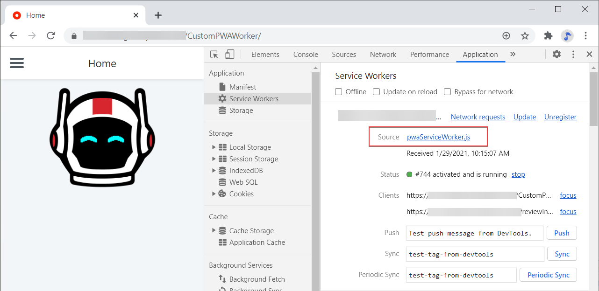
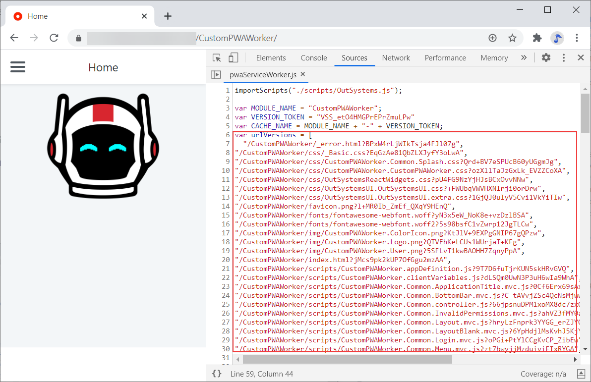

# Advanced settings and customizations

<div class="info" markdown="1">

Applies only to Mobile Apps.

</div>

Progressive web app (PWA) is an evolving and open technology. This document is about settings and techniques that go beyond the built-in capabilities of the OutSystems PWAs.

## Working with the PWA manifest

Service Studio generates the [PWA manifest](https://developer.mozilla.org/en-US/docs/Web/Manifest). You can edit the following manifest options from the Service Studio UI.

| Service Studio property | Manifest key  |
| ----------------------- | ------------- |
| Application Name        | `name`        |
| Application Description | `description` |
| App Primary Color       | `theme_color` |
| Application Logo*       | `icons`       |

(*) Service Studio generates the four required resolutions of the icon.

### Editing manifest

You edit the manifest in the `PWAManifest` section of the **Extensibility Configurations** JSON.

You can edit the manifest in two places:

* In Service Studio, in the **Extensibility Configurations** of the module properties.
* In LifeTime, by going to **Applications** > **(app name)** > **Settings** > **Advanced** > and editing **Extensibility Configurations**.

<div class="warning" markdown="1">

**Important notes about overriding the manifest**

The platform applies the default settings for all values that aren't in the manifest. When you insert your values to override the settings, keep in mind the following:

* The manifest in Service Studio overrides the PWA settings **in all environments**. You can edit the manifest in any module of the app, just keep in mind that when changing the configurations of a module that isn't the home module, you need to republish the home module to properly apply the configurations to the entire app.
* The manifest in LifeTime overrides the PWA settings **in the current environment only**.

</div>

### Sample PWA manifest

You can use [Web App Manifest Generator](https://app-manifest.firebaseapp.com/) to generate the manifest, or experiment with this sample. 

```
{ 
   "PWAManifest":{ 
      "name":"Name overridden",
      "short_name":"ShortName overridden",
      "description":"Description overridden",
      "theme_color":"#EDEDED",
      "background_color":"black",
      "dir":"ltr",
      "orientation": "portrait",
      "serviceworker":{ 
         "src":"/PWAServiceWorker/scripts/PWAServiceWorker.ServiceWorker.js"
      }
   }
}
```

You should be able to use the JSON for both PWA and plugins.

## Adding custom service worker

A service worker in PWAs enables your app to tap into important features, like handling network requests or dealing with online and offline resources. The OutSystems PWAs come with a default service worker. You can implement a custom service worker, which lets you add additional features to the apps.

If you choose to have a custom service worker in your PWA, you need to **manage static resources and URL mappings** manually. You can reuse the references the platform generates, which makes manual management more straightforward.

To add a custom service worker in PWA, do the following:

1. [Get static resources links and URL mappings](#getting-static-resources-links-and-url-mappings).
2. [Add a custom service worker script](#adding-custom-service-worker).
3. [Edit the PWA manifest to reference the worker](#editing-manifest).

### Getting static resources links and URL mappings

When you use the default service worker in your PWA, Service Studio compiles the static resources and URL mappings automatically. You can get them by inspecting the app source code in a browser.

To get the static resources links and URL mappings of a PWA, publish your app and do the following:

1. Open the app in Chrome and go to the developer tools, then navigate to **Application** > **Service Workers** > **pwaServiceWorker.js**. The source code of **pwaServiceWorker.js** opens. 

    

1. Copy the items from `urlVersions` in the **pwaServiceWorker.js** file. These URLs point to the static resources.

    

1. Also, copy the items from `urlMappings` in the **pwaServiceWorker.js** file.

<div class="warning" markdown="1">

You need to [keep the PWA resources and URLs up to date](#keeping-resources-up-to-date) when you update the app that uses a custom service worker. 

</div>

### Adding the custom service worker script

Add a JavaScript file and write your service worker code. The implementation depends on your use case, but you can check out [Introduction to Service Worker](https://developers.google.com/web/ilt/pwa/introduction-to-service-worker) by Google and [Service Workers](https://www.w3.org/TR/service-workers/) by W3C. 

1. Add a JavaScript in **Interface** > **Scripts**. See [Use JavaScript code from an external library](../../../integration-with-systems/javascript/mobile/use-external-lib.md) for instructions.

1. Add your JavaScript code for the custom service worker.

<div class="info" markdown="1">

The PWA uses a custom script as a service worker only after you [edit the serviceworker value in the PWA manifest](#editing-manifest).

</div>

### Adding the custom service worker to the manifest

Edit the PWA manifest so that the `src` value of `serviceworker` points to your JavaScript file. 

Here ia JSON snippet with added the serviceworker value:

```
{ 
   "PWAManifest":{ 
      "serviceworker":{ 
         "src":"/MyScripts/CustomServiceWorker.js"
      }
   }
}
```

See also notes about [editing the manifest](#editing-manifest).

### Keeping resources up to date

<div class="info" markdown="1">

This section is important when you're developing a custom service worker, as it can save you time and prevent broken experience for your users.

</div>

When you publish a new version of the app, you should:

1. Remove the custom service worker and republish the app. This adds the default service worker to the app.
1. With the default service worker on, [extract static resource and URL list](#getting-static-resources-links-and-url-mappings).
1. Update your code of the custom service worker with the new lists of static resources and URL mappings.
1. Add the custom worker again to the app by editing the manifest and republish the app.
