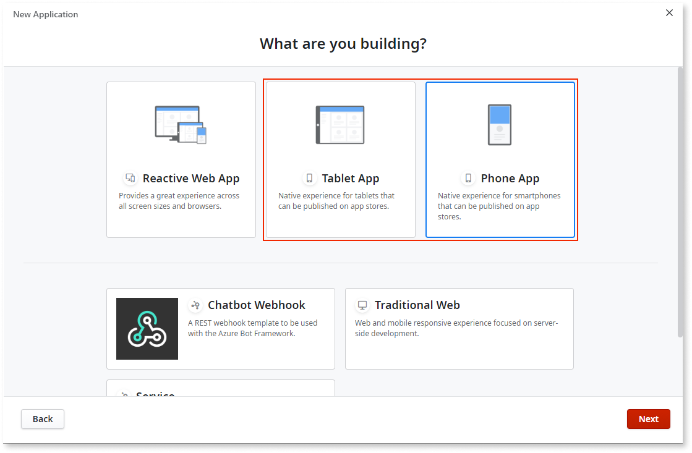
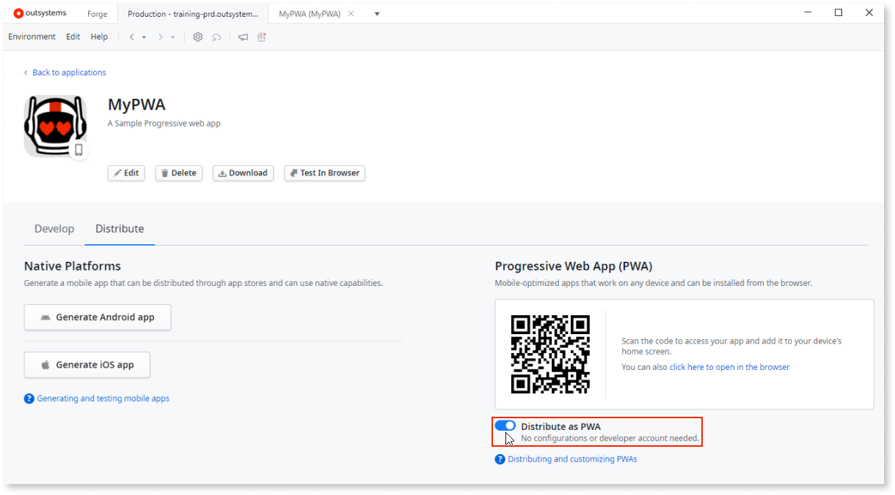
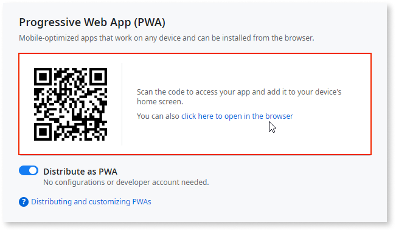
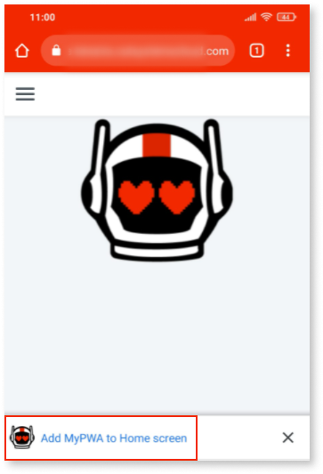
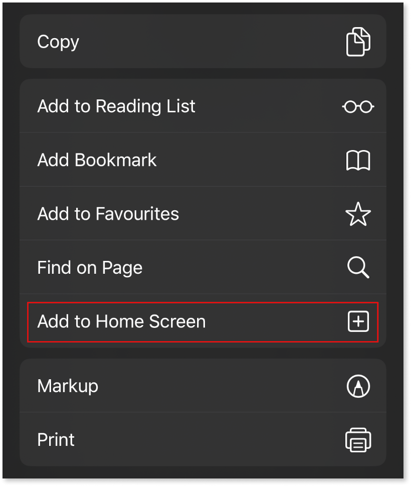
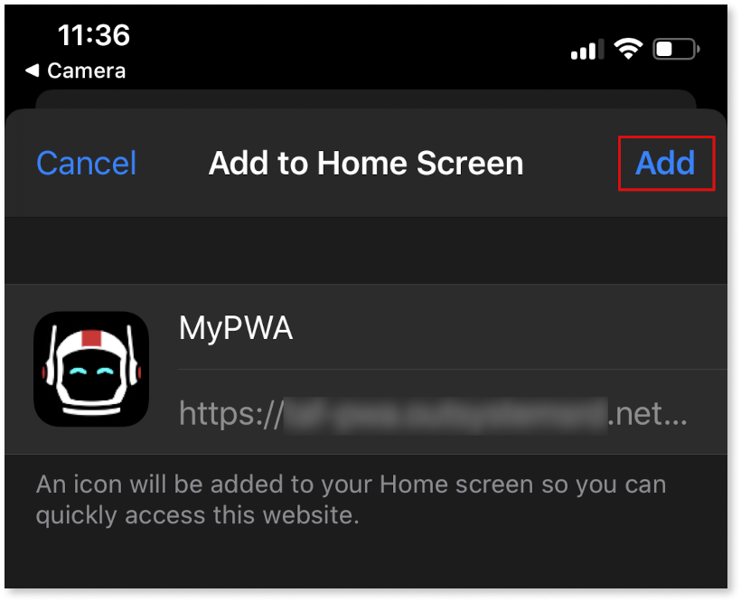

# Distribute as a progressive web app

A progressive web app (PWA) provides a native-like experience without having to distribute a native mobile app. PWA is an emerging technology that combines existing web technologies with modern browser features.

The main benefits of PWAs:

* More efficient to manage, as they don't require app stores like native mobile apps.
* Based on the web browser technology that doesn't depend on a platform:
    * The same app runs on Android and iOS. Additionally, in OutSystems you can distribute an app as a PWA and as native builds for Android/iOS.
    * They can run on a web browser with the same offline capabilities of a mobile app.
* They update the moment you publish changes to your OutSystems environment.
* Lighter on user devices' systems resources.
* When you develop PWAs in OutSystems, you get all benefits of the low-code development. It's enough to turn on the PWA distribution of the app.

Check out [PWA - The Fastest, Easiest Way to Deploy your OutSystems Apps](https://www.youtube.com/watch?v=_YQKTDV_YpE) for a quick video intro!

PWA in OutSystems is a **distribution mode** for mobile apps. A mobile app belongs to the Mobile App runtime, and the default app templates of this type are **Phone App** and **Tablet App**. Select them when you're creating a new app in Service Studio that you want to offer users as a PWA. You can simultaneously distribute a mobile app as a native mobile app and as a PWA.

**Prerequisites**

To distribute your app as a PWA, you need:

* Service Studio 11.6 or later
* Platform Server 11.9 or later
* LifeTime Oct.2019 CP1 or later
* A valid SSL certificate to allow HTTPS communication

## Creating an app and enabling the PWA

Create a mobile app and turn on the toggle **Distribute as PWA** in the app details.

1. Start creating a new app, and in the **New Application** window select **Phone App** or **Tablet App** app template.

    

    

    You can use an existing Mobile App to activate the PWA distribution. Review the user experience if your mobile app uses native plugins that work only with native Android or iOS builds.

    

1. Add a Screen and some logic to it.

1. Publish the app.

1. In the app details, under the **Distribute** tab, turn on the toggle **Distribute as PWA**. To locate the **Distribute** tab, go back to the home screen of Service Studio and click your app icon.

    

**Notes**

* You don't have to republish your app after changing the value of the **Distribute as PWA**, as this change is effective immediately.
* You can also change the PWA settings for an app in an environment through Service Center. For more information, see [Generate and distribute your mobile app](../generate-distribute-mobile-app/intro.md#distribute-your-app-as-pwa).

Mobile best practices apply for PWA development as well, particularly about [designing lightweight local storage](https://success.outsystems.com/Documentation/Best_Practices/Development/OutSystems_Mobile_Best_Practices#lightweight-local-storage).

## Running the PWA

Here is how you can run your PWA. Go to the app details in Service Studio and click **Distribute** tab:

* **Scan the QR code** to open the PWA on your mobile device.
* **Click the link** to open the PWA in a desktop browser.

### PWA in Android

Follow these steps to install and run your PWA on an Android device.

1. Visit the app URL in Chrome.

1. Tap the banner **Add (my app) to Home screen**.

    

1. After you see a confirmation that Android added the shortcut to the home screen, open the app like any other app installed from a store. You can uninstall it like any other Android app.

    

### PWA in iOS

Follow these steps to install and run your PWA on an iOS device.

1. Visit the app URL in Safari.

1. Tap the Share button. The share menu opens.

    

1. Tap **Add to home screen**. The confirmation screen opens.

    

1. In the confirmation screen, tap **Add**.

    

1. Your app should now be on the home screen. You can uninstall it like any other iOS app.

    

## Customizing your PWA

You can customize your app by:

* Editing the details in the app details screen.
* [Editing the PWA manifest](advanced.md#editing-manifest).

### Changing the PWA properties

You can edit your app name, description, color, and logo through the UI of Service Studio. Make sure you republish the app. For overriding properties with the PWA manifest, check out [Advanced settings and customizations](advanced.md).

### Prompting users to install PWA in iOS

Use a prompt to tell your users they can install the PWA version of the app. For the iOS devices, try out the community-contributed plugin [Prompt to Install PWA](https://www.outsystems.com/forge/component-overview/8216/prompt-to-install-pwa), or develop a custom solution.

Android (Chrome) offers a native experience for the install prompt, so you don't need a plugin.

## Using plugins {#plugins}

These are the officially supported plugins for PWAs:

* [Camera Plugin](https://www.outsystems.com/forge/component-overview/1390/camera-plugin), from version 6.0
* [Location Plugin](https://www.outsystems.com/forge/component-versions/1395), from version 5.1

More plugins are coming soon, and you can contribute with your own on the Forge.

## Debugging your PWA

To debug a PWA, emulate the app in Google Chrome. Go to the **Debugger** tab, and then in the **Debug Setup** select **Emulate using Chrome**.

Having issues with your PWA? Check out [Troubleshooting and known issues](troubleshooting-know-issues.md).

## Learning resources

* [PWAs overview and best practices](https://www.outsystems.com/training/courses/164/pwa-overview-and-best-practices/) is an intermediate course about progressive web apps in OutSystems. Learn more about differences between PWAs and native apps, advantages and challenges, installation and desktop support.

______________________________________________________________
_QR CODE is a registered trademark of Denso Wave Incorporated._
