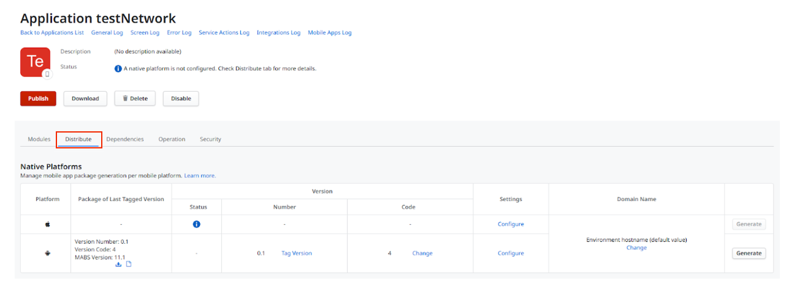
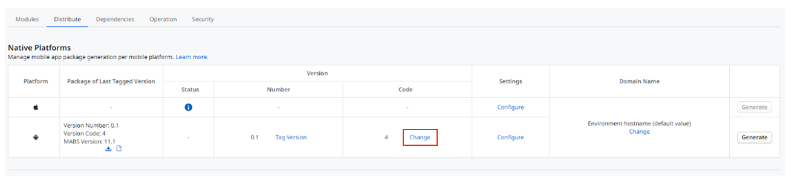
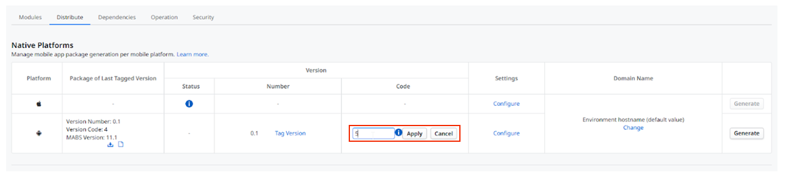
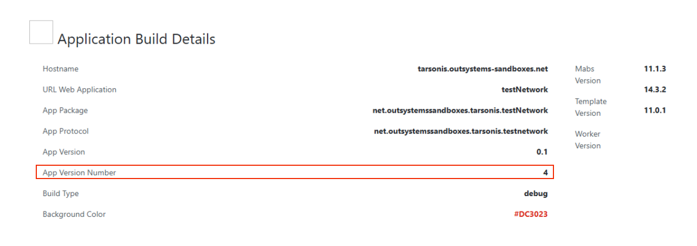

# Customizing the mobile app version code

The need to manually change the Version Code is rare but crucial in some specific situations. The most common is migrating an existing application from another technology to OutSystems.

Imagine your app is already published on the app stores, but was built with a different technology. This app already has a high Version Code, for example, 500. When you migrate the app to OutSystems and generate the first version, OutSystems will, by default, assign it an initial Version Code (for example, 1). If you try to submit this version to the app store, it will be rejected because its Version Code (1) is lower than the one already in place in the store (500).

## How to Change the Version Code in Service Center

In this case, you must access the Service Center, in the Native Platforms tab, and manually change the Version Code to a number higher than the app's current version in the app store. This way, you ensure your first OutSystems version is recognized as a valid update.

How to change the Version code:

1. Access the Service Center of your OutSystems infrastructure.
1. Go to the **Factory** tab, and then go to the **Application** tab.
1. Find your application and select it.
1. Go to the **Distribute** tab.

    

1. In the Code column, for the platform you want to change (iOS or Android), click the **Change** button.

    

1. Enter the new value for the Version Code and Apply.

    

After this procedure, the next time you generate a new app package, the changed version code increments by one.

## Checking the App Generation Version

Additionally, in some cases, it can be useful to validate which version code the client used to generate their application. For example, if a client is on-premises and you don't have access to their environment, you can access the Mobile Apps Build Service (MABS) logs to find out which OutSystems version the app was generated with.

