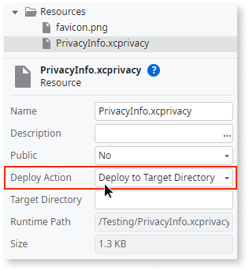

# Privacy updates for Apple App Store submissions

Apps submitted to the Apple App Store must include a privacy manifest file outlining the APIs employed and their purposes. When uploading a new or updated app to App Store Connect, include approved justifications for the APIs used in your code. Furthermore, when integrating a new third-party SDK, follow the API, privacy manifest, and signature requirements specific to that SDK. You must verify that the version employed includes its privacy manifest and note that signatures are compulsory when incorporating it as a binary dependency.

Your app or third-party SDK must declare one or more approved reasons that accurately reflect your use of each of these APIs and the data derived from their use. Use these APIs and their data for the declared reasons only. Ensure that your app's functionality, as presented to users, aligns with these declared reasons and that you don't use the APIs or derived data for tracking.

## Privacy manifest file

You must provide a PrivacyInfo.xcprivacy file in your OutSystems app, where the APIs used are detailed. Provided is a default file that can be used. Ensure you've installed a new app build after adding the privacy manifest file. 

     <?xml version="1.0" encoding="UTF-8"?>
     <!DOCTYPE plist PUBLIC "-//Apple//DTD PLIST 1.0//EN" "http://www.apple.com/DTDs/PropertyList-1.0.dtd">
     <plist version="1.0">
     <dict>
     <key>NSPrivacyTracking</key>
     <false />
     <key>NSPrivacyTrackingDomains</key>
     <array />
     <key>NSPrivacyCollectedDataTypes</key>
     <array />
     <key>NSPrivacyAccessedAPITypes</key>
     <array>
     <dict>
     <key>NSPrivacyAccessedAPIType</key>
     <string>NSPrivacyAccessedAPICategoryFileTimestamp</string>
     <key>NSPrivacyAccessedAPITypeReasons</key>
     <array>
     <string>C617.1</string>
     </array>
     </dict>
     <dict>
     <key>NSPrivacyAccessedAPIType</key>
     <string>NSPrivacyAccessedAPICategorySystemBootTime</string>
     <key>NSPrivacyAccessedAPITypeReasons</key>
     <array>
     <string>35F9.1</string>
     </array>
     </dict>
     <dict>
     <key>NSPrivacyAccessedAPIType</key>
     <string>NSPrivacyAccessedAPICategoryDiskSpace</string>
     <key>NSPrivacyAccessedAPITypeReasons</key>
     <array>
     <string>E174.1</string>
     </array>
     </dict>
     <dict>
     <key>NSPrivacyAccessedAPIType</key>
     <string>NSPrivacyAccessedAPICategoryUserDefaults</string>
     <key>NSPrivacyAccessedAPITypeReasons</key>
     <array>
     <string>CA92.1</string>
     </array>
     </dict>
     </array>
     </dict>
     </plist>

## Providing a privacy manifest file for a File plugin

When you use a File plugin, you must include a PrivacyInfo.xcprivacy file in your OutSystems app.

The following table contains the required key and recommended reason value for this plugin:

|Key | Recommended reason value | Recommended reason |
|----------|-------------|------|
| [NSPrivacyAccessedAPICategoryFileTimestamp](https://developer.apple.com/documentation/bundleresources/privacy_manifest_files/describing_use_of_required_reason_api#4278393) | C617.1 | Declare this reason to access the timestamps, size, or other metadata of files inside the app container, app group container, or the app’s CloudKit container. |
| | 3B52.1 | Declare this reason to access the timestamps, size, or other metadata of files or directories that the user specifically granted access to, such as using a document picker view controller. |
| [NSPrivacyAccessedAPICategoryDiskSpace](https://developer.apple.com/documentation/bundleresources/privacy_manifest_files/describing_use_of_required_reason_api#4278397) | E174.1 | Declare this reason to check whether there is sufficient disk space to write files, or to check whether the disk space is low so that the app can delete files when the disk space is low. The app must behave differently based on disk space in a way that is observable to users. Information accessed for this reason, or any derived information, may not be sent off-device. There is an exception that allows the app to avoid downloading files from a server when disk space is insufficient. |

### Example privacy manifest file for a File plugin

    <?xml version="1.0" encoding="UTF-8"?>
    <!DOCTYPE plist PUBLIC "-//Apple//DTD PLIST 1.0//EN" "http://www.apple.com/DTDs/PropertyList-1.0.dtd">
    <plist version="1.0">
    <dict>
    <key>NSPrivacyAccessedAPITypes</key>
    <array>
    <!-- Add this dict entry to the array if the PrivacyInfo file already exists -->
    <dict>
    <key>NSPrivacyAccessedAPIType</key>
    <string>NSPrivacyAccessedAPICategoryFileTimestamp</string>
    <key>NSPrivacyAccessedAPITypeReasons</key>
    <array>
    <string>C617.1</string>
    <string>3B52.1</string>
    </array>
    </dict>
    <dict>
    <key>NSPrivacyAccessedAPIType</key>
    <string>NSPrivacyAccessedAPICategoryDiskSpace</string>
    <key>NSPrivacyAccessedAPITypeReasons</key>
    <array>
    <string>E174.1</string>
    </array>
    </dict>
    </array>
    </dict>
    </plist>

## Providing a privacy manifest file in OutSystems 11

In Service Studio add and upload the privacy manifest file:

1. In the **Data** tab, add the file to **Resources**. Right-click and select **Import Resource**. Select your file.

1. Set the name to `PrivacyInfo.xcprivacy`

1. Ensure that the **Deploy Action** attribute of the **Resource** property is set to `Deploy to Target Directory`.

    

1. In the **Logic** tab, select your app icon. In the **Advanced** section, click on **Extensibility Configurations.**

1. You can replace `Thekeyoftheresource` with another name; however,  `src` and `target` must have the values shown in the entry.

    ```
    {
    "resources": {
            "ios": {
                "Thekeyoftheresource": {
                    "src": "www/PrivacyInfo.xcprivacy",
                    "target": "PrivacyInfo.xcprivacy"
                }
            }
        }
    }
    ```

