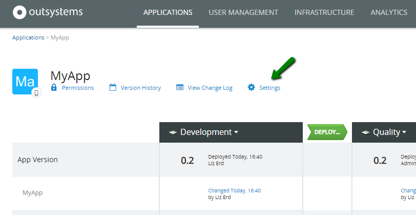
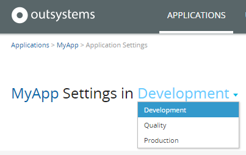
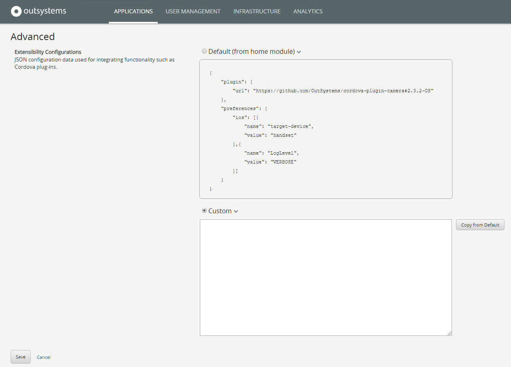
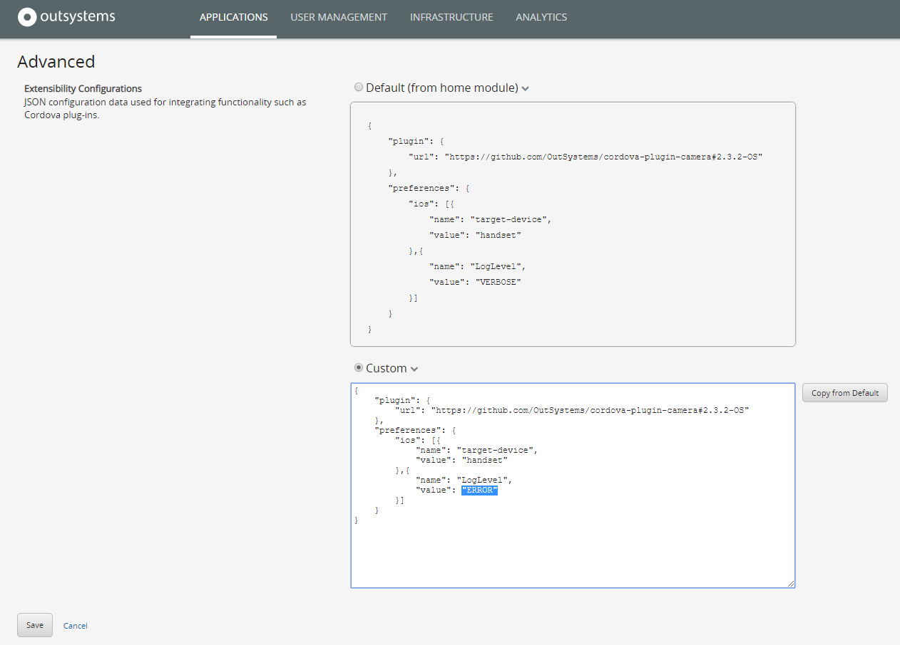

# Override the Default Mobile Extensibility Configurations

Applies only to Mobile Apps.

The [default Extensibility configurations](mobile-app-packaging-delivery/customize-mobile-app/intro.md) of an OutSystems mobile app are defined at design time in the application home module. However, there are some situations when it is necessary to have different extensibility configurations for different environments.

For example, the development team needs to troubleshoot an issue in a plugin used by a mobile app, so they want to increase the plugin logging level in the development environment only, keeping the default logging level in quality and production environments.

With OutSystems you can override, for a specific environment, the default Extensibility Configurations that were defined at design time, with no need to manually change and deploy the application in that environment.

To override the Extensibility Configurations of your mobile app for a specific environment, do the following:

1. In LifeTime management console, go to the details page of the application.

1. Press the **Settings** link.  

    

1. Choose the environment where you want to override the Extensibility Configurations. The application must be already deployed in that environment.  

    

1. In the **Advanced** section, you will see the default Extensibility Configurations that were defined at design time. Choose the **Custom** option.

    

1. Use the **Copy from Default** button to copy the default configurations to the custom field.

1. In the Custom field, change only the configurations that need to be different for that environment, keeping the remaining configurations as is. Make sure the development team validates or provides you with the custom configurations.

    

1. Press the **Save** button.

Now, when a new mobile app package is generated in this environment, the custom configurations will override the default configurations defined in the application module. Also, the custom configurations will be kept for the environment after new application deployments.

## Known issue with the JSON size limit in LifeTime Extensibility Configuration

Applies only to:

* LifeTime, versions earlier than 11.6.1 **with**
* Platform Server, versions earlier than 11.10.0

In LifeTime earlier than version 11.6.1 the Extensibility Configuration JSON has a character limit. If you go over the limit, the following error shows: **Failed to deserialize JSON to REST_ErrorRecord: Unexpected character encountered while parsing value: <. Path '', line 0, position 0.**

You can resolve the issue by:

* Upgrading **both** LifeTime to 11.6.1 or later and Platform Server to version 11.10.0 or later.

Or by:

* Editing the Extensibility Configuration JSON in Service Studio.
