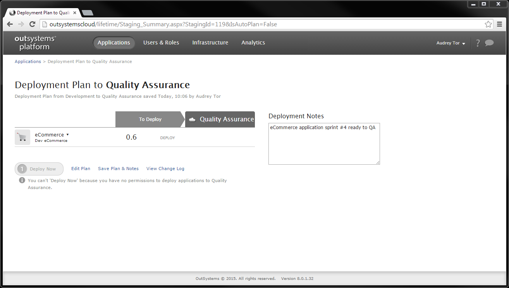
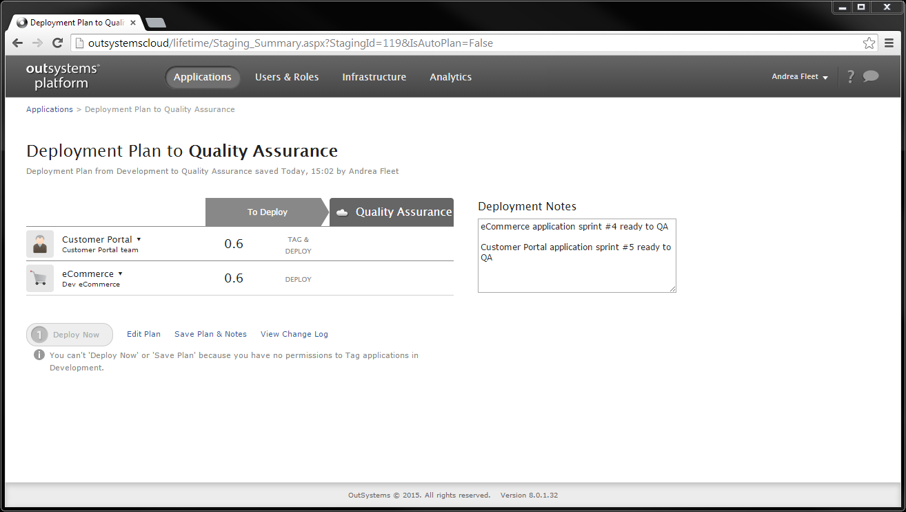
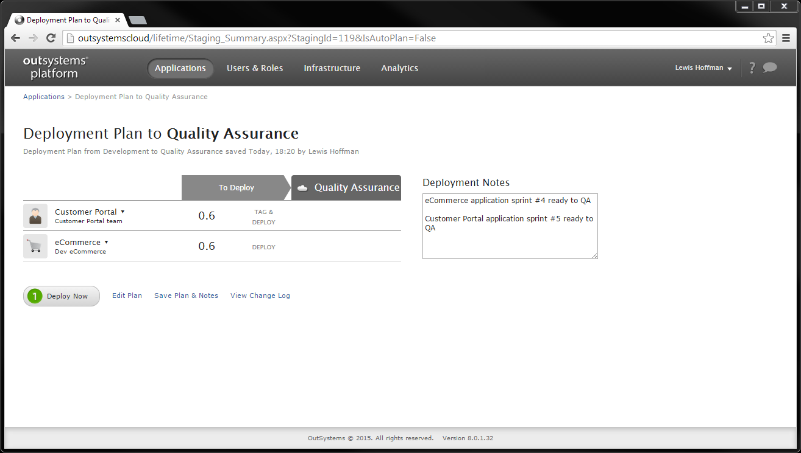
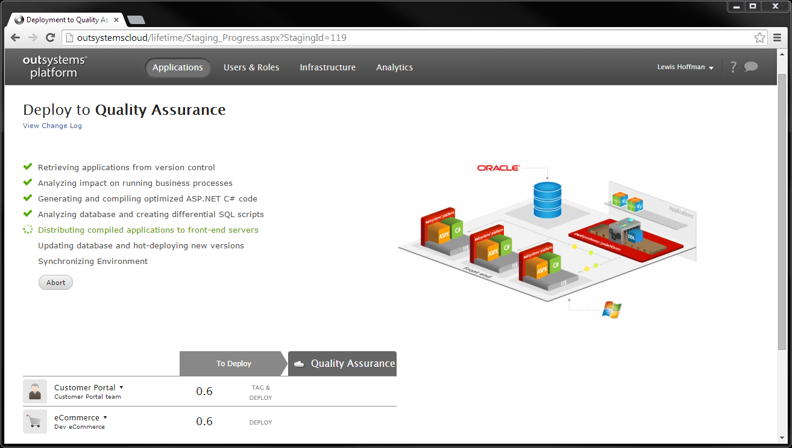

# Plan a Deployment for the Operations Team

In organizations following enterprise-grade security policies, you typically need to control who can deploy new releases to Quality Assurance or Production after approval. OutSystems enables your development and operation teams to collaborate in this process.

This topic describes how the development team can collaboratively create a deployment plan to be later executed by the operations team to deploy the applications.

In this example the eCommerce and Customer Portal apps are developed by two different teams. The teams have finished the last developments, and the apps are ready to be tested in Quality Assurance.

Each team leader adds their application to the deployment plan, but only the operations team has permissions to deploy applications to Quality Assurance.

To learn how to set up the permissions in your teams to comply with your deployment process, check [Understand the Permission Model for IT Users](../manage-platform-app-lifecycle/manage-it-teams/about-permission-levels.md).

## Create a Deployment Plan

After reaching a stable new version, the eCommerce team leader prepares the deployment plan for the eCommerce application.

On the deployment summary screen, fill-in the deployment notes, and choose **Save Plan &amp; Notes**. Notice that even though team leaders have no permissions to deploy to Quality Assurance, they can still create deployment plans.

## Edit a Deployment Plan

Later on, the Customer Portal team leader edits the existing plan.

Click on the **Saved** blue button between Development and Quality Assurance, and set Customer Portal to **Tag and Deploy 0.6**.

On the deployment summary screen, edit the deployment notes to include more comments. You can then save the plan for the operations team.

## Execute the Deployment

Now the operations team just needs to review the plan and execute it, since only they can deploy applications to Quality Assurance. Click on the **Saved** blue button between Development and Quality Assurance.

Click the **Continue** button to review the deployment plan.

Review the application versions and deployment notes. Click **Deploy Now**.

The deployment begins, and you can check the deployment logs to see if everything went according to the plan.

