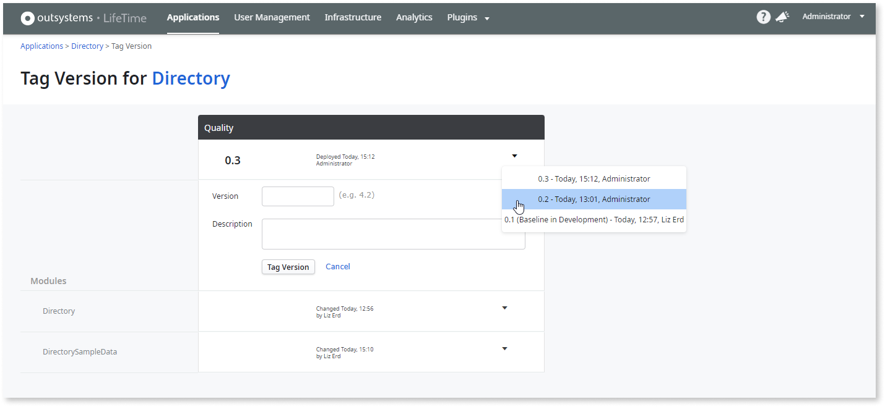
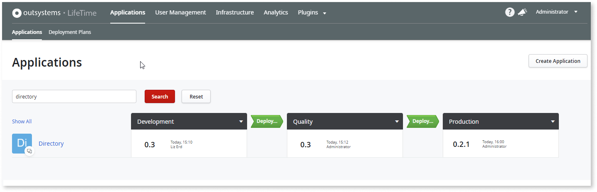
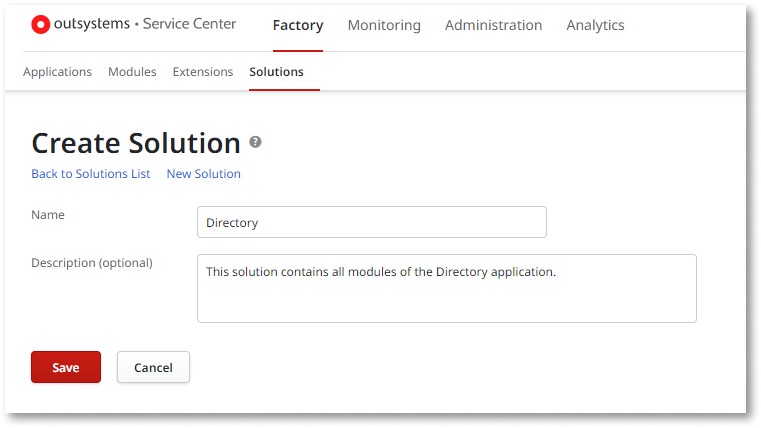
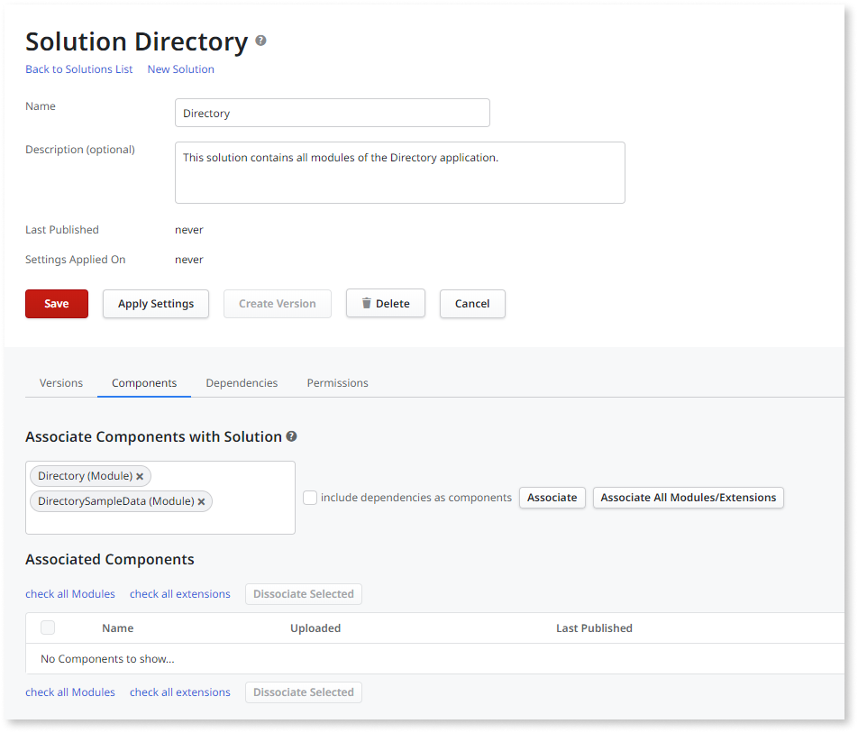
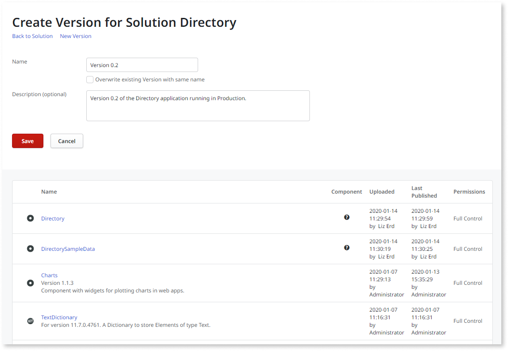

# Rollback to a Previous Version

This topic describes how to rollback to a previous version of an application.

In this example the 0.3 version of Directory was deployed to Production, and a critical bug was then detected. Since the bug is causing data to be inconsistent, the Operations team needs to rollback the application to its previous version.

## When to rollback to a previous version?

Most of times, bugs found in Production are small and have low impact to the business. In those scenarios the team can simply [Apply a Hotfix](<apply-a-hotfix.md>).

In scenarios where it's not possible to apply a hotfix due to the severity of the bug or time constraints, there are two ways to rollback an application to its previous version:

* Create and deploy a tag based on a previous version, in the LifeTime console (`https://<lifetime_env>/lifetime`).
* Republish a previous version of the Solution, in the environment's Service Center console (`https://<environment>/ServiceCenter`).

## Create a tag based on a previous version

The tagging operation isn't available for mobile apps. As it's not possible to rollback app versions in the App Stores, LifeTime doesn't support creating a tag based on a previous mobile app version. However, you can rollback a mobile app to a previous version [using the LifeTime API](../ref/apis/lifetime-deployment/examples/api-rollback-mobile-app.md).

In LifeTime it's not possible to deploy a version lower than the one running on the environment. Instead, you need to create a new tag for that version. This lets you track which patches have been applied to a running application.

This version will be exactly the same as the stable version, since LifeTime lets you specify the modules when tagging a version.

To create a new tag based on the previous version, do the following:

1. In LifeTime, click the Directory application to go to the application details screen.

1. In the Quality environment, click **Tag Version** to create the new tag.

1. By default, tags are based on the latest version: click the ▼ button in front of the application version and choose the **0.2** option to specify that the version you are creating is the same as version 0.2. This option isn't available for mobile applications.

    

    Notice that by choosing the version 0.2 of the application as the base version for the tag, the version of the Directory, DirectorySampleData and all other modules of this application have also changed. LifeTime lets you specify the module versions that will be part of the tag.

1. Fill in the description for the tag and click **Tag Version** to create the new version.

You have just created the Directory version 0.2.1, that is exactly the same has the Directory 0.2. Now, simply deploy Directory 0.2.1 to Production. Learn how to [Deploy an Application](<deploy-an-application.md>).

## Republish a previous version of the Solution

Some software factories have complex internal processes to deploy applications, making it difficult to integrate OutSystems in their deployment procedures.

In such scenarios, another way to rollback to a previous version, is to create a Solution in the Service Center console **before deploying a new version**. Solutions allow you to aggregate several application modules into a single deployable unit.

To create the Solution, do the following:

1. Go to the Service Center console of the Production environment (`https://<prod_environment>/ServiceCenter`).

1. Click **Factory** and then **Solutions**.

1. In the Solutions screen, choose **New Solution**.

    

1. After the Solution is created, you need to specify the modules that are part of it: **type 'Directory'**, **'DirectorySampleData'** in the input field.

    

1. Finally click **Associate** to include the specified modules in the solution.

To create a new version of the Solution, click the **Create Version** button and specify the version name and a description for this version.

Once you save, the version becomes available under the 'Versions' tab. To rollback to this version, simply click on the **Publish** button. Even though the solution is published via the environment management console, LifeTime automatically detects its version, so it displays in Production 'Directory 0.2'.

For mobile applications, make sure the new version code of your app in the App Stores is higher than the previous app version code.

