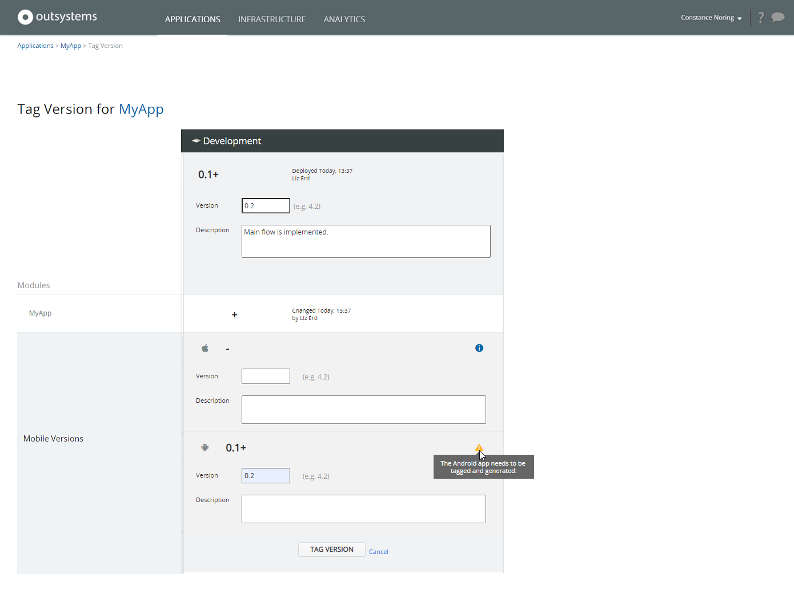

# Tag a Version

Tagging an application version in LifeTime means that a snapshot of the development state of the application is taken and a version number is associated to it. When [deploying the application](<deploy-an-application.md>), just select the tagged version and LifeTime deploys the application in the exact development state in which it was tagged.

A typical situation of tagging an application is when it reaches a development milestone:

1. The application is tagged
2. The development continues
3. The tagged version of the application is deployed to another environment for tests

When tagging a mobile app, there is an extra section called Mobile Versions that allows tagging the mobile package. That operation isn't frequently needed because the platform automatically updates the app without generating new packages. In some [update scenarios](<mobile-app-packaging-delivery/mobile-app-update-scenarios.md>) new packages have to be tagged and generated.

Here's an example of tagging applications.

## Tag a Web and a Mobile Application

In this example, there are two applications in Development environment:

* A mobile app (MyApp)
* A web application (MyWebApp)

They have reached a development milestone and must be tagged.

The plus ('+') sign means the applications have changed since their last tag.

### Tag the Mobile App

To tag the mobile app, do the following:

1. Click on **MyApp** to show its details.
    
    

1. Click the **TAG VERSION** button for the Development environment.

1. Set the Version to **0.2** and type a description. In the Mobile Versions section, there's also a plus ('+') sign for the Android platform, meaning that the [changes in the app](mobile-app-packaging-delivery/mobile-app-update-scenarios.md) require the tagging and generation of a new mobile package. Set also the mobile version for the native platform. Make sure the mobile version [is higher than any previous version](#mobile-package-version).
    
    

1. Click the **TAG VERSION** button to finish.
    
    

The mobile app is now tagged and can be [deployed](<deploy-an-application.md>) to Quality at any time.

Note that the mobile version will only be updated in other environments if the application  **is deployed through LifeTime**. Publishing the same version in other environments directly in Service Center or Service Studio will not update the mobile version.

If you need to install and test the tagged application version in a mobile device still in the Development environment, you can [generate a new mobile package](mobile-app-packaging-delivery/generate-distribute-mobile-app/intro.md) before proceeding with the deploy to Quality. Otherwise, OutSystems generates a new mobile package during the deployment process.

#### Mobile package versions { #mobile-package-version }

In [update scenarios](<mobile-app-packaging-delivery/mobile-app-update-scenarios.md>) that require the generation of a new mobile package, you need to set the new mobile version for the package during the tagging operation in LifeTime. This **new mobile version** must be **higher than any previous version**.

LifeTime applies this restriction to the mobile version to comply with the same restriction in public app stores, where you can't publish a new version of your mobile app using a version number lower than the current one. As LifeTime can't validate which versions were already published in the app stores, the tagging operation restricts lower mobile versions.

To cope with this limitation, during the development cycle between app store releases, the developers should increment the mobile version below the next version value for the new app store release.

Take the following example:

* You release your mobile app to app stores with **version 1.0**. The next release in the stores should be **version 2.0**.

* During the development cycle of version 2.0, the development team needs to generate new mobile packages.

* Therefore, every time the developers need to generate a new mobile package during the development cycle, the mobile version must be **lower than 2.0**. For example, you can use the following version numbers: 1.1, 1.2, 1.3, or 1.0.1, 1.0.2, 1.0.3, depending if there is the possibility of intermediate releases.

* You should use the mobile version 2.0 only when the new release of your application is ready to publish in the app stores.

### Tag the Web Application

To tag the web application, do the following:

1. Click on **MyWebApp** to show its details.

    

1. Click the **TAG VERSION** button for the Development environment.

1. Set the Version to **0.3** and type a description. 

    

1. Click the **TAG VERSION** button to finish.

    

The web application is now tagged and can be [deployed](<deploy-an-application.md>) to Quality at any time.
