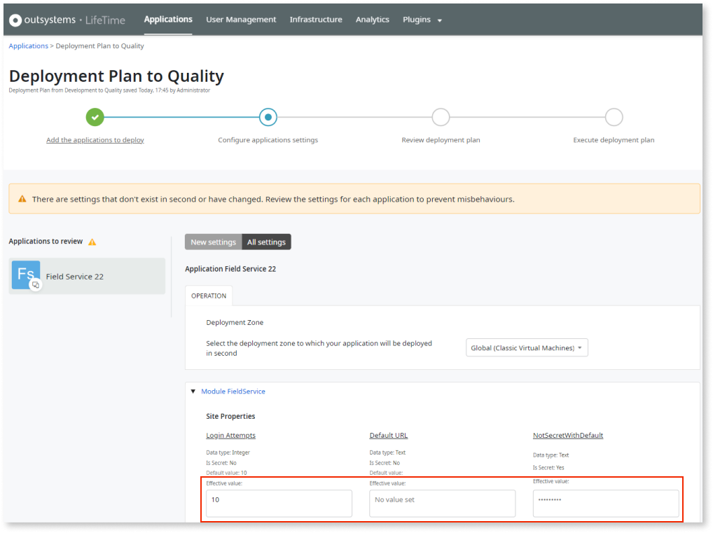
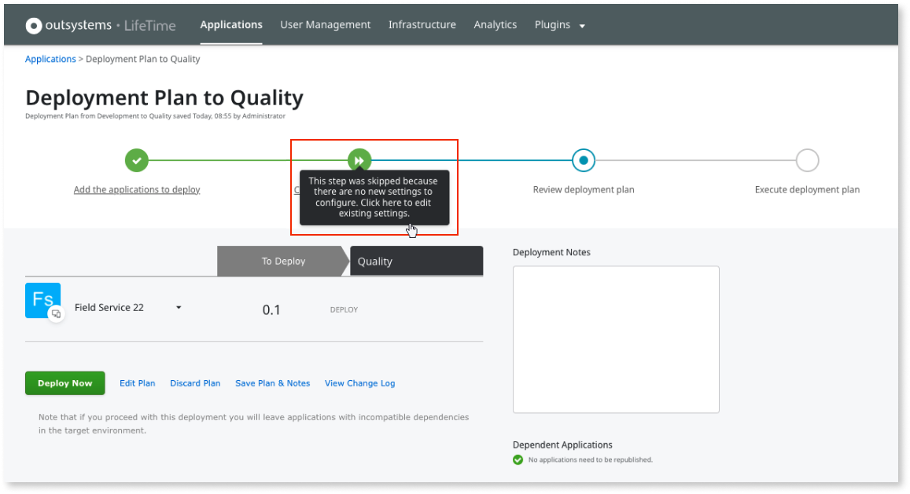

# Configure site properties during deployment

You can configure your applications' site properties in the target environment during the deployment plan.

Ensure the user executing the deployment has the **Change & Deploy Applications** permission for all apps in the deployment plan.

The deployment plan wizard allows you to configure the site properties of the apps being deployed during the **Configure application settings** step.

When deploying apps, after you add the apps to your deployment plan, the deployment plan wizard takes you to the **Configure application settings** step.

If there are application modules in the plan with new site properties that were never set in the target environment, you can define the **Effective value** for those site properties in the target environment in this step.

Additionally, if you make any changes to the **IsSecret** property of the site property, you must define the effective value for the site property. To learn more about how to use site properties and secret site properties, refer to [Site property](../ref/lang/auto/class-site-property.md#example-2). 

In the deployment plan wizard, you can also change the existing settings of the applications to deploy. Because secret site properties don't have default values, the **Default Value** field will not display any information. To display the existing settings, click the **All settings** button.

Select an app from the app list to display the settings for that application. If your deployment plan contains applications with no changes, you can't change the settings for those apps.

The following are some examples of when this step is **skipped** or **disabled**:

* The step is **skipped** when there are no new settings to configure. However, if you need to change any existing settings, you can manually go back to **Configure application settings** by clicking the step in the wizard.

    

* The step is **disabled** when there aren't any settings to configure or the user executing the deployment doesn't have the required permissions.

The site properties of the applications to deploy are set in the target environment after the apps are published. Beware of Timers that run `When Published`, since the site properties that the Timers may use are not yet updated when the Timers run.

To update the site properties value in the target environment after the deployment, [use the Service Center console](configure-application-settings-after-deployment.md).

This feature doesn't apply to multi-tenant site properties.

