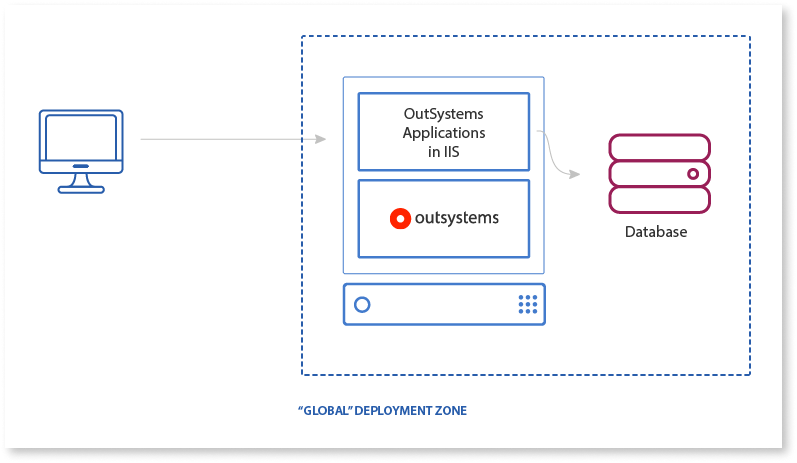
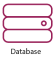
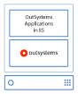
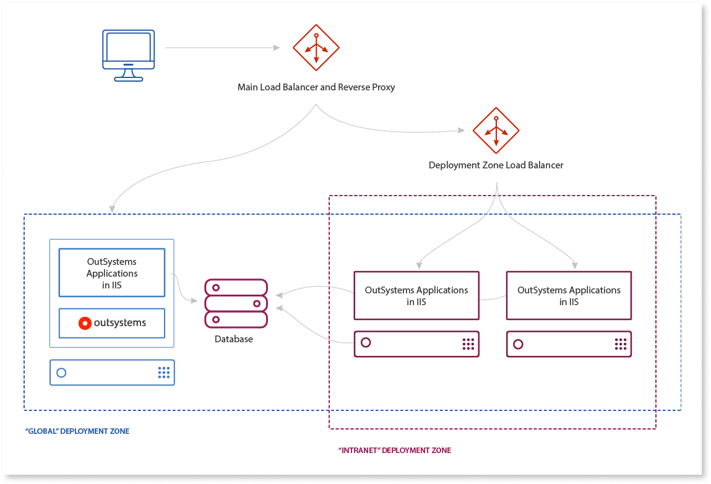
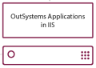

# Recommended Network Architecture

Deployment Zones are only available in OutSystems on-premises installations.

When using deployment zones with more than one front-end server, you must use additional pieces of software (or hardware) to ensure that user requests get to the correct front-end servers where you deployed your OutSystems applications.

You can use a **load balancer** to distribute load (according to a given algorithm) between several servers. Deployment zones usually have their deployment zone address set to the address of the load balancer that distributes load between the front-end servers of that deployment zone.

If you have OutSystems applications in different deployment zones you will also need a **reverse proxy**. In this scenario a load balancer isn't enough, since not all the apps are available in every front-end server. In this case, you need an additional mechanism that can route requests to the front-end servers where you published the OutSystems apps that handle those requests. A properly configured reverse proxy knows how to map an application to the deployment zone where that application is available.

## Configuring the Address of Deployment Zones 

The **"Deployment Zone Address" attribute** of deployment zones allows a given module to refer to any other module, either in the same zone or in a different one (for example, SOAP or REST calls, references to processes, references to resources from other modules). OutSystems generates all server-side calls/redirects using the deployment zone address where you deployed the producer module.

You have to make sure that the addresses configured for all your deployment zones fit your network layout and topology.

In a **single-server scenario**, you can set the "Deployment Zone Address" field to the address of the environment according to its "Hostname" parameter, which is configured in Service Center > Administration > Environment Configuration > Hostname.

Element | Description
:------:|------------
 | User devices (mobile or desktop) accessing OutSystems applications.
 | Database (on-premise or on the cloud) used by the platform to store application metadata and by applications to store business data.
 | OutSystems platform, installed on a virtual machine or on the cloud, along with applications living in the same IIS server (possibly using different application pools).

In a **farm scenario**, when you're using multiple servers, the deployment zone address should be the address of the load balancer configured to distribute load across servers in that deployment zone.

Element | Description
:------:|------------
 | **Main Load Balancer and Reverse Proxy** - Exposes `www.mydomain.net` address and knows how to map `/AppX` and `/AppY` to the servers where those applications are available. **Deployment Zone Load Balancer** - Distributes load among the servers configured in the deployment zone.
 | A second (or third) server on which OutSystems applications can be reached. Installed on a virtual machine or on the cloud and reachable by the platform.
**"Intranet" Deployment Zone** | A customer-defined zone, including only some of the servers configured in the environment (2 out of 3 in the diagram).

Client-side calls (any code running on the browser or on a mobile device) rely on the **environment URL**, so be sure to configure your network topology so that your public-facing applications are reachable through the environment URL.
