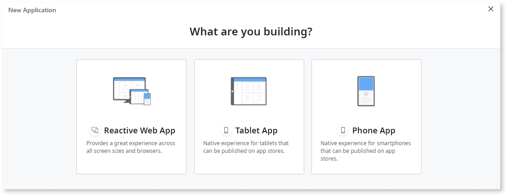

# Application Templates

An OutSystems app consists of modules that Service Studio bootstraps from the application template you select. Thanks to the application templates, the apps have many predefined elements that save you development time, like login screens, a theme, layouts.

There the following types of application templates:

* built-in application templates
* custom application templates
* Forge application templates

### Built-in application templates

**Reactive Web App**, **Phone App**, and **Tablet App** are the built-in application templates that OutSystems creates and maintains. They use the [OutSystems UI](https://outsystemsui.outsystems.com/outsystemsuiwebsite/) and let you use the compatible theme, patterns, screen templates, and other UI components.

### Custom application templates

Custom application templates are the application templates you create. Check out [Create a Custom Application Template](<../ui/reuse/create-a-custom-application-template.md>) for more instructions.

### Forge application templates

Forge application templates are provided by the OutSystems Community and shared at [Forge](https://www.outsystems.com/forge/#category=templates). Once you install an application template from Forge, you can select it when you're creating a new app, just like other application templates.