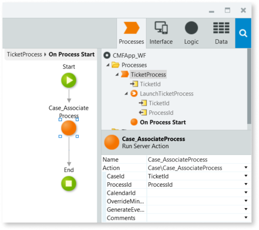

# Create a case management app

To start developing your case management app using the [Case Management framework](https://www.outsystems.com/forge/Component_Overview.aspx?ProjectId=9179), you start by creating a few modules that support the definition of your main case.

Follow this guide to create the basis of your case management app, with the following modules:

* The user interface (UI) module which contains the screens of your app needed for end users to interact with the cases. Follow the optional step in this guide to create a simple version of this module so you can test your app.

* A core services (CS) module which contains the case business entity, the case definition and the case status definitions for a case. Each core services modules can only include one case definition.

* The workflow (WF) module which contains the BPT processes associated with case definitions.

## Prerequisites

Before you proceed, make sure that you installed the latest version of the [Case Management framework](https://www.outsystems.com/forge/Component_Overview.aspx?ProjectId=9179) in your environment.

## Overview

[Step 1. Creating the app and a core services module](#step1)

[Step 2. Creating the business entity and the case definition](#step2)

[Step 3. Associating the business entity with case](#step3)

[Step 4. Creating the initial case status](#step4)

[Step 5. Creating a bootstrapping action](#step5)

[Step 6. Creating the workflow module](#step6)

[Testing your Reactive Web app setup (optional step)](#opt-step)

[Next Steps](#next-steps)

### Step 1. Creating your app and the core services module { #step1 }

Start by creating your app and adding the core services module. The core services module is where you build the business logic and the corresponding public actions, and the configuration mechanisms for the case definition that you need while developing your apps with the Case Management framework.

Let's create an app, then create a core services module for your case, and finally create the business entity for your case. Follow these steps:

1. In Service Studio, create a new app.

    

    Create a Reactive Web app or a Traditional Web app. The last optional step of this guide only works for Reactive Web apps.

    

1. Create a **Service** module and name it `<business-entity-name>_CS`.

    

    Replace &lt;business-entity-name&gt; with a name that represents the business entity that will be associated with the case definition of your app. For example, if you are creating a support ticketing app, use `Ticket` as the &lt;case-entity-name&gt; since your cases represent support tickets.

    

1. In **&lt;business-entity&gt;_CS**, open **Manage Dependencies**, and add the following dependencies:
    
    * From the **CM_Case_CS** producer, add the **Case** entity.
    
    * From the **CaseConfigurations_API** producer, add the **SetupCaseManagementApplication** service action.

    * From the **CaseServices_API** producer, add the **Case_Initialize** action.

    * From the **CM_CaseDefinition_CS** producer, add the **PurgeType** static entity.

1. In the **Data** tab, create a new **Entity** for the business data of the cases, and set the name and add relevant attributes. For example, name the new entity `Ticket`, and add a `Description` text attribute.

1. Set the **Public** property of the entity to **Yes**.

1. Set the **Data Type** of the **Id** attribute to **Case Identifier**.

1. Right-click the entity, select **Edit Entity**, and in the **Advanced** tab select **Expose Process Events**.

### Step 2. Creating the case definition { #step2 }

Next, let's create a static entity to keep the case definition and then create a record for the first case definition of your app. Follow these steps:

1. In the **Data** tab of **&lt;business-entity&gt;_CS**, create a **Static Entity**, and name it `CaseDefinitionConfiguration`.

1. Set the **Public** property to **Yes**.

1. Rename the **Id** attribute to `CaseDefinitionId`, and the **Data Type** as **Text**.

1. Rename the **Label** attribute as `Name`.

1. Add a new attribute named `Description`, with the **Data Type** set as **Text**.

1. Add a new attribute named `HasAccessControl`, with the **Data Type** set as **Boolean**.
 
1. Add a new attribute named `PurgeTypeId`, with the **Data Type** set as **PurgeTypeId**.
 
1. Add a new attribute named `DaysToPurgeCase`, with the **Data Type** set as **Integer**.

1. Add a new attribute named `DaysToPurgeProcess`, with the **Data Type** set as **Integer**.

1. Delete **Order** and **Is_Active** attributes.

    

1. To configure the case definition, add a **Record** to the **CaseDefinitionConfiguration** static entity. Name the record `CaseDefinition`.

1. Generate a GUID and paste that GUID into the value field of the **CaseDefinitionId** attribute of the CaseDefinition record.

    

    A Globally Unique IDentifier, or GUID, is used as a unique identifier to ensure integrity across environments.  
    You can use an online GUID generator to create a GUID for each record.

    Check the [RFC 4122](https://www.ietf.org/rfc/rfc4122.txt) for more information on GUIDs and their format.

    

1. Set the **Name** and **Description** attributes of the **CaseDefinition** record.

### Step 3. Associating the business entity with case { #step3 }

In this step you add an action to the core services module that associates the business entity with the case definition. Follow these steps:

1. In the **Logic** tab of **&lt;business-entity&gt;_CS**, create a **Server Action**, and name it  `<business-entity-name>_Create`, where &lt;business-entity-name&gt; is the name of the entity created in Step 1. This action is used to encapsulate the logic to initialize the case.

1. Set the **Public** property of the action to **Yes**.

1. Add an **Input Parameter** and name it `<business-entity-name>`. Ensure the data type of the parameter is set as **&lt;business-entity-name&gt;**.

1. In the action flow of **&lt;business-entity-name&gt;_Create**, add a **Case_Initialize** action between the **Start** and **End**.

1. Set **CaseDefinitionId** of the **Case_Initialize** action as `TextToIdentifier(Entities.CaseDefinitionConfiguration.CaseDefinition)`.

1. Add an **Assign** after the **Case_Initialize** action, and set the `<business-entity-name>.Id` (the identifier of the input parameter) as `Case_Initialize.CaseId` (the output of Case_Initialize).

1. Add a **Create&lt;business-entity-name&gt;** action after the assign, and set the **Source** as the input parameter.

    

### Step 4. Creating the initial case status { #step4 }

In this step you create the initial case status of the case definition. Follow these steps:

1. In the **Data** tab of **&lt;business-entity&gt;_CS**, create a **Static Entity**, and name it `CaseStatusConfiguration`.

1. Set the **Public** property to **Yes**.

1. Rename the **Id** attribute to `CaseStatusId`, and the **Data Type** as **Text**.

1. Rename the **Label** attribute as `Name`.

1. Add a new **Text** attribute named `Alias`.

1. Add a new **Boolean** attribute named `IsInitial`.

1. Rename the **Is_Active** attribute to `IsActive`.

1. Add a **Record** to the **CaseStatusConfiguration** static entity.

1. Name the record `<initial-state>`, where &lt;initial-state&gt; represents the initial state of a case in your app, for example `Submitted`.

    

1. Set **IsInitial** as **True**.

1. Generate a GUID and paste that GUID into the value field of the **CaseStatusId** attribute of the **&lt;initial-state&gt;** record.

    

    A Globally Unique IDentifier, or GUID, is used as a unique identifier to ensure integrity across environments.  
    You can use an online GUID generator to create a GUID for each record.

    Check the [RFC 4122](https://www.ietf.org/rfc/rfc4122.txt) for more information on GUIDs.

    

### Step 5. Creating a bootstrapping action { #step5 }

In this step you create an action that bootstraps the case definition and case status definition every time you publish the core services module. Follow these steps:

1. In the **Processes** tab of **&lt;business-entity&gt;_CS**, add a **Timer** and name it `Bootstrap_CaseConfiguration`.

1. Set the **Schedule** property of the timer as **When Published**.

1. In the **Action** property of the new timer, select **New Server Action**.

1. Drag the **CaseDefinitionConfiguration** static entity to the new action flow to add an **Aggregate** that fetches all records in CaseDefinitionConfiguration.

1. Drag the **CaseStatusConfigurations** static entity to the action flow after the previous aggregate to add an **Aggregate** that fetches all records in CaseStatusConfigurations.

1. In the action, create a new **Local Variable**, name it **SetupData**, and set the **Data Type** as **SetupData**.

1. Add an **Assign** after the aggregate that fetches all the **CaseStatusConfigurations**, and add the following assignments:

    * Set **SetupData.BusinessEntityEspaceId** as `GetOwnerEspaceIdentifier()`.
    * Set **SetupData.CaseDefinition** as `GetCaseDefinitionConfigurations.List.Current` and complete the mapping with the data from the aggregate:
        * Set **CaseDefinitionId** as `TextToIdentifier(GetCaseDefinitionConfigurations.List.Current.CaseDefinitionConfiguration.CaseDefinitionId)`.
        * Set **Name** as `CaseDefinitionConfiguration.Name`.
        * Set **Description** as `CaseDefinitionConfiguration.Description`.
        * Set **HasAccessControl** as `CaseDefinitionConfiguration.HasAccessControl`.
        * Set **PurgeTypeId** as `CaseDefinitionConfiguration.PurgeTypeId`.
        * Set **DaysToPurgeCase** as `CaseDefinitionConfiguration.DaysToPurgeCase`.
        * Set **DaysToPurgeProcessas** `CaseDefinitionConfiguration.DaysToPurgeProcessas`.
    * Set **SetupData.CaseStatusList** as `GetCaseStatusConfigurations.List`  and complete the mapping with the data from the aggregate:
        * Set **CaseStatusId** as `TextToIdentifier(CaseStatusConfiguration.CaseStatusId)`.
        * Set **Name** as `CaseStatusConfiguration.Name`.
        * Set **Alias** as `CaseStatusConfiguration.Alias`.
        * Set **IsInitial** as `CaseStatusConfiguration.IsInitial`.
        * Set **IsActive** as `CaseStatusConfiguration.IsActive`.

1. Add a **SetupCaseManagementApplication** service action after the **Assign**.

1. Set **SetupData** of the **SetupCaseManagementApplication** as the local variable `SetupData`.

1. Publish the module by selecting **1-Click Publish**.

### Step 6. Creating a module for the workflow { #step6 }

In this step you create the workflow module, where you can later build the processes for case definitions using [BPT](../../processes/intro.md).

Follow these steps:

1. In app details, create a **Blank** module and name it `<app-name>_WF`.

1. In the &lt;app-name&gt;_WF module, open **Manage Dependencies**, add the following dependencies:

    * From the **&lt;business-entity&gt;_CS** producer, add the business entity you created in Step 1.
    
    * From the **CaseServices_API** producer, add the **Case_AssociateProcess** action.

1. In the **Process** tab, create a new **Process**.

1. Set the **Launch On** property to the **Create&lt;business-entity-name&gt;** entity action, where &lt;business-entity-name&gt; is the name of the business entity created in Step 1.

1. In the elements tree, right-click the process and select **Add Callback Action** > **On Process Start**.

1. In the **On Process Start** action, add the **Case_AssociateProcess** action between the **Start** and **End**.

1. Set the following properties of the **Case_AssociateProcess** action:

    

    * Set **CaseId** as `<business-entity-name>Id`, where &lt;business-entity-name&gt; is the name of the business entity you created in Step 1.

    * Set **ProcessId** as `ProcessId`.

1. Publish the module by selecting **1-Click Publish**.

If you created a Reactive Web App you can check out the next optional step to learn how to create the UI module and test the setup of your case management app.

Otherwise you can check out the [next steps](#next-steps) on developing your case management app.

### Testing your Reactive Web app setup (optional step) { #opt-step }

The following steps are for Reactive Web Apps only.

Let's make sure the setup of your case management app is complete by adding a UI module that you can use to test your app.  

Follow these steps:

1. Create a **Reactive Web App** module and name it  `<app-name>_UI`.

1. Open Manage Dependencies and add **&lt;business-entity-name&gt;_Create** and **&lt;business-entity-name&gt;** entity from **&lt;business-entity&gt;_CS** producer. Where &lt;business-entity-name&gt; is the name of the business entity you created in step 1.

1. In the **Interface** tab, add a new empty screen to the **Main Flow**.

1. Add a local variable with **&lt;business-entity-name&gt;** data type.

    

    Note: If you want to be able to test your app without logging in, you should set your screen to **Anonymous** at this point.

    

1. Set your screen as **Anonymous**, in the **Roles** properties.

1. Add a **Form** to your screen.

1. Drag your local variable into the form widget.

1. Define a new action for the **OnClick** event of the generated button.

1. Add a **&lt;business-entity-name&gt;_Create** action after the **OnClick** event flow.

1. Set the **&lt;business-entity-name&gt;_Create** action input as the local variable created in step 4.

1. Publish the module by selecting **1-Click Publish**.

1. Open the app in your browser by selecting **Open in browser**.

1. In your app, fill in the form and submit it.

1. Access the Service Center for your environment by going back to Service Studio and selecting **Module Management in Service Center**.

1. In **Monitoring** > **Processes**, find your process. Verify that it ran and is now closed.

### Next steps

After completing the steps in this topic you are ready to continue developing your case management app. The typical next steps include the following:

* In the core services module, define all the [cases status](case-state.md) for the case definition.

* In the workflow module, create the processes that support your cases using [BPT](../../processes/intro.md) while making sure you associate the processes with cases.

* In the UI module, create the screens that let your end users interact with cases and check the [list of activities associated with their cases](list-activities.md).

* Add other [case management features provided by Case Management framework](intro.md#built-in-functionality) to your app.
