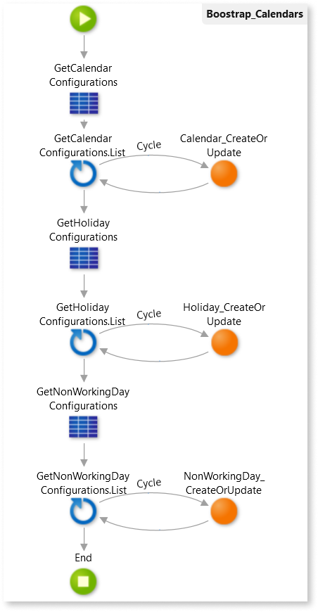

# Defining working schedules with calendars

In the Case Management framework, you can use calendars to calculate service level agreement (SLA) due dates while taking into account the working schedule of your end users. Your app can have more than one calendar, and each calendar can include the following information:

Working hours
:   Set the start and end hours of the work day.

Non-working days
:   Set weekdays when end users don't work. For example if an end user team works from Monday to Friday, then Saturday and Sunday are non-working days.

Holidays
:   Set days of the year where end users don't work. Holidays can be recurrent, like Christmas which happens in the same day every year, or non-recurrent.

You can use a calendars in the following ways:

* Associate a calendar with a case definition by using the calendar identifier, **CalendarId**, with the **Case_AssociateProcess** action.

* Associate a calendar with a case management group, by using the calendar identifier, **CalendarId**, with the **GroupExtended_CreateOrUpdate** action.

* Use the calendar while calculating the due date of an activity by using the calendar identifier, **CalendarId**, with the **Activity_CalculateAndSetDueDate** action.

Check the following sections to learn how to prepare your case management app to use calendars, how to create calendars, and how to then use calendars in your app.

## Set up calendars

Before using calendars in your case management app you must change the configuration module by adding static entities to hold the configurations of calendars, holidays, and non-working days, and then creating a timer to bootstrap these configurations.

To set up your case management app to work with calendars follow these steps:

1. In **&lt;app-name&gt;_Configuration** module, open  **Manage Dependencies**, and add the following dependencies:

    * **Timezone** and **Weekday** static entities from the **CM_WorkingDays_CS** producer.

    * **Calendar_CreateOrUpdate**action from the **CaseConfigurations_API** producer.

1. In the **Data** tab, create a static entity, and name it `CalendarConfigurations`.

1. Ensure the **CalendarConfigurations** static entity has the following attributes:

    * `Id`, **Identifier** with **Text** data type and length of `36`.
    * `Name`, with **Text** data type and length of `50`.
    * `Description`, with **Text** data type and length of `200`.
    * `WorkingHourStart`, with **Time** data type.
    * `WorkingHourEnd`, with **Time** data type.
    * `TimezoneId`, with **Timezone Identifier** data type.
    * `IsActive`, with **Boolean** data type.

1. Create a static entity, and name it `HolidayConfigurations`.

1. Ensure the **HolidayConfigurations** static entity has the following attributes:

    * `Id`, **Identifier** with **Text** data type and length of `36`.
    * `CalendarId`, with **CalendarConfigurations Identifier**.
    * `Name`, with **Text** data type and length of `50`.
    * `Date`, with **Date** data type.
    * `IsRecurrent`, with **Boolean** data type.
    * `IsActive`, with **Boolean** data type.

1. Create a static entity, and name it `NonWorkingDayConfigurations`.

1. Ensure the **NonWorkingDayConfigurations** static entity has the following attributes:

    * `Id`, **Identifier** with **Text** data type and length of `36`.
    * `CalendarId`, with **CalendarConfigurations Identifier**.
    * `WeekDayId`, with **WeekDay Identifier**.
    * `IsActive`, with **Boolean** data type.

1. In the **Processes** tab, add a new timer and name it `Boostrap_Calendars`.

1. Set the **Schedule** property of the timer as **When Published**.

1. In the **Action** property of the new timer, select **New Server Action**.

1. In the new action, drag the **CalendarConfigurations** static entity between the **Start** and **End** to create an aggregate that fetches the CalendarConfigurations records.

1. After the aggregate created in the previous steps, add a **For Each**.

1. Set the **Record List** of the **For Each** as `GetCalendarConfigurations.List`.

1. Add a **Calendar_CreateOrUpdate** action next to the **For Each**.

1. Connect the **For Each** to the **Calendar_CreateOrUpdate**, and then connect the **Calendar_CreateOrUpdate** to the **For Each**.

1. Set the **CalendarRec** of the **Calendar_CreateOrUpdate** as `GetCalendarConfigurations.List.Current.CalendarConfigurations`.

1. Ensure the **CalendarRec** attributes have the following mapping:

    * **Id** = `TextToIdentifier(Id)`
    * **Name** = `Name`
    * **Description** = `Description`
    * **WorkingHourStart** = `WorkingHourStart`
    * **WorkingHourEnd** = `WorkingHourEnd`
    * **TimezoneId** = `TimezoneId`
    * **IsActive** = `IsActive`

1. After the **For Each**, drag the **HolidayConfigurations** static entity to create an aggregate that fetches the HolidayConfigurations records.

1. After the aggregate created in the previous steps, add a **For Each**.

1. Set the **Record List** of the **For Each** as `GetCHolidayConfigurations.List`.

1. Add a **Holiday_CreateOrUpdate** action next to the **For Each**.

1. Connect the **For Each** to the **Holiday_CreateOrUpdate**, and then connect the **Holiday_CreateOrUpdate** to the **For Each**.

1. Set the **CalendarHolidayRec** of the **Holiday_CreateOrUpdate** as `GetHolidayConfigurations.List.Current.HolidayConfigurations`.

1. Ensure the **CalendarHolidayRec** attributes have the following mapping:

    * **Id** = `TextToIdentifier(Id)`
    * **CalendarId** = `TextToIdentifier(CalendarId)`
    * **Name** = `Name`
    * **Date** = `Date`
    * **IsRecurrent** = `IsRecurrent`
    * **IsActive** = `IsActive`

1. After the **For Each**, drag the **NonWorkingDayConfigurations** static entity to create an aggregate that fetches the NonWorkingDayConfigurations records.

1. After the aggregate created in the previous steps, add a **For Each**.

1. Set the **Record List** of the **For Each** as `GetNonWorkingDayConfigurations.List`.

1. Add a **NonWorkingDay_CreateOrUpdate** action next to the **For Each**.

1. Connect the **For Each** to the **NonWorkingDay_CreateOrUpdate**, and then connect the **NonWorkingDay_CreateOrUpdate** to the **For Each**.

    

1. Set the **CalendarNonWorkingDayRec** of the **NonWorkingDay_CreateOrUpdate** as `GetNonWorkingDayConfigurations.List.Current.NonWorkingDayConfigurations`.

1. Ensure the **CalendarNonWorkingDayRec** attributes have the following mapping:

    * **Id** = `TextToIdentifier(Id)`
    * **CalendarId** = `TextToIdentifier(CalendarId)`
    * **WeekDayId** = `WeekDayId`
    * **IsActive** = `IsActive`

1. Publish the module by selecting **1-Click Publish**.

After these steps you can add calendars to your app.

## Add a calendar

To add a calendar to your case management app, make sure you have [set up your app to work with calendars](#set-up-calendars) and then follow these steps:

1. In **&lt;app-name&gt;_Configuration** module, add a record to **CalendarConfigurations**. Each record of this static entity represents a calendar.

1. Generate a GUID and paste that GUID into the value field of the **Id** attribute of the record.

    

    A Globally Unique IDentifier, or GUID, is used as a unique identifier to ensure integrity across environments.  
    You can use an online GUID generator to create a GUID for each record.

    Check the [RFC 4122](https://www.ietf.org/rfc/rfc4122.txt) for more information on GUIDs.

    

1. Set the remaining attributes of the record.   
    For example, to set up a calendar for a Portuguese office with working hours from 9 AM to 6 PM set the attributes as follows:

    * Set **Name** as `"Portugal2020"`.
    * Set **Description** as `"2020 calendar for the working hours of the Portuguese office."`.
    * Set **Working Hour Start** as `#09:00:00#`.
    * Set **Working Hour End** as `#18:00:00#`.
    * Set **TimezoneId** as `Entities.Timezone.UTC_00_00_Dublin_Edinburgh_Lisbon_London`.
    * Set **IsActive** as **True**.

1. Publish the module by selecting **1-Click Publish**.

After these steps the **Boostrap_Calendars** timer runs, and creates the new calendar.

## Add holidays to a calendar

To add holidays to a calendar, make sure you [added a calendar to your app](#add-a-calendar), and then follow these steps: 

1. In **&lt;app-name&gt;_Configuration** module, add a record to **HolidayConfigurations**. Each record of this static entity represents a holiday.

1. Generate a GUID and paste that GUID into the value field of the **Id** attribute of the record.

    

    A Globally Unique IDentifier, or GUID, is used as a unique identifier to ensure integrity across environments.  
    You can use an online GUID generator to create a GUID for each record.

    Check the [RFC 4122](https://www.ietf.org/rfc/rfc4122.txt) for more information on GUIDs.

    

1. Set the remaining attributes of the record.  
    For example, to set up a recurrent holiday for Christmas day and associate it with a previously created calendar, set the attributes as follows:

    * Set **CalendarId** as the **Id** of the calendar.
    * Set **Name** as `"Christmas"`.
    * Set **Date** as `#2020-12-25#`.
    * Set **IsRecurrent** as **True**.
    * Set **IsActive** as **True**.

1. Repeat the previous steps for each holiday you want to add.

1. Publish the module by selecting **1-Click Publish**.

After these steps the **Boostrap_Calendars** timer runs, and creates the new holidays for the calendar.

## Add non-working days to a calendar

To add non-working days to a calendar, make sure you [added a calendar to your app](#add-a-calendar), and then follow these steps:

1. In **&lt;app-name&gt;_Configuration** module, add a record to **NonWorkingDayConfigurations**. Each record of this static entity represents a non-working day.

1. Generate a GUID and paste that GUID into the value field of the **Id** attribute of the record.

    

    A Globally Unique IDentifier, or GUID, is used as a unique identifier to ensure integrity across environments.  
    You can use an online GUID generator to create a GUID for each record.

    Check the [RFC 4122](https://www.ietf.org/rfc/rfc4122.txt) for more information on GUIDs.

    

1. Set the remaining attributes of the record.  
    For example, to set up Sunday as a non-working day and associate it with a previously created calendar, set the attributes as follows:

    * Set **CalendarId** as the **Id** of the calendar.
    * Set **WeekDayId** as `Entities.WeekDay.Sunday`.
    * Set **IsActive** as **True**.

1. Repeat the previous steps for each non-working day you want to add.

1. Publish the module by selecting **1-Click Publish**.

After these steps the **Boostrap_Calendars** timer runs, and creates the new non-working days for the calendar.

