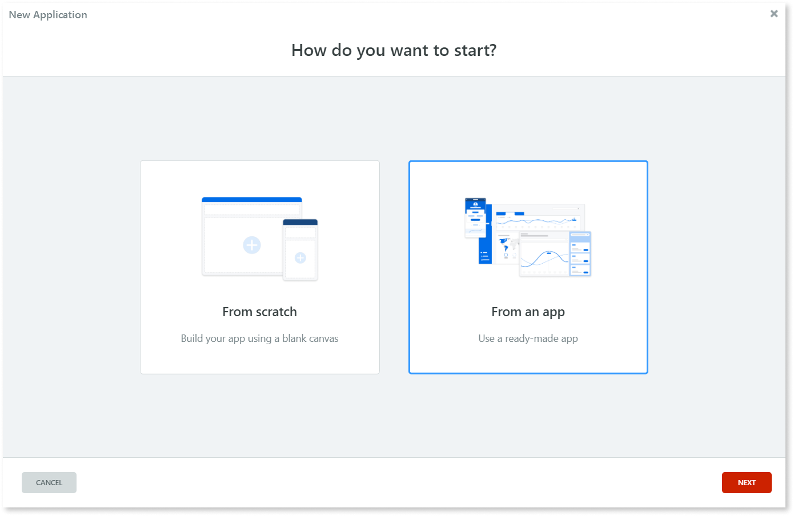
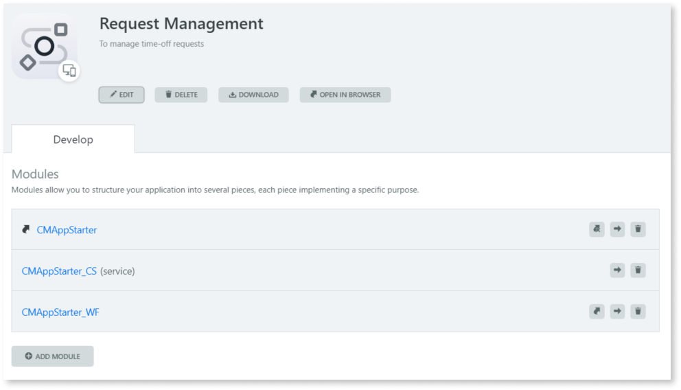
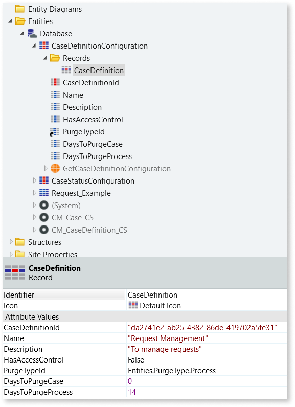
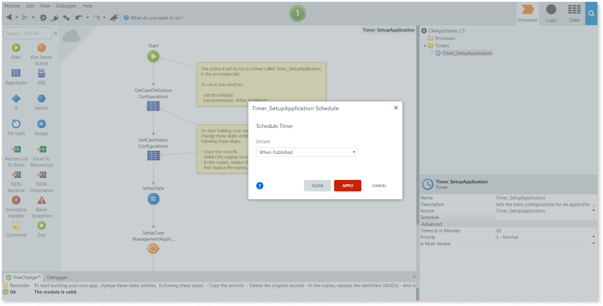
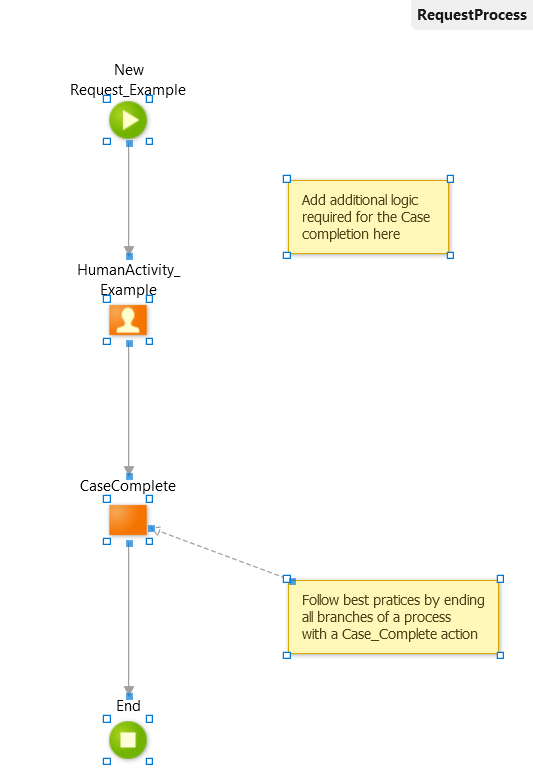

# Creating a case management app with App Starter

## Overview

To start developing your Case Management (CM) app using the [Case Management framework (CMf)](https://www.outsystems.com/forge/Component_Overview.aspx?ProjectId=9179), you can now use the Case Management App Starter. It provides you with all the foundations including the modules, the core entities, and setup actions, enabling you to quickly start building your Case Management app.

The App Starter contains the following modules:

* The user interface (UI) module which contains the screens of your app needed for end users to interact with the cases.
* A core services (CS) module which contains the case business entity, the case definition, and the case status definitions for a case. Each core services module can only include one case definition.
* The workflow (WF) module which contains the Business Process Technology (BPT) processes associated with case definitions.

### Process

Firstly you need to install the Sample App in Service Studio and then configure and adjust each of the three modules in preparation for building your own CM app. 

### Prerequisites

Before you proceed, make sure that:

* Your environment uses OutSystems Platform Server 11 Release Oct.2019 or later.
* You have [the latest version of the Case Management framework](https://www.outsystems.com/forge/component-overview/9179/case-management-framework) installed in your environment.

## Installing the CM App Starter

1. In Service Studio, create a **New Application**.

1. Start **from an app** and click **Next**.

1. Select **Case Management App Starter** from the list and click **Install**.

1. With the App Starter successfully installed, click on **Customize App**.

1. Click **EDIT** and adjust the name of your app to your preference. For the purposes of this article this will be referred to as `<app-name>`.

1. If desired, you can also change or delete the description and icon for the app.

## Reconfiguring the Core Services (CS) module

The core services module is where the core business entities and the corresponding public actions are defined and held. It is where the configurations are made for the case definition that you need while developing your app with the Case Management framework. 

You now need to make some minor changes to the CS Module.

### CaseDefinitionConfiguration

The **CaseDefinitionConfiguration** static entity holds the case definition for the current application, with additional options regarding access control and purging. Let’s configure it to position and identify the new app in the Case Management framework:

1. Open the **CMAppStarter_CS** module.

1. Rename the module to `<business-entity-name>_CS`.

    

    Replace &lt;business-entity-name&gt; with a name that represents the business entity that will be associated with the case definition of your app. For example, if you are creating a support ticketing app, use `Ticket` as the &lt;case-entity-name&gt; because your cases represent support tickets.

    

1. Go to the **Data** tab and in the **CaseDefinitionConfiguration** static entity, copy the **CaseDefinition_ExampleToCopyAndDelete** Record.

1. Right-click the **Records** folder and paste the record.

1. Delete the original record and rename the pasted record `CaseDefinition`.

1. Now you need to adjust the **Case_Initialize** server action to ensure the names align. Go to the **RequestExample_Create** flow. In the **Case_Initialize** server action, change the **CaseDefinitionId** to `TextToIdentifier(Entities.CaseDefinitionConfiguration.CaseDefinition)`.

1. Generate a GUID and paste it into the value field of the CaseDefinitionId attribute.

    

    A Globally Unique IDentifier  (GUID) is used as a unique identifier to ensure integrity across environments.
    You can use an online GUID generator to create one for each record.

    Check the [RFC 4122](https://www.ietf.org/rfc/rfc4122.txt) for more information on GUIDs and their format.

    

1. Change the **Name** attribute to your `<business-entity-name>`.

1. Change the **Description** attribute to a summary of your case’s context.

1. Define any other attribute values to your preference.

### CaseStatusConfiguration

Next, let’s customize the **CaseStatusConfiguration** static entity to define the different statuses the case can have.

1. Still in the Data tab of the **CMAppStarter_CS** module, open the CaseDefinitionConfiguration static entity.

1. Open the **Records** folder and copy the **Closed_ExampleToCopyAndDelete** record.

1. Right-click the **Records** folder and paste the record inside. Rename the record to `Closed`.

1. Generate a GUID and paste it into the value field of the **CaseStatusId** attribute.

1. Delete the original **Closed_ExampleToCopyAndDelete** record.

1. Copy the **Open_ExampleToCopyAndDelete** record.

1. Right-click the **Records** folder and paste the record inside. Rename the record to `Open`.

1. Generate a GUID and paste it into the value field of the **CaseStatusId** attribute.

1. Delete the original **Open_ExampleToCopyAndDelete** record.

1. In the Closed record set the IsInitial attribute to True and the **IsInitial** attribute on the **Open** to `False`.

    

    You must have at least one, and no more than one record with the IsInitial attribute set as True. This is the status a case has when it’s created.

    Check the RFC 4122 for more information on GUIDs and their format.

    

1. Click **1-Click Publish** to publish the module.

You can use the **Request_Example** entity included as your business entity and reconfigure it to your preference.

### Timer_SetupApplication

The Setup server action has everything ready to bootstrap the app to CMf. This action is called on the **Timer_SetupApplication**.

1. Go to the Logic tab and double click **Timer_SetupApplication**.

1. Go to the **Processes** tab, open the **Timers** folder and select the **Timer_SetupApplication** timer.

1. Double-click the **Schedule** attribute and select when the timer should occur. We recommend this is set to `When Published`.

    

    Note: Selecting this option means the CMf application setup automatically runs when the module is published.

    

1. Click **1-Click Publish** to publish the module.

## Reconfiguring the Workflow (WF) module

The WF module has the **TicketProcess_Example** process defined, ready for use as a foundation for your case’s workflow process.

You now need to reconfigure some of the module’s dependencies, names, and also fix any errors from deleted status records and changes made in the CS module:

1. Open the **CMAppStarter_WF** module.

1. Rename the module to `<business-entity-name>_WF`.

1. Click on **Manage Dependencies**.

1. Refresh the modified elements by clicking **REFRESH ALL**, followed by **APPLY**.

1. Fix any errors.

1. Click **1-Click Publish** to publish the module.

### Customizing the case workflow

You can now start customizing the WF module in preparation for your CM app and building processes for case defnitions using [BPT](../../processes/intro.md). Note that there is a **HumanActivity_Example** activity that you can adapt to your preference including its name, description and if needed, setting instructions.

The CaseComplete action calls on the Case_Complete action from CMf. After you have finished customizing the module, ensure the CaseComplete action is the final step in the flow.

## Reconfiguring the User Interface (UI) module

You now need to reconfigure some of the UI module’s names and also fix any errors from deleted status records and changes made in the CS module:

1. Open the **CMAppStarter_UI** module.

1. Rename the module to `<app-name>_UI`.

1. Click on **Manage Dependencies**.

1. Refresh the modified elements by clicking **REFRESH ALL**, followed by **APPLY**.

1. Fix the errors:

    * Rename **Case_GetActivities** to `TextToIdentifier(Entities.CaseDefinitionConfiguration.CaseDefinition)`.

    * Change Case_GetCases to `TextToIdentifier(Entities.CaseDefinitionConfiguration.CaseDefinition)`.

1. Click **1-Click Publish** to publish the module.

You can now customize the module by deleting the included instructions or adding columns to the tables for example.

## Next steps

Now that you’ve completed the steps in this article you are ready to continue developing your case management app. The typical next steps include:

* In the core services module, define all the [cases status](case-state.md) for the case definition.

* In the UI module, adjust the example screens so that your end users can interact with cases and check [list of activities associated with their cases](list-activities.md).

* Add other [case management features provided by Case Management framework](intro.md#built-in-functionality) to your app.
