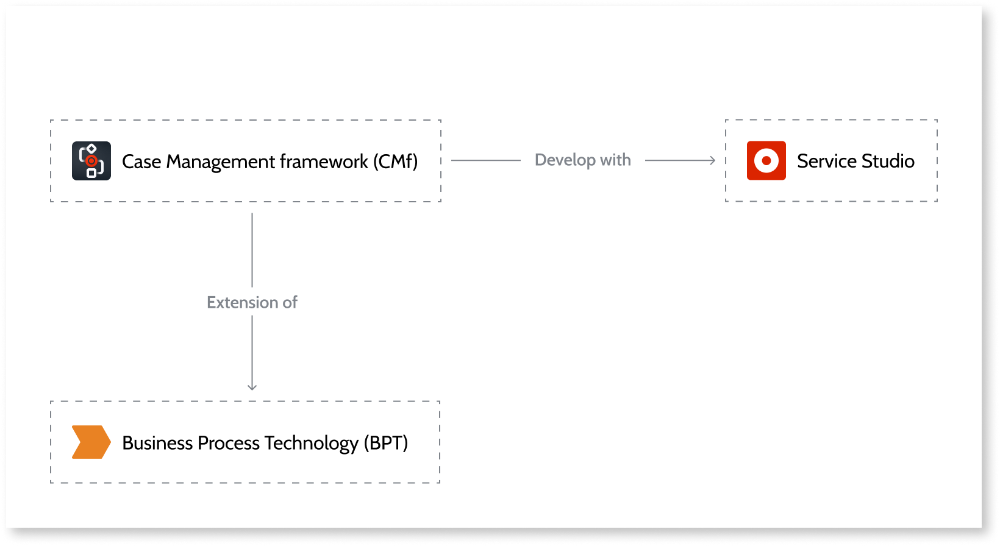
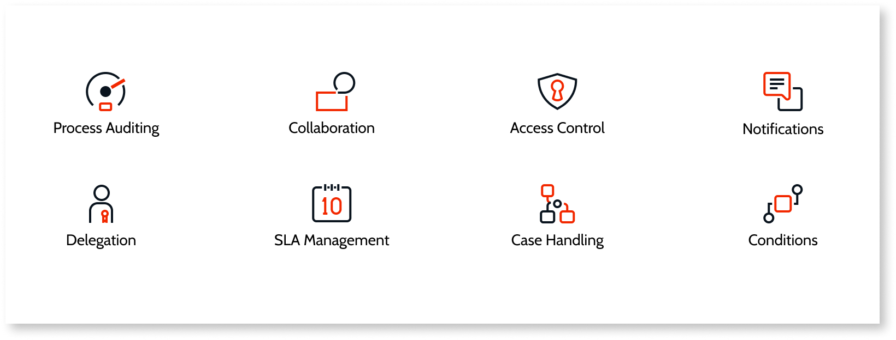

# Use Case Management framework

The Case Management framework (CMf) enables you to build Case Management applications faster, more effectively, and with better outcomes. The Case Management framework enhances [Business Process Technology (BPT)](../../processes/intro.md) and provides the critical capabilities and pre-built workflow functions needed to implement custom-fit business process and case management solutions, faster and easier. This allows you to follow the pace and demands of the business using apps created fit for purpose and ready for operational proficiency, and that continue to change and evolve to new trends and needs.

CMf is an extension of Business Process Technology (BPT) and is developed using OutSystems Service Studio. With CMf you are able to leverage a common set of features that make the development of case management apps simply, and more efficiently.

## Prerequisite

To use the Case Management framework, your environment must use Platform Server 11 Release Oct.2019 or later.

## CMf features

The Case Management framework uses cases as an extension of processes and activities, and provides actions and entities that let you add the following capabilities to your case management apps.

**Process Auditing**

Keep track of process transactions during the entire lifecycle of a case.

**Collaboration**

Improved collaboration by allowing you to take over, delegate, release, block, escalate, or reschedule tasks.

**Access Control**

[Keep track and control, access to all case instances](access-control/intro-ac.md) that are or were once associated with a certain end user or group.

**Notifications**

End-users are kept active and alerted to required actions by receiving Email notifications based on CMf templates. Create a set of CMf email templates associated with case types to keep end-users active and alerted to required actions.

**Delegation**

End-users can [manage delegation](delegate.md) and absence periods. Include services and logic bundled for activities to have delegations into consideration.

**Service-Level Agreement (SLA) Management**

[Configure specific SLA](sla.md) for processes and activities with calendars.

**Case Handling**

Cases can be viewed on a timeline, linked, and it is also possible to manage sub-cases.

**Conditions**

Define different types of rules to be used in case and process decisions, helping you ensure a process evolves as expected. Includes four types of rules: logical (return yes or no), group (return a specific group), user (return a user), and status (return one or more status).

### Other CMf features

**Case Status Machine**

[Create a status machine](case-state-machine.md), [define a set of case statuses](case-state.md) and what transitions can occur between statuses.

**Task Operations**

Use a set of case activities operations. Allows you to perform takeover, pick up, release, block, unblock and add comments to activities.

**Case Events**

Associate events to a case, for example, trigger a notification for open cases one day before breaching the case SLA.

## CMf application examples

CMf enables you to create a number of applications that deal with different types of business needs and scenarios. These can be categorized into Simple, Medium, and Complex.

You can check the CMf capabilities on medium complexity apps, using the service web app [OutTracker here](https://www.outsystems.com/forge/component-overview/9951/outtracker).

**Simple**

Typically these are internal productivity apps dealing with business processes usually triggered by a form submission, with a mix of simple human decision making and simple business rules. The typical process is the assignment and reassignment of a task or activity, the approval or rejection of a specific task, or the delegation and task escalation. These apps negate the requirement to have approvals and other day-to-day tasks normally addressed using email.

App examples:

* Expense Approvals
* Vacation approvals
* Employee on-boarding
* Employee performance

**Medium**

Typically these are operational, multi-functional apps geared towards helping maintain a great customer service supported by several channels such as web portals, mobile apps, and customer interactions over chat. The capability to integrate with external and several services and systems of records in order to consolidate and aggregate information to provide a better service.

App examples:

* Support cases
* Inspections
* Supplier management
* Contract management

**Complex**

Typically the complex scenarios are the mission critical ones, both business and customer driven. They are usually long lived, like for claim management or the full life of a loan for example. They have the ability to quickly integrate with many different and complex core systems.
It’s a claim handling a credit request application that demands an engaging digital experience, a deep UX orchestration is a key core capability.

App examples:

* Claims handling
* Policy underwriting
* Shipping and distribution
* Fraud detection and management

## Using the Case Management framework

To start creating a case management app using the Case Management framework, follow the [create a Case Management framework app](bootstrap-app.md) guide.
