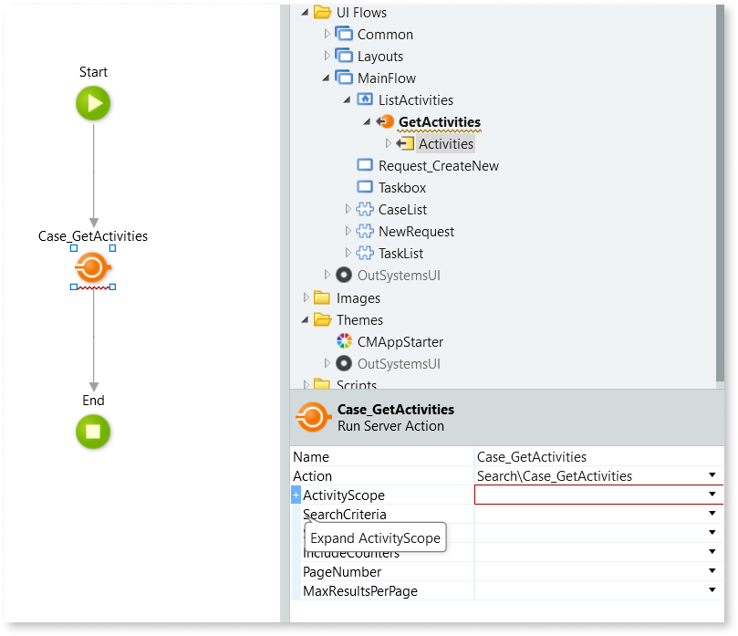
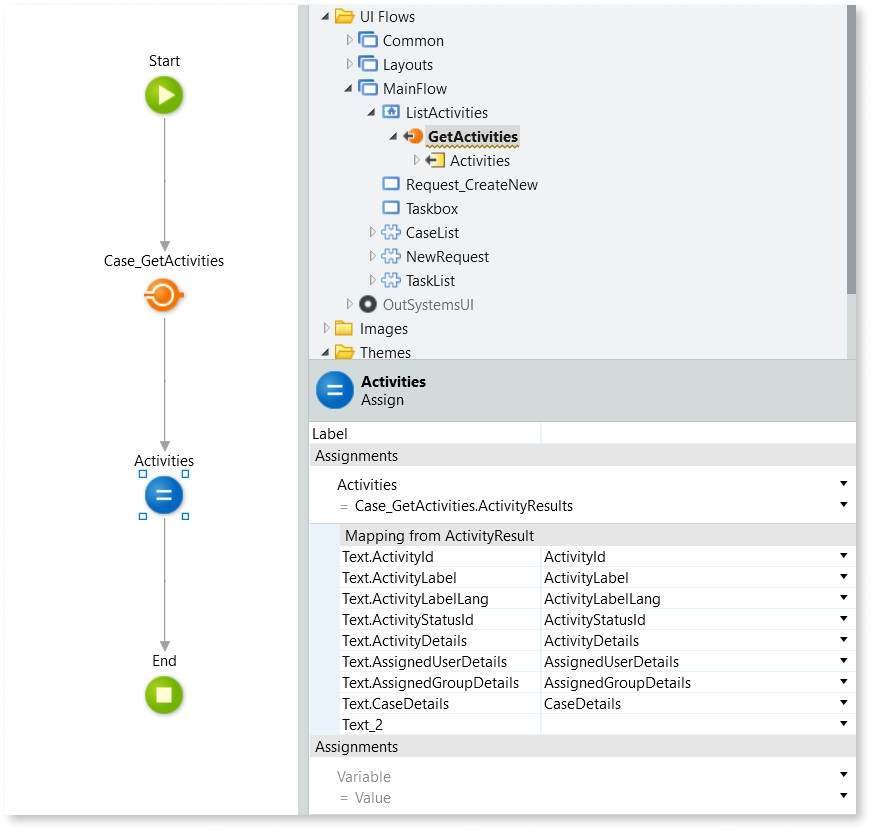
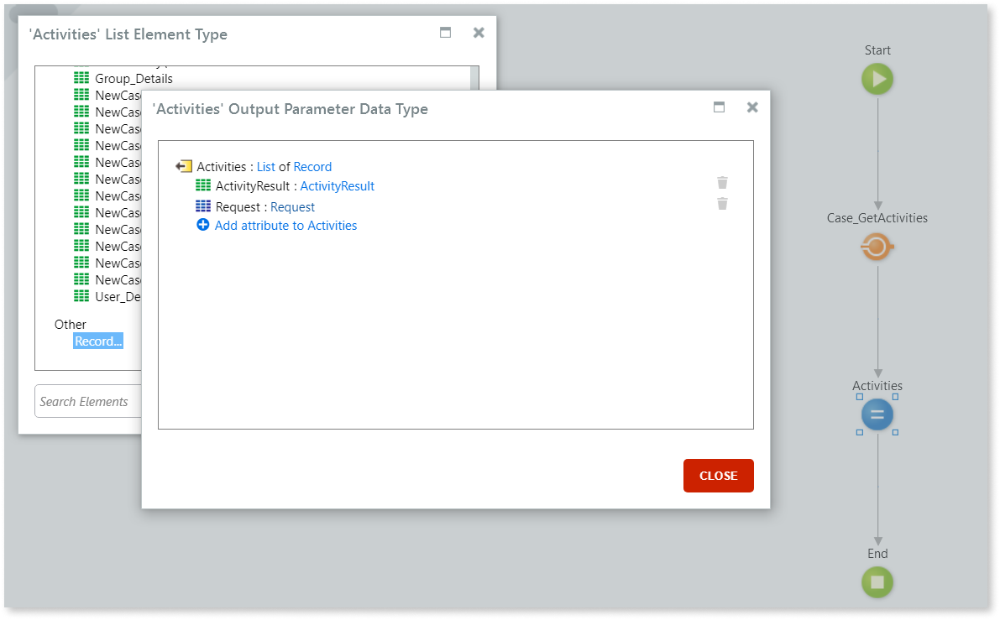
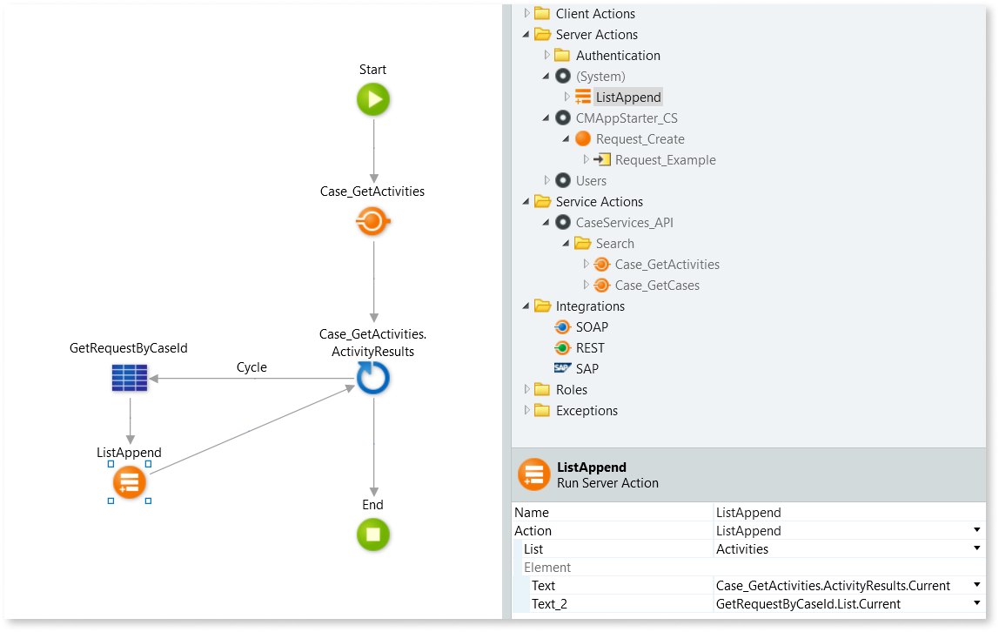

# How to get list of activities assigned to a case worker

Learn how to get a list of activities assigned to a case worker logged in to your app.
You can then use this list as the data source of a Table or List widget to enable case workers to see a list of the cases with activities currently assigned to them.

## Get list of activities assigned to logged user { #basic-list}

Before following the steps, make sure you have created the UI module of your app, named **&lt;app-name&gt;_UI**.

To get a list of activities assigned to a case worker logged in to your app, follow these steps:

1. In **&lt;app-name&gt;_UI**, open **Manage Dependencies**, and add the following dependencies:

    * From the **CaseServices_API** producer, add the **Case_GetActivities** action.
    * From the **CM_CaseServices_BL** producer, add the **ActivityAssigneeType** static entity.
    * From the **CM_CaseServices_BL** producer, add the **ActivityAssignmentStatus** static entity.
    * From the **CM_CaseServices_BL** producer, add the **ActivityProgressStatus** static entity.

1. In the screen where you want to display the list of activities, add a **Data Action**.

1. In the data action flow, add a **Case_GetActivities** service action.

1. In the properties pane of the **Case_GetActivities** action, click on **Expand ActivityScope**.

1. To get activities that the logged in user can work on, set **ActivityAssigneeType** as `Entities.ActivityAssigneeType.MyActivities`.

    

    This returns the following activities:

    * Activities assigned to the logged in user.
    * Activities assigned to a group the logged in user belongs to.
    * Activities that aren't assigned to a user nor to a group.

    

1. To get activities assigned to the user, set **ActivityAssignmentStatus** as `Entities.ActivityAssignmentStatus.Assigned`.

1. To get activities that aren't done yet, set **ActivityProgressStatus** as `Entities.ActivityProgressStatus.Active`

1. Select the output parameter, and in the property pane set its **Data Type** to **ActivityResult list** by selecting **List...** > **NewCaseSearch\ActivityResult**.

1. In the flow, add an **Assign** after the **Case_GetActivities** action and name it to your preference.

1. In the **Assign**, add an assignment that sets the output parameter as  `Case_GetActivities.ActivityResults`.

After these steps, use the output parameter as the data source of a **Table** or **List** to show the information to the case workers.

## Add case information to the list of activities

You may need to show extra information about the case in the activities list, for example the subject line of a support ticket.

To add case information that's stored in the case business entity, make sure you have created a [Data Action to get a list of activities](#basic-list), and then follow these steps:

1. In **&lt;app-name&gt;_UI**, open **Manage Dependencies**, and from the **&lt;business-entity&gt;_CS** producer, add the case business entity as a dependency.

1. In the flow of the data action used to fetch the list of activities, set the output parameter's **Data Type** as a **List** of **Records** composed by the **ActivityResult** structure and the **&lt;business-entity&gt;** entity by doing the following:

    1. In the **Data Type** dropwdown of the output parameter, select **List..**.
    1. Select **Record..**.
    1. Select **Add attribute to &lt;output-name&gt;**, and add the following attributes:
        * `ActivityResult` with **NewCaseSearch\ActivityResult** structure data type.
        * `<business-entity>` with **&lt;business-entity&gt;** entity data type.
    
    

1. If you followed the [procedure to get list of activities assigned to logged user](#basic-list), delete the **Assign** from the flow.

    

    This action is good practice but note that it will generate errors. These will be resolved when the remainder of the procedure is completed.

    

1. In the flow, add a **For Each** after the **Case_GetActivities** service action.

1. Set the **Record List** of the **For Each** as `Case_GetActivities.ActivityResults`.

1. In the flow, add an **Aggregate** to fetch the data of the case business entity by dragging the **&lt;business-entity&gt;** entity next to the **For Each**.

1. Connect the **For Each** to the **Get&lt;business-entity&gt;** aggregate created in the previous step.

1. In the **Get&lt;business-entity&gt;** aggregate, add a **Filter**, and set it as `<business-entity>.CaseId = Case_GetActivities.ActivityResults.Current.CaseDetails.CaseId`, replacing &lt;business-entity&gt; by the name of your case business entity.

1. In the flow, add a **ListAppend** server action after the **Aggregate** created in step 6, and then connect the **Aggregate** to the **ListAppend** action.

1. In the properties of **ListAppend**, set **List** as the output parameter.

1. Select **Expand Element** (represented by the **+** next to **Element**), set **ActivityResult** as `Case_GetActivities.ActivityResults.Current`, and set **&lt;business-entity&gt;** as `Get<business-entity>.List.Current`, replacing &lt;business-entity&gt; by the name of your case business entity.

1. Connect the **ListAppend** action to the **For Each**.

After these steps, use the output parameter as the data source of a **Table** or **List** to show the information to the case workers.
