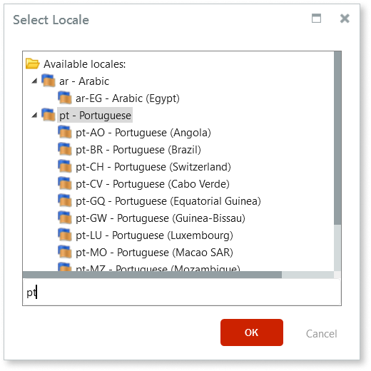
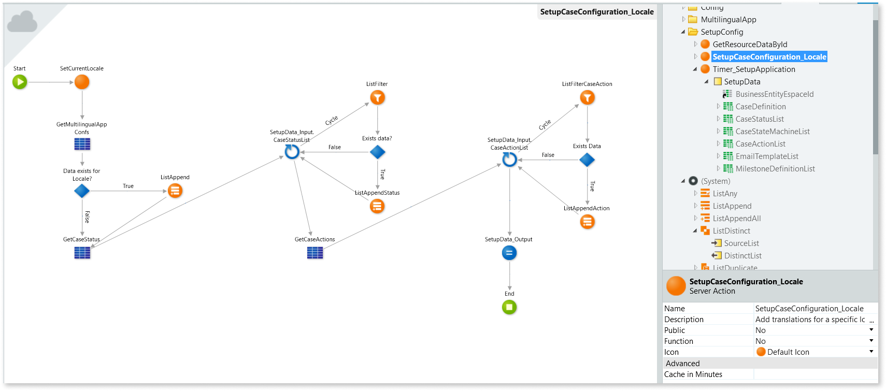
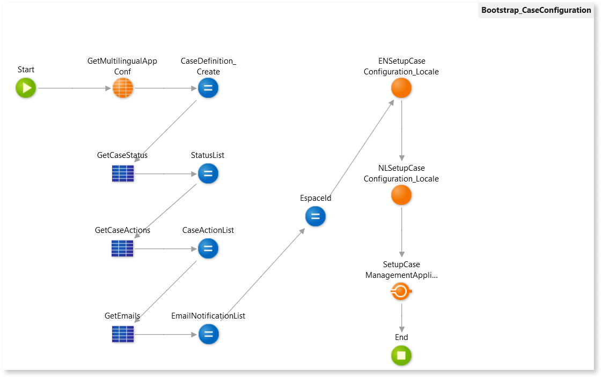

# Enable multilingual Case Management framework

This article describes how to set up and enable multilingual Case Management framework (CMf) so you can build Outsystems Case Management (CM) applications in different languages.

There are three main parts to the enablement, starting with translating the relevant static entities, setting up an action to enable translations and finally adapting the Bootstrap_CaseConfiguration timer action.

These instructions build on the setup you completed during the bootstrap of your [Case Management framework application](../creating-cmfapp.md) and use the static entities you created.

## Translating Case Management framework static entities

This section describes how to translate the CM static entities in your `<business-entity-name>_CS` module.

Translate only the attributes that need translation. The Id attributes, which are displayed in the translation window are text identifiers, and shouldn't be translated.

1.  Open the **&lt;business-entity&gt;\_CS** module.

1.  Go to the **Data** tab, right-click the **Multilingual Locales** folder and add your desired Locales. Select the most generic locale - for example, (pt) as opposed to (pt-PT).

    

    

    * CMf translations are not available for all locales. The supported languages are English (en), Portuguese (pt), Arabic (ar), Japanese (ja), Spanish (es) , Italian (it), Dutch (nl), and German (de).

    * Locale names use the RFC 1766 standard format.

    

1.  Carry out the translations. Translations can either be done manually or by exporting to Excel, both accessed by right-clicking the **Multilingual Locales** folder in the **Data** tab. For the UI and front-end translations, as well as the static entities listed below follow [this guide for Traditional Web apps](https://success.outsystems.com/Documentation/11/Developing_an_Application/Design_UI/Translating_the_app_UI/Multilingual_Web_Applications) and [this one for Reactive Web apps and Mobile apps](https://success.outsystems.com/Documentation/11/Developing_an_Application/Design_UI/Multilingual_Reactive_Web_and_Mobile_Apps). 

Below is a list of setup CMf static entities that you have to translate. Note that these names apply to the example described in this article.

* **CaseDefinitionConfiguration** - this is the [static entity created that holds the Case Definition for the current application](../creating-cmfapp.md).

* **CaseStatusConfiguration** - this is the [static entity that holds the different Case Status records and defines which one is the initial status](../creating-cmfapp.md).

* **Milestones** (if applicable) - this is a [static entity that hold milestone definitions or types](../milestone/how-enable-ms.md).

* **CaseActions** (if applicable) - this is a static entity that stores the Case Actions used while designing human activities.

## Enabling the translation to a given locale

In this procedure you create an action to enable the translation based on the specified locale. 

The image below shows a sample completed action flow. It includes the optional CaseActions static entity. In your action flow, ensure all connections for your Case Definition and Case Status static entities correspond with those shown:

1. In the **Logic** tab, create a server action and name it `SetupCaseConfiguration_Locale`.

1. In the **SetupCaseConfiguration_Locale** action, add the following parameters:

    * Input parameter named `Locale` with a **Data Type** of **Text** and **Is Mandatory** set to **Yes**.

    * Input parameter named `SetupData_Input`. In the **Data Type** property, select [**Setup\SetupData**](../ref/auto/CaseConfigurations_API.final.md#Service_SetupCaseManagementApplication). Set the **Is Mandatory** to **Yes**.

    * Output parameter named `SetupData_Output`. In the **Data Type** property, select [**Setup\SetupData**](../ref/auto/CaseConfigurations_API.final.md#Service_SetupCaseManagementApplication).

1. Select **Manage Dependencies**, and from the **System** producer, add the [**SetCurrentLocale** action](../../../../ref/apis/auto/system-actions.final.md#Client_SetCurrentLocale).

1. Add **SetCurrentLocale** action to the flow.

1. In the **SetCurrentLocale** properties, set the **Locale** property to the **Locale** input parameter.

1. Go to the **Data** tab and drag the **CaseDefinitionConfiguration** static entity into the flow. This is the static entity where the Case Definition was defined during the bootstrap of your CMf application. In the properties, set its **Max. Records** to `1`.

1. Drag an **If** to the flow and label it `Data exists for Locale`. Set its Condition to `not GetMultilingualAppConfs.List.Empty and Trim(GetMultilingualAppConfs.List.Current.MultilingualAppConf.Name) <> ""`

1. From the **Logic** tab, open **(System)** and drag the **ListAppend** server action into the flow. Set its **List** to `SetupData_Input.CaseDefinition.TranslationList`. Expand its Element and set the following:

    * **Locale** - `Locale`

    * **Name** - `GetMultilingualAppConfs.List.Current.MultilingualAppConf.Name`

    * **Description** - `SetupData_Input.CaseDefinition.Description`

1. From the **Data** tab, add the  **CaseStatusConfiguration** static entity to the flow and name it `GetCaseStatus`. This is the static entity where the Case Status was defined during the bootstrap of your CMf application. Set its **Max. Records** to `999`.

1. Drag a **For Each** to the flow and set its **Record List** to `SetupData_Input.CaseStatusList`.

1. From the **Logic** tab add a **ListFilter**. Set its properties to:

    * **SourceList** - `GetCaseStatus.List`

    * **Condition** - `TextToIdentifier(CaseStatusId)`

1. Connect the **For Each** to the **ListFilter**.

1. Drag an **If** to the flow and name it `Data Exists?`. Set its **Condition** to `not ListFilter.FilteredList.Empty and Trim(ListFilter.FilteredList.Current.MultilingualAppCaseStatus.Label) <> ""`

1. Connect the **ListFilter** to the **If**.

1. From the **Logic** tab, add a **ListAppend** and connect the **If** to it.

1. Set the **ListAppend List** to `SetupData_Input.CaseStatusList.Current.TranslationList` and expand the  Element to set the following:
    * **Locale** - `Locale`

    * **Name** - `ListFilter.FilteredList.Current.MultilingualAppCaseStatus.Label`

    * **Alias** - `ListFilter.FilteredList.Current.MultilingualAppCaseStatus.Label`

1. Connect the **ListAppend** to the **For Each**.

1. **Optional:** You can, optionally, add the **CaseActions** static entity to the flow. To do this, follow the same steps 9-17 as for the **Case Status** above.  

1. Drag an **Assign** to the flow. Add the Assignment **SetupData_Output = SetupData\_Input**. This assigns the output parameter called **SetupData\_Output** as the input data that was received previously.

1. Ensure all connections are made as shown in the image. 

This action should be called in the timer as many times as the amount of languages that you want to add, further explained in the following section.

## Adapting the Bootstrap Timer action

On the main **Bootstrap_CaseConfiguration** timer action, call the new action based on the locales we added in the data tab and the ones we want to translate.

1. Add the server action **SetupCaseConfiguration_Locale** for all the desired locales.
In our example we created two actions, one for English (en) and another for Dutch (NL). We named them "ENSetupCaseConfiguration_Locale" and "NLSetupCaseConfiguration_Locale".

1. You now need to set the input of your actions to the output from the previous action:

    * For the **ENSetupCaseConfiguration_Locale**, add the Action parameters:

        * **Locale** - `"en"`

        * **SetupData_Input** - `SetupData`

    * For the **NLSetupCaseConfiguration_Locale**, add the Action parameters:

        * **Locale** - `"nl"`

        * **SetupData_Input** - `ENSetupCaseConfiguration_Locale.SetupData_Output`

            **Note:** You can use the **SetupCaseConfiguration_Locale** action for each locale you need to set up. The **SetupData_Input** input parameter of each instance of this action should receive the output of the previous one.

1. For the **SetupCaseManagementApplication**, add the **SetupData**, `NLSetupCaseConfiguration_Locale.SetupData_Output`.

    **Note:** The **SetupData_Input** input parameter of the **SetupCaseManagementApplication** action should receive the output of the last one of these **SetupCaseConfiguration_Locale** actions.

1. Publish the module by clicking **1-Click Publish**.
