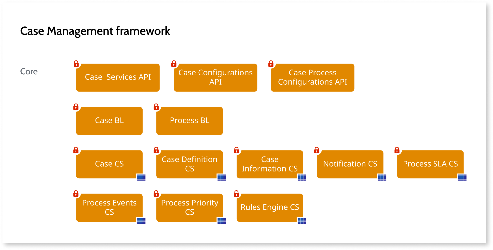

# Case Management framework reference

The Case Management framework accelerates the creation of custom-fit business process and case management apps, by extending the capabilities provided by [Business Process Technology (BPT)](../../../processes/intro.md).

## Framework architecture

The **API modules** include the actions that you can use in your applications:

* The [Case Services API](auto/CaseServices_API.final.md) includes actions used to interact with cases related to a Process.
* The [Case Configurations API](auto/CaseConfigurations_API.final.md) includes actions used to configure a case in your app.
* The [Case Process Configurations API](auto/CaseProcessConfigurations_API.final.md) includes actions used to configure the underlying BPT process associated with a case.

The Business Logic, or **BL**, **modules** include the process logic to support Case Management framework.

The Core Services, or **CS**, **modules** include entities to support case management concepts and functionality.

Your app should interact with Case Management framework mostly through the API modules.
