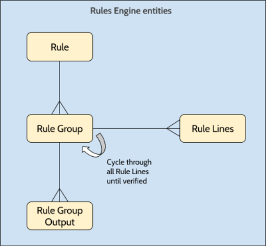

# Rules engine

Before trying to use the rules engine, it’s important to understand what parts make up the engine so you can get it up and running smoothly.

There are 4 parts to every rule:

Rule
:   This is the rule you want to evaluate. This rule contains the name and description of what is to be evaluated to make it easier for whoever is going to be using it to understand the purpose.

Rule Group
:   A rule is made up of several conditions (Rule Lines) which will be evaluated. These Rule Lines are grouped together in Rule Groups and will be evaluated together. A Rule will only be considered verified (considered true) if all Rule Lines of a Rule Group have been verified.

Rule Line
:   This is where the actual conditions that need to be verified are configured. It is at the rule level where you will define, for example, the values or fields you wish to compare and what type of comparison you want to be validated. If a Rule Line’s conditions have been validated, the Rule Line is considered verified, and the engine will evaluate the rest of the Rule Lines in the Rule Group to calculate the final result.

Rule Group Output
:   This is the output that will be delivered if all the Rule Lines in the Rule Group for a specific Rule have been met. This may be, for example, a simple “True or False” or something more complex such as a list of Ids, Statuses or Groups.

## Setting up your first rule

The setting up of a rule is creating a record of each of the necessary items that make up a Rule.

### Step 1 - The Rule

To implement a specific business rule, you will already have thought about what your rule will be validating, so you should already have what is needed to define the Rule record, namely the **Name** and **Description** and the type of rule result you expect.

You are able to define rules which will return one of the following types of results:

Logical
:   This will return either True or False depending on the conditions being met or not.

Custom
:   This will return a pre-defined text value if the Rule conditions are met.

Group, Status and User
:   This will return a list of one of the selected types of identifiers if the rule conditions are met. Note that for these specific items, there is currently no extra validations included in the API to guarantee that you are really returning those types of items. This means that the correct definition of data needs to be guaranteed by the developer.

You will also need to identify which **Case Definition Id** is related to this rule and you are set to go.
We will be covering the external rules and URL in a future document.

### Step 2 - Rule Group

This is the record which will group together the different conditions (Rule Lines) you want to verify for a specific Rule and will also identify the result that will be returned if all the conditions are met.

You will be able to give this group a description to better understand what this group may be validating for this specific rule.

You will also indicate the order by which you want to evaluate each of the group of rules, creating a hierarchy of rules from specific to generic if needed.

You can have multiple Rule Groups for a single Rule. In this case, what will happen is that each of the Rule Groups’ Rule Lines will be validated in order (The Rule Group’s order) and the first one to have all it’s Rule Lines validated, will return the Rule Output. If multiple Rule Groups would satisfy the conditions, only the first one’s results will be returned.

### Step 3 - Rule Line

The real magic happens in the Rule Lines. This is where you indicate the conditions that need to be met for a Rule Group to be validated and return the expected results.

A Rule Line is made up of:

* The Operator which can be one of the following values:
    * Equal
    * Not Equal
    * Greater
    * Greater or Equal
    * Less
    * Less Or Equal
    * Like
    * Not Like
    * In
    * Not In
    * Between
    * Exists
    * Not Exist
    * Is Empty
    * Is Not Empty

* The Left and Right attribute to which the operator will be applied. You have access to an array of different types of attributes to be able to use with the rules, from fields in your case to activities in your process. For a complete list of values, you may check the ExtraField static entity in the CM_CaseCommon_CS module.

All of the Rule Lines of a Rule Group are evaluated and if all of the lines are verified, then the system will return the Rule Group Output as the result of the validation.

If one of those lines is not validated, the system will move onto the next Rule Group until either all the lines of a group are valid or there are no more Rule Groups. In this case, the result will be empty.

### Step 4 - Rule Output Group

The result of a collection of Rule Lines being correctly validated. It can be either the return of a simple True or False, if a Logic Type rule is set, or something more complex such as a text or list of Statuses.

## Evaluating the Rule

The way to ask the engine to validate if one of the Rules is valid you can call one of the execution actions in the CaseServices_API in the Rules Engine folder and use the result in your Case Management Application’s code.
