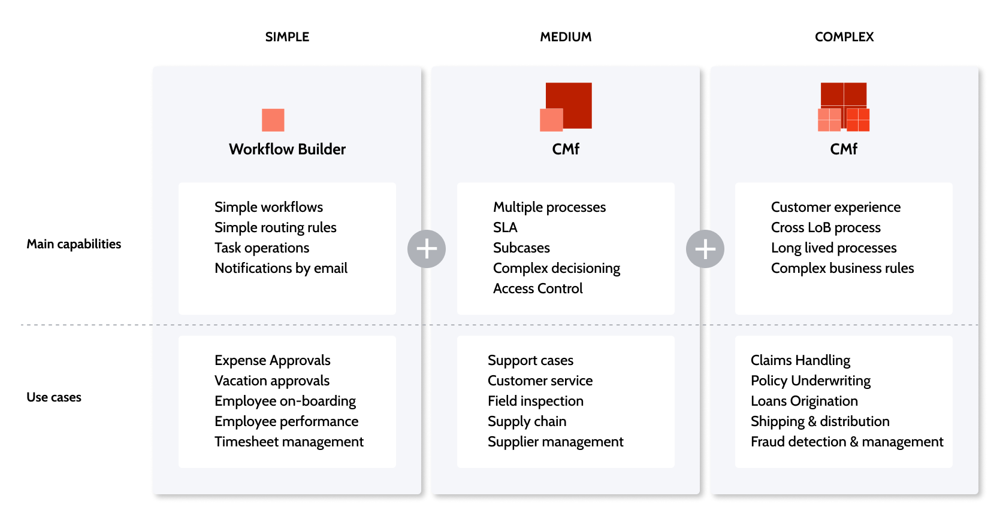

---
tags:
summary: Selecting when to build case management apps with the Case Management framework and when to build them with Workflow Builder.
---
# Create case management and workflow apps

Case Management Framework (CMf) allows you to leverage a common set of features helping you build powerful Case Management applications faster and easier in Service Studio. CMf also supports case management application development in the web application Workflow Builder (WB). WB enables anyone in the business to build their own apps in minutes by simply creating visual workflows, and without the need of coding.

Before building your case management app, you should consider how best to do so.

## Choosing between Workflow Builder and Case Management framework

Depending on who’s building the app, the complexity, and what type of case management app you want to develop, it's important to choose the right tool for building it. Simple applications can be built using CMf, however, for rapid development and by anyone in the business, we recommend using WB. For medium and complex apps, we recommend using CMf.

To read more about Workflow Builder go to the [Introduction to Workflow Builder article](workflow-builder/intro.md), or to start building CM apps with it, go to the [Using Workflow Builder procedure](workflow-builder/how-use.md).

To read more about the Case Management framework, go to the [Introduction to the Case Management framework article](case-management-framework/intro.md), or to start building CM apps with it, go to the [Creating a Case Management app procedure](case-management-framework/creating-cmfapp.md).
