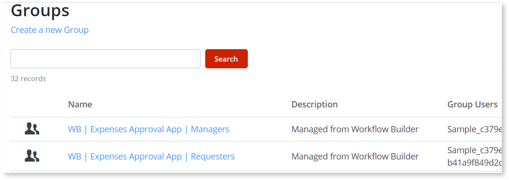

# App lifecycle management

Once you are comfortable with the generated app and want to evolve the app created in [Workflow Builder](http://workflowbuilder.outsystems.com/) to a production environment to make it available to your app end users, you have to contact your IT team.

Note: Always make sure that you involve the IT team so that the overall experience with the Workflow Builder is as frictionless as possible.

During the development process, you defined groups of users. As the next step, and before the app is available to your end users, you need to share with your IT team the name of the groups you added to the workflow process. Also, you need to identify which users are part of each group. Your app is only ready for your users to access it after your IT adds this information in the OutSystems Users tools.

## Users and user group management

To manage users and groups the IT user needs to have access to the  [OutSystems Users tool](../../security/end-user-manage/accessing-users.md), provided by OutSystems, that allows you to manage users.
To have access to this tool, OutSystems users need to have administrator privileges. Usually, your organization IT owns and manages this tool.

When publishing an app to your development environment, the Workflow Builder adds to the **OutSystems Users** the groups that your business users created in the apps they built in Workflow Builder.

 These groups have the following nomenclature when created by the Workflow Builder:
 
 The group requesters for each app have the following naming convention on the entity Group:

`[WB | App Name | Requesters]`

 Although the Workflow Builder user on the app sees the **Requesters** name, each group associated with a manual activity has the following naming convention on the entity Group:

`[WB | App Name | Group name]`
 
 For example, a group Managers of an **Expenses Approval** app would be called `WB | Expenses Approval | Managers`. The Workflow Builder user only sees the name **Managers** within the Workflow Builder app.

