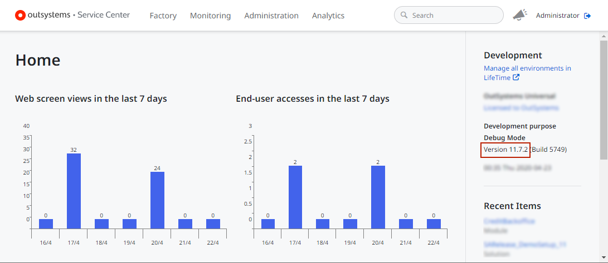

# How to check the Platform Server version installed in an Environment

To check which version of Platform Server an Environment is using, follow these steps:

1. Log in to the Service Center console of the Environment (`https://<environment>/ServiceCenter`), where `<environment>` is the address of the Environment.

1. Check the Platform Server **Version**.

    
