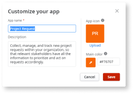
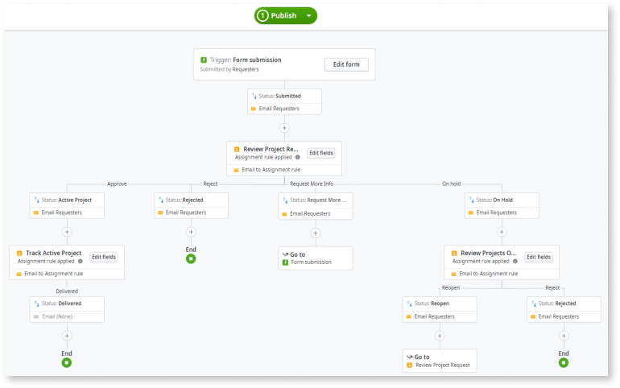

# Using the Project Request template

To start creating your app using the New Initiative Request template, follow the steps below.

1. On the initial screen, select the **Project Request** option. Workflow Builder then displays a preview about creating apps with the selected template.

1. Click on the **Select** button to proceed.

1. Enter the app's basic information:

    * **App name** — the name of the app you are developing.

    * **Description** — a brief description of the outcome of the app.

    * **App icon** — upload an icon for the app that you are about to create.

    * **Main color** — Pick up the color to apply to the main actions (buttons) and menus background on the generated app. If you upload an icon for your app, Workflow Builder selects the main color based on it, for example, your company brand color.

        

1. Click on the **Save** button. Workflow Builder then creates and displays the workflow of your app.

    

1. On the initial form at the top of the workflow, click on the **Edit form** button to edit the form fields of the template. You can rename, change the properties, add, or remove fields.

    For detailed information about editing forms, go to the [Set up form](how-create-app-from-scratch.md#set-up-form) section of the [Creating a Workflow Builder app from scratch](how-create-app-from-scratch.md) document.

1. On the **Status** rectangle below the form, set the status for the form to have when your users submit it. The default status is **Submitted**.

    For detailed information about setting the form's status, go to the [Set form status](how-create-app-from-scratch.md#set-form-status) section of the [Creating a Workflow Builder app from scratch](how-create-app-from-scratch.md) document.

1. Click on the **Review Project Request** manual task below on the workflow to create an assignment to the user or groups of users you want to assign the task, and to edit the manual task fields.

    For detailed information about assigning tasks, go to the [Manual tasks](how-create-app-from-scratch.md#manual-tasks) section of the [Creating a Workflow Builder app from scratch](how-create-app-from-scratch.md) document.

1. Click on the rectangles below the **Review Project Request** manual task on the workflow to edit the predefined statuses.

1. Click on the **Track Active Project** rectangle to edit the predefined conditions (rules), and its fields. You can edit each condition status by clicking on the rectangles.

    For detailed information about editing conditions go to the [Conditons](how-create-app-from-scratch.md#conditions) section of the [Creating a Workflow Builder app from scratch](how-create-app-from-scratch.md) document.

1. To edit the **Review Projects On Hold** manual task, and its fields, repeat step 6 of this procedure. You can always delete steps on the workflow if you don't need them.

1. To edit the **Go to** action related to the **Review Projects On Hold** status, click its rectangle, and select a new destinantion from the drop-down menu. All the available destinations belong to the workflow.

To learn how to publish and test your Workflow Builder app, go to [Publishing and testing your app](publish-test.md).