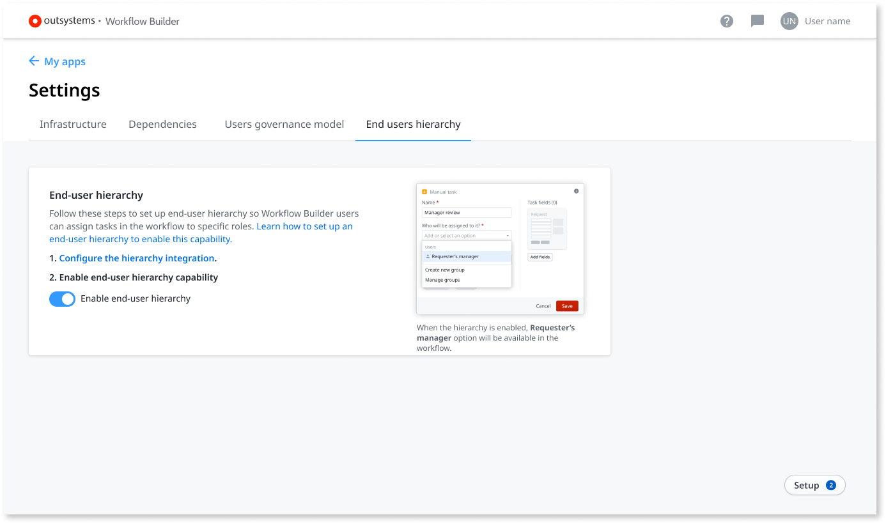

# How to set up the end users hierarchy

The goal of this document is to guide [IT users](../../../managing-the-applications-lifecycle/manage-it-teams/about-permission-levels.md) through the setup of the end users hierarchy in [Workflow Builder](http://workflowbuilder.outsystems.com/).

You need to be an [Workflow Builder administrator](how-works.md#workflow-builder-administrator) to set up the end users hierarchy.

When building the workflow app, the Workflow Builder users can assign tasks in the workflow to specific roles. For example, one employee acting as a requester, and a manager acting as an approver. They have to inform you about the roles they created so that you could create them hierarchically in [Users](../../security/end-user-manage/accessing-users.md).

Workflow Builder generates for each app a set of groups, roles, and sample users (in the development environment only) that you need to use for the user and access management. The roles and groups generated are associated with each application and have the following structure:

|Roles |
|------|
|&lt;**AppName**&gt;Requester |
|&lt;**AppName**&gt;Operator  |
|&lt;**AppName**&gt;Administrator|

|Groups |Roles in group |Sample users in group |
|-----------------------|-------------------|-----------|
|WB \| &lt;**AppName**&gt; \| Requesters | &lt;**AppName**&gt;Requester | Requester  |
|WB \| &lt;**AppName**&gt; \| &lt;**GroupName**&gt; | &lt;**AppName**&gt;Operator  | &lt;**GroupName**&gt;|
|WB \| &lt;**AppName**&gt; \| Administrator|&lt;**AppName**&gt;Administrator | Administrator|

The &lt;AppName&gt;Administrator role enables an end user to manage all the request and tasks of the app, by doing the following:

* See every request and associated task, and check for assignment warnings, for example a task is assigned to a group without any users.

* Reassign tasks to themself or to another user belonging to group assigned to the task.

Using the example of an **Expense Approval** app with validation with the procurement and finance groups, the roles, groups, and sample users created in the development environment are:

|Roles |
|------|
|**ExpenseApproval**Requester |
|**ExpenseApproval**Operator |
|**ExpenseApproval**Administrator |

|Groups                           |Roles in group             |Sample users in group |
|---------------------------------|---------------------------|------------|
|WB \| **Expense Approval** \| Requester            |**ExpenseApproval**Requester |Requester   |
|WB \| **Expense Approval** \| Procurement  |**ExpenseApproval**Operator  |Procurement |
|WB \| **Expense Approval** \| Finance      |**ExpenseApproval**Operator  |Finance     |
|WB \| **Expense Approval** \| Administrator | **ExpenseApproval**Administrator | Administrator

## Configuring the hierarchy integration

To configure the hierarchy integration you need to use the [Case_Configurations_API](../case-management-framework/ref/auto/CaseConfigurations_API.final.md) from Case Management Framework.

1. Use the [ImportUserHierarchy_GetSample](../case-management-framework/ref/auto/CaseConfigurations_API.final.md#ImportUserHierarchy_GetSample) API to get the template you need for importing data.

1. Use the [UserHierarchy_Import](../case-management-framework/ref/auto/CaseConfigurations_API.final.md#UserHierarchy_Import) method, to bulk import the user records you need, by mentioning those users.

1. Use the [ImportUserHierarchy_GetStatus](../case-management-framework/ref/auto/CaseConfigurations_API.final.md#ImportUserHierarchy_GetStatus) method to return the status of the bulk operation and errors, if any.

1. Click on the **Enable hierarchy** switch to enable the end users hierarchy capability.

    
