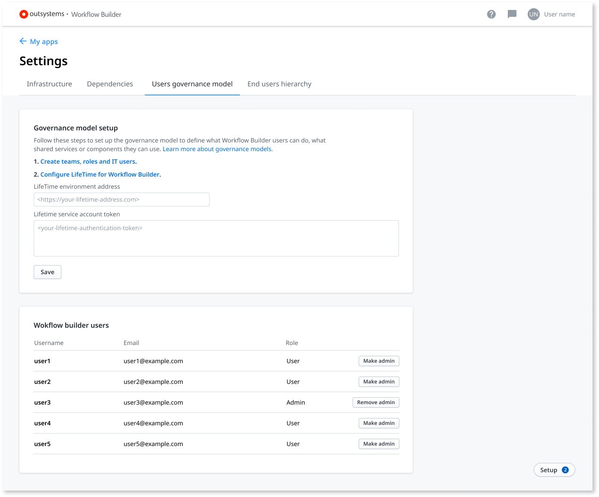

# How to set up the users governance model

The goal of this document is to guide [IT users](../../../managing-the-applications-lifecycle/manage-it-teams/about-permission-levels.md) through the setup the end users governance model in [Workflow Builder](http://workflowbuilder.outsystems.com/).

You need LifeTime version 11.5.0 (released March 2020) or later to set up the users governance model.

Setting up the users governance model, allows you to define what users can do in Workflow Builder and what shared services or components they can use.

To set up the user governance, perform the following steps:

1. Create teams, roles, and IT users in LifeTime. Refer to [Manage IT users](../../../managing-the-applications-lifecycle/manage-it-teams/about-permission-levels.md) and to [End user management](../../security/end-user-manage/accessing-users.md) for more information.

1. On the **LifeTime environment address** field, enter your LifeTime environment address.

1. [Get your LifeTime service account token](../../../ref/apis/lifetime-deployment/rest-api-authentication.md#creating-a-service-account) and enter it on the **LifeTime service account token** field.

    

1. Click on the **Save** button to save the changes.
