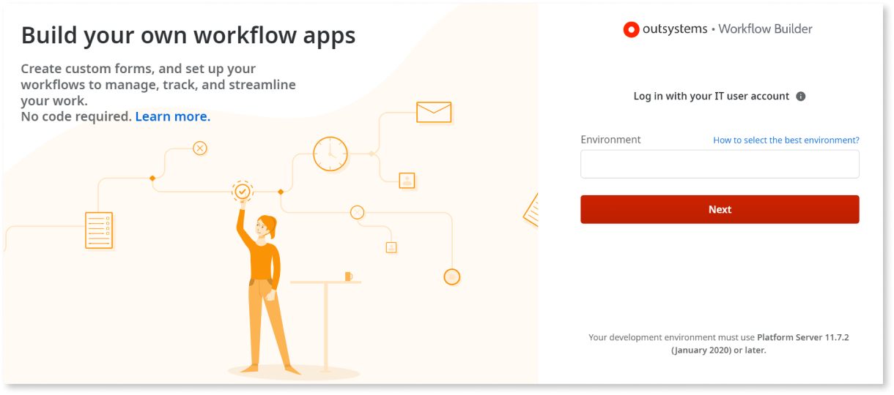
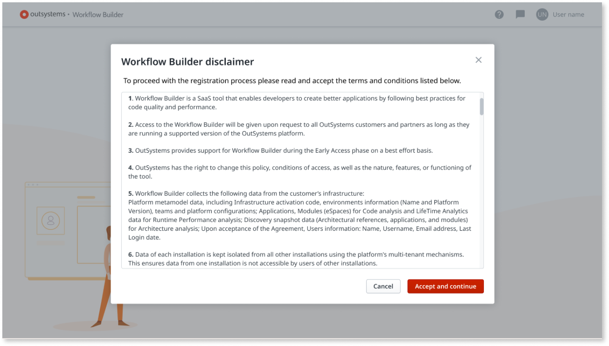
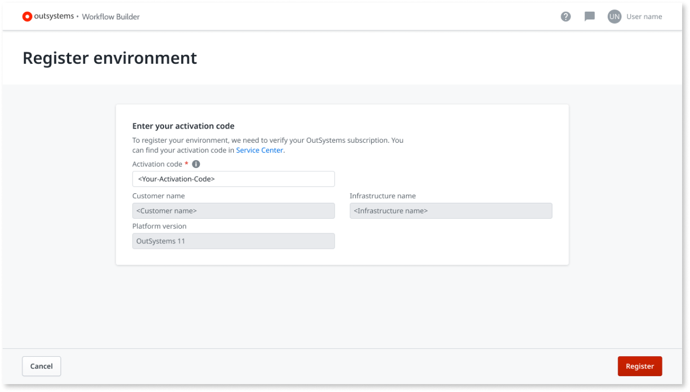
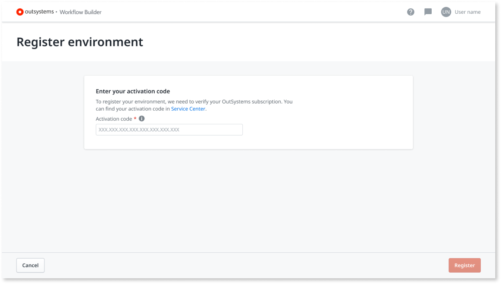
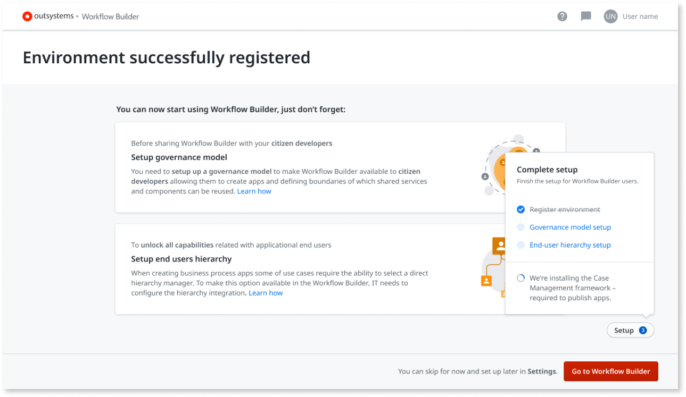
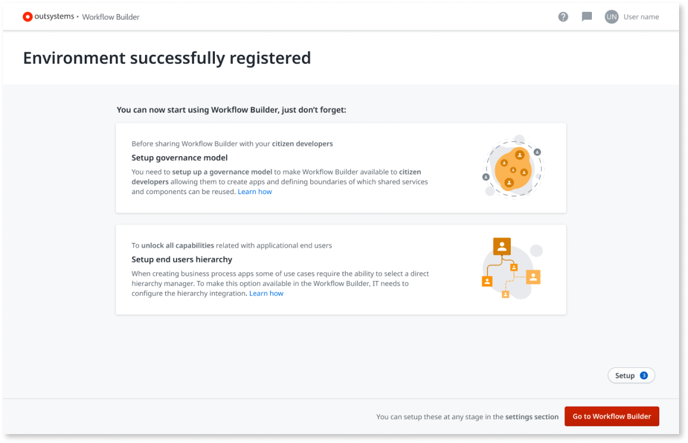

# How to set up Workflow Builder

The goal of this document is to guide [IT users](../../../managing-the-applications-lifecycle/manage-it-teams/intro.md) through the [Workflow Builder](http://workflowbuilder.outsystems.com/) installation process. 

## Prerequisites { #prerequisites }

To use Workflow Builder, make sure you meet the following prerequisites:

### Your environment

* Your environment is associated with an [OutSystems Edition](https://www.outsystems.com/pricing-and-editions/) that isn't the Free Edition. **You can't use a Personal Environment with Workflow Builder**.

* Your development environment must use Platform Server 11.7.2 (January 2020) or later to run Workflow Builder. To allow your users to reuse OutSystems Entities from your environment, the minimum version of Platform Server is 11.9 (July 2020). Refer to the [release notes](https://success.outsystems.com/Support/Release_Notes/Workflow_Builder) for more information.

* Ensure your development environment allows inbound traffic from `https://workflowbuilder.outsystems.com` in port **443** to communicate with Workflow Builder. The Workflow Builder will use the environment's public DNS hostname to communicate. Refer to the [Workflow Builder network requirements](../../../setup-maintain/setup/network-requirements.md#workflow-builder) for detailed information.

If your infrastructure is on OutSystems Cloud and you didn't [configure an internal network for the environment](../../../managing-the-applications-lifecycle/secure-the-applications/configure-internal-network.md), you already meet this prerequisite.

### Your user { #your-user }

* You must have an IT user with **Create Applications** and **Change and Deploy Application** permissions for the environment.

### Your device

You can access Workflow Builder with the latest versions of the following **desktop browsers** only:

* Edge
* Firefox
* Google Chrome
* Safari

## Log in for the first time

Before logging in for the first time, make sure you have IT user accounts for your users in your OutSystems infrastructure. [Learn how to create IT users](../../../managing-the-applications-lifecycle/manage-it-teams/create-an-it-user.md) in OutSystems.

When you log in to [Workflow Builder](http://workflowbuilder.outsystems.com/) for the first time you enter the following welcome screen:

To log in to Workflow Builder, perform the following steps.

1. Enter the address of your OutSystems development environment in the **Environment** field. Then, click **Next**.

    

    Use a **non-production environment** with Workflow Builder, preferably your **development environment**.  
    When you publish an app in Workflow Builder, it publishes the app in the environment you entered in the login.
    
    

1. Enter your username and password.

1. Click **Login**.

## Register your infrastructure

As a first user from your organization logging in, you first need to register your environment. The registration procedures vary, depending on your OutSystems platform version.

### Initial steps

To begin registering your infrastructure in Workflow Builder, perform the following steps:

1. Click **Register environment**.

    

1. Read the Workflow Builder disclaimer and GDPR information carefully. To proceed, click **Accept and continue**.

    

1. Check your OutSystems Platform Server release version.

    1. If your release is **between 11.7.2 and 11.8.0**, proceed to the [Platform Server releases 11.7.2 until 11.8.0](#ps-lower-1180) section.
    1. If your release is **11.8.0 or later**, proceed to the [Platform Server release 11.8.0 onwards](#ps-later-1180) section.

### Platform Server release 11.8.0 onwards { #ps-later-1180 }

For OutSystems releases later than **11.8.0** (April 2020), Workflow Builder collects all data from your infrastructure automatically, including Activation Code.

1. Check the information displayed, and click **Register**.

    

1. Proceed to the [Final steps](#final-steps) section.

### Platform Server releases 11.7.2 until 11.8.0 { #ps-lower-1180 }

For Platform Server releases **between 11.7.2 and 11.8.0** (April 2020), perform the following steps:

1. Enter your activation code, and click **Register**.
Check how to [Find the Activation Code of your infrastructure](https://success.outsystems.com/Support/Enterprise_Customers/Licensing/02_Manage_and_Upgrade/Find_the_Activation_Code_and_the_Serial_Number).

    

1. Workflow Builder collects all data from your infrastructure automatically. Check the information displayed, and click **Register**.

    

### Final steps

After collecting the activation code and related data from your infrastructure, your environment is successfully registered. A new installation begins in the background for the Case Management framework.

#### Case Management framework

At this point, the installation of Case Management framework starts automatically. Case Management framework is an OutSystems solution, a set of pre-built functions from which the Workflow Builder relies on to work correctly, and to be able to publish an app directly to the registered environment. For more information refer to the [Case Management framework documentation](../case-management-framework/intro.md).

Case Management framework is only installed in the registered environment.

In case the Case Management framework fails to install, you have the possibility to download it and install it directly in your environment as any other OutSystems app, through your Service Center.

At this stage, you need to set up the governance model according to the instructions in the following sections.

#### Governance model setup

You can invite business developers to leverage the Workflow Builder to build workflow apps for their everyday needs. Setting up the governance model defines what users can do, and what shared services or components they can use. Check [How to set up the users governance model](how-setup-governance.md) for more information.
 

#### End user hierarchy setup

When building the workflow app, Workflow Builder users can assign tasks in the workflow to specific roles. Learn [How to set up the end users hierarchy](how-setup-end-users-hierarchy.md) to enable this capability.

Click **Go to Workflow Builder button** to go to the Workflow Builder home screen.

