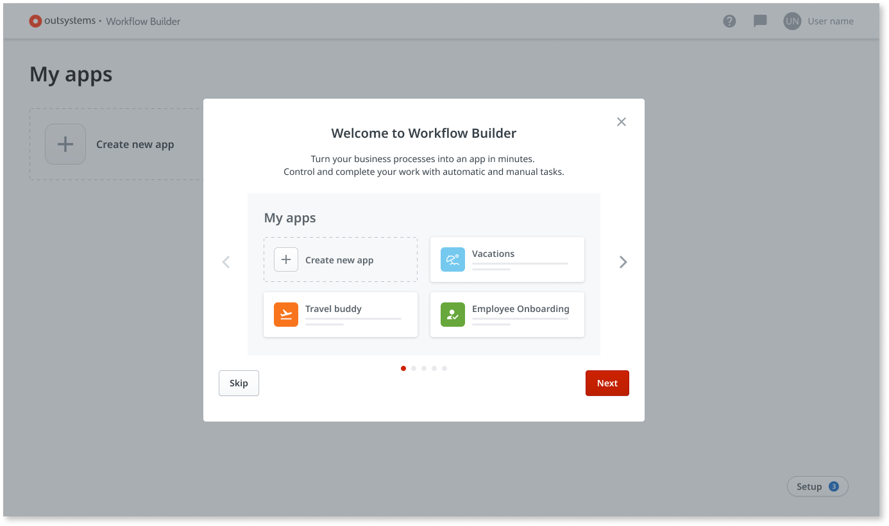

# Using Workflow Builder

[Workflow Builder](http://workflowbuilder.outsystems.com/) is a web-based tool that runs on the OutSystems cloud. To use Workflow Builder, your infrastructure must comply with [a list of prerequisites](how-setup.md#prerequisites). Contact your IT team to ensure these.
To access Workflow Builder, [follow this link](http://workflowbuilder.outsystems.com/).

## Login

To build apps with the Workflow Builder, you need to have an IT user in your infrastructure, with permissions to publish apps to your development environment. In OutSystems language, "publishing an app" means installing the generated app in the destination environment.

When logging in the Workflow Builder, you need to provide the **development environment** address and the login credentials, as depicted in the image below. If you don't know your IT user or don't have one yet, you need to request it to your IT department. They're able to assist with this step. The same applies to the requested environment address.

After logging in, if Workflow Builder lets you know that the environment isn't registered, do one of the following depending on your LifeTime role:

* If you **are an administrator** check the environment prerequisites on [How to set up Workflow Builder](how-setup.md).

* If you **aren't an administrator** contact your OutSystems IT administrator and ask them about [setting up Workflow Builder](how-setup.md).

## Onboarding

Once the register process is complete, you get an onboarding that briefly explains the main features of Workflow Builder to familizarize you with the tool.

If you want to revisit the onboarding, just look for the **?** button at the top menu of the tool, to trigger the onboarding steps.

### My apps screen

After the onboarding, you land on the **My apps** screen. This screen is where the created apps appear. In the first stage, it's empty, since no apps were yet developed in Workflow Builder for this environment.

Anyone that publishes an app to the development environment registered previously has their apps appear in this screen.

### App status

If there are apps already developed in this environment, they're visible on this screen. They can have different statuses: Published, Draft, or Failed to publish.

* **Published** - an app already developed in the Workflow Builder and published in your OutSystems environment. You can only edit this app in Workflow Builder.

* **Draft** - an app that you started developing in the Workflow Builder that isn't published yet. Meaning that the generated app wasn't yet created in your development environment.

* **Failed to publish** - an app developed with the Workflow Builder that got an error while publishing. In this case, try to publish it again. If the error remains, contact your IT support.

* **Converted to Service Studio** - this app is available in Service Studio for further development, and no longer available for edition with Workflow Builder.

To learn how to create a new app in Workflow Builder, open [Creating a Workflow Builder app](how-workflow-design.md).
