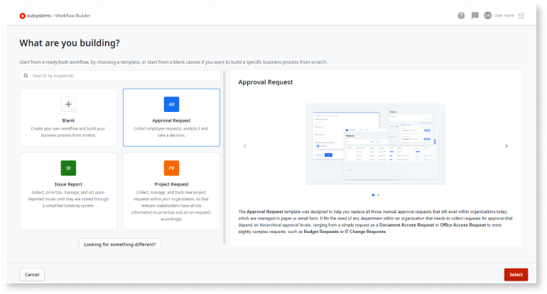

# Creating a Workflow Builder app

Your [Workflow Builder](http://workflowbuilder.outsystems.com/) design journey starts on the **My Apps** screen. Here, you can start creating internal productivity apps, such as expenses approval, employee onboarding, employee performance, vacation approval, timesheet management, and other kinds of case management apps.

As a Workflow Builder app developer, the first step to do is to click **Create app** to enter the initial screen.

On this screen choose from one of the following options:

* **Blank canvas** - to create your app from scratch. Go to [Create an app from scratch](how-create-app-from-scratch.md) to learn about this process.

* **Project Request** - to use the Workflow Builder template for creating an app that lets end users submit an initiative, project, or idea proactively while sharing it with relevant stakeholders and decision makers in your organization. Go to [Using the Project Request template](how-project-request-template.md) to learn about this process.

* **Approval Request** - to use the Workflow Builder template for creating an app with a two-level approval and an automated decision that depends on a business variable set by the requester while submitting the request. Go to [Using the Approval Request template](how-approval-request-template.md) to learn about this process.

* **Issue Report** - to use the Workflow Builder template for creating an app that lets end users report and follow incidents that are then assigned and solved by the right people within your organization. Go to [Using the Issue Report template](how-issue-report-template.md) to learn about this process.

If you're looking for another type of case management app, send your feedback to OutSystems by clicking on the **Looking for something different?** button and filling the form feedback form.

