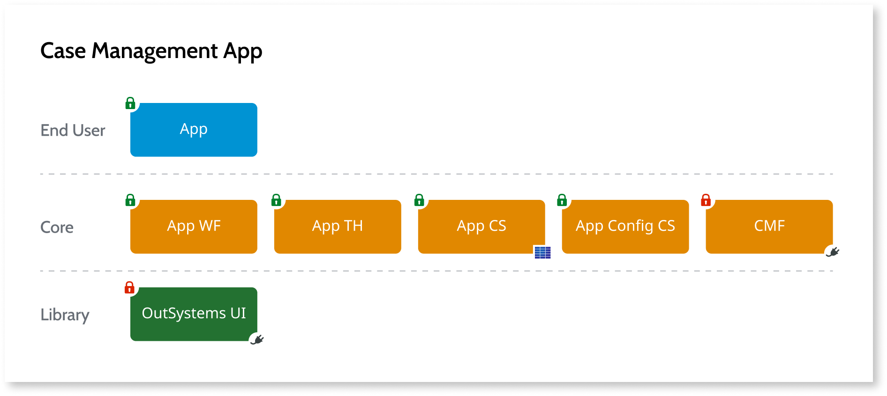
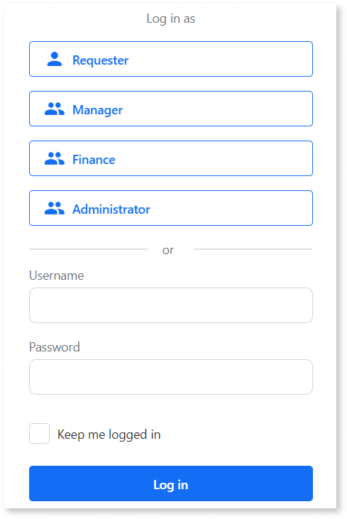
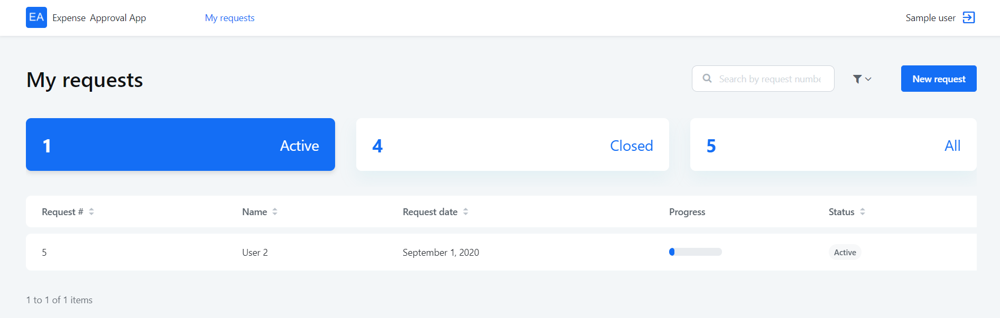

# How Workflow Builder works

[Workflow Builder](http://workflowbuilder.outsystems.com/) is a Software as a Service (SaaS) tool that connects to your development environment and allows non technical users to develop case management apps very fast by building simple workflows.

If you meet the [prerequisites](how-setup.md#prerequisites), you can use Workflow Builder with infrastructures on the OutSystems Cloud, on other public or private clouds, or on-premises.

Workflow Builder relies on Case Management framework, a set of pre-built functions to work correctly, and to be able to publish an app directly to the registered environment. For more information refer to the [Case Management framework documentation](../case-management-framework/intro.md)

## Generated apps

Workflow Builder generates Reactive Web Apps and deploys them on your development environment. It ensures the apps go through the same application development lifecycle as any other OutSystems app, with proper architecture, and following all the best practices.

When published in the target environment, Workflow Builder bootstraps the app's configurations, including the creation of groups of users and the creation of app roles.

The following diagram shows the modules of a Workflow Builder generated app:

The case management apps contains three layers, according to the [OutSystems Architecture Canvas](https://success.outsystems.com/Support/Enterprise_Customers/Maintenance_and_Operations/Designing_the_Architecture_of_Your_OutSystems_Applications/The_Architecture_Canvas):

**End User**

* **App** - Contains the screens to map the application such as the requesters' and the managers' screens.

**Core**

* **App WF** - Contains the application workflow and references the business entity.
* **App TH** - Contains the menu for the case and the app style guide.
* **App CS** - Contains the business data entity associated with the case. References the case definitions and the case status, from Case Management framework.
* **App Configuration CS** - Contains all the static entities with the specific business details, with the status for the case, case definition type, rules engine, and contains all the required bootstrap data, needed to move case configuration data between environments.
* **CMF** - Case Management framework - contains the actions to add capabilities to the case management apps: process audit, conditions, case state machine, email notifications, delegation, service-level agreement (SLA) management, case events, access Control, and task operations.

**Library**

* **OutSystems UI** - Contains the responsive UI patterns and screen templates on top of a solid design system. See the [OutSystems UI web site](https://www.outsystems.com/outsystemsuiwebsite/) for more details.

## Users in Workflow Builder

Workflow Builder authenticates IT users by contacting your environment to validate the user credentials.
To use Workflow Builder in an environment, you must have an [IT User](../../../managing-the-applications-lifecycle/manage-it-teams/intro.md) that has the [correct permissions](how-setup.md#your-user) for that environment.
All IT users in your infrastructure with these permissions can use Workflow Builder.

### Workflow Builder administrator

The first user registering an environment in Workflow Builder is assigned as a Workflow Builder admin.
An admin can assign other Workflow Builder users as admins, in **Settings** > **User governance model**.

## Sample users in the generated apps

To allow the business developers to test their apps while developing them Workflow Builder creates sample users on the publishing process, based on the groups of users defined in the workflow.

Logging in using these users shows the menus and screens specific to that users. For example, a requester sees a menu to create a new request and submit it for approval, and a manager sees the list of requests that need approval, and have the option to approve or reject them.

The following image shows an example of a requester's **My requests** screen:

Check [Generating and testing your app](publish-test.md) for more information.
