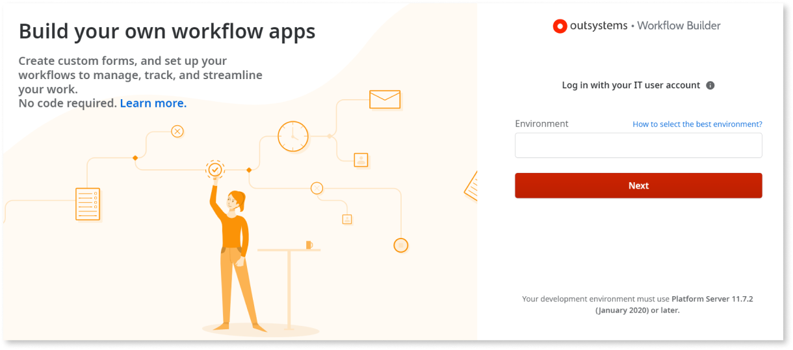

# Create workflow apps with Workflow Builder

[Workflow Builder](http://workflowbuilder.outsystems.com/) allows anyone to build apps for task management and automation in minutes, only by creating workflows. It's an IT-governed tool that IT managers with LifeTime administrator role, experienced in working with the OutSystems platform, need to register and set up first. Once set up, anyone in the organization that designs and manages workflows can use Workflow Builder, extending the team of in-house app developers.

All users need to have their development environment registered in Workflow Builder by IT managers, using the Platform Server version 11.7.2 or later. See [How to set up Workflow Builder](how-setup.md) to learn more about the Workflow Builder prerequisites and setup.

Creating low-code Reactive Web Apps with Workflow Builder makes the app creation process simpler, faster, and more collaborative, where multidisciplinary teams work together reducing the time-to-business outcome.

With Workflow Builder you can create apps that automate processes, improve efficiency, and get better outcomes on your daily work. Even if you have no previous experience developing apps.  

During the development process, you can reuse data (OutSystems Entities) from existing databases in your development environment. Ask your IT Admin about these. You can test the generated app using different sample users, and iterate it until you're sure it follows the process rules and needs for the different types of users involved.

When you finish developing, the role of IT managers is to actively lead and manage the entire app lifecycle, deployment to QA/testing, then to production environments, and also to provide access to all your end users. 

As business needs keep changing, you can update apps you have in production to reflect changes to the business process. Perform the needed changes, test them, and ask your IT manager to publish the new version.

## Start from an app template

Workflow Builder includes several templates that help you accelerate the creation of your next workflow app. Each template includes form fields and workflow logic that fits a type of workflow app, like data collecting or issue reporting. You can also build your workflow app from scratch. The following workflow app templates are available:

Project Request
:   Automate the collection of incoming projects, requirements or ideas requested by different departments within your organization, so you can receive, track, prioritize and make the right decisions based on all the context you have.

Approval Request
:   Handle requests that can go from a simple request such as a document access request or office access request to more complex requests that depend on several approval levels and business variables to direct the request to the right assignment group.

Issue Report
:   Create, prioritize and follow the issue tickets until they're solved. Typical tickets include information about the problem to solve, information about the requester, priority, expected resolution time and a knowledge base.

## Start using Workflow Builder

To learn how to use Workflow Builder, go to [How to use Workflow Builder](how-use.md).

If you are an IT manager, and want to learn how to set up Workflow Builder, go to [How to Set up Workflow Builder](how-setup.md).
