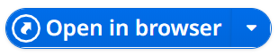
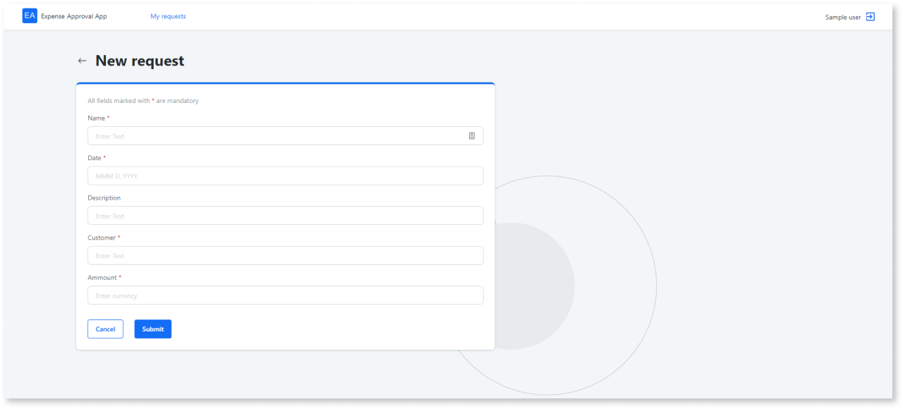
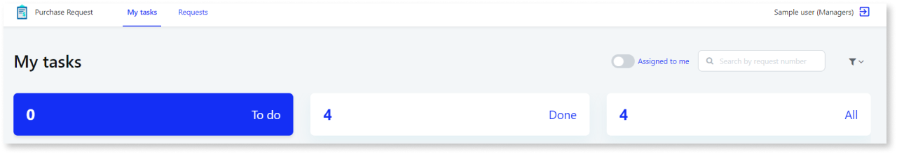
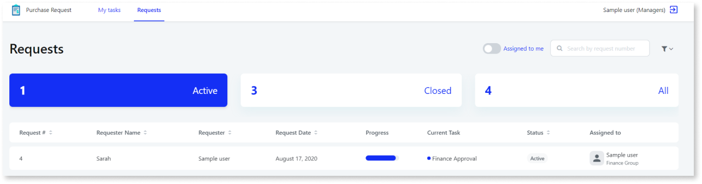
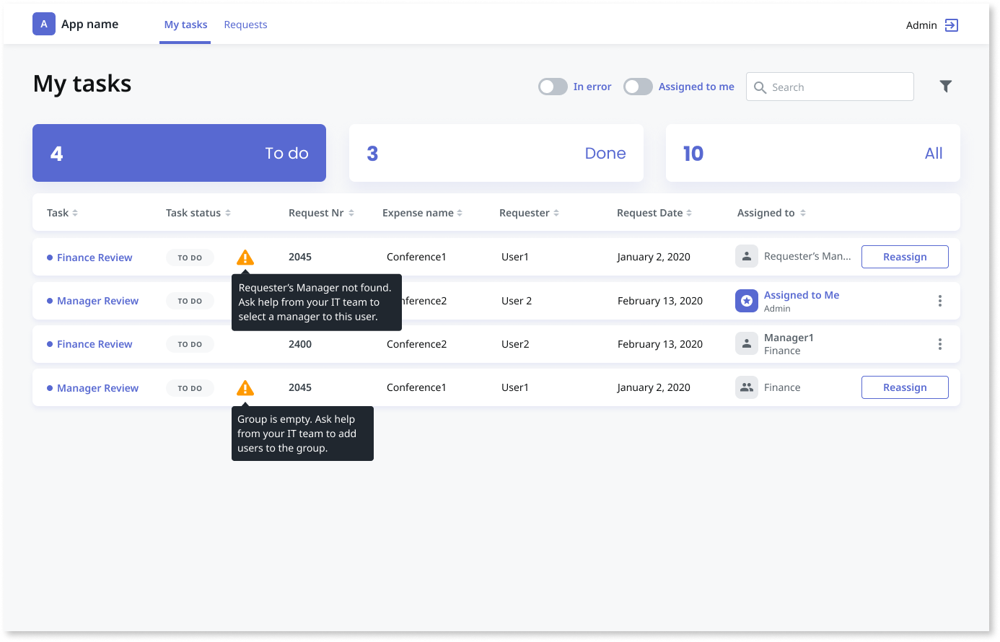
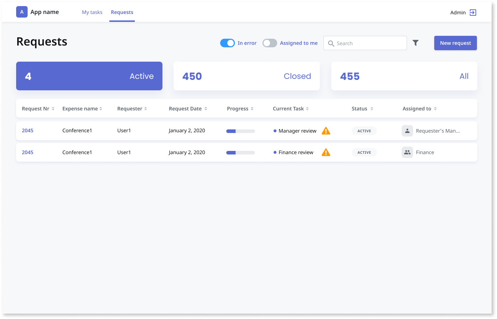
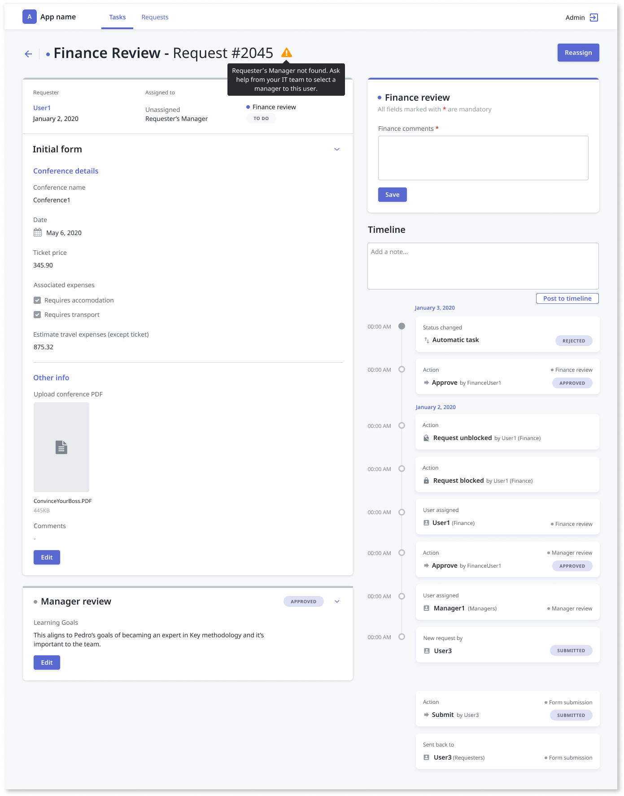
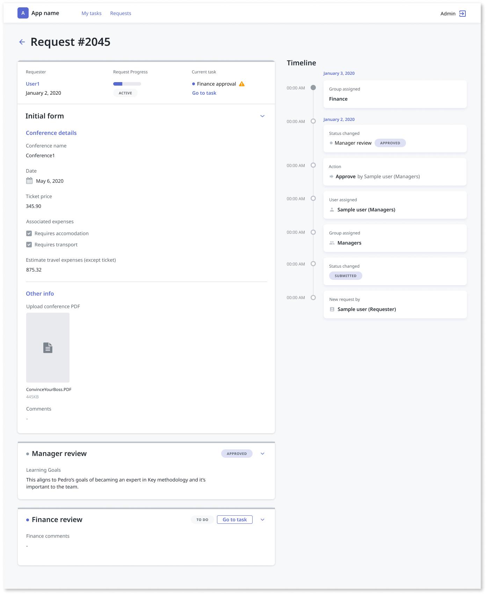
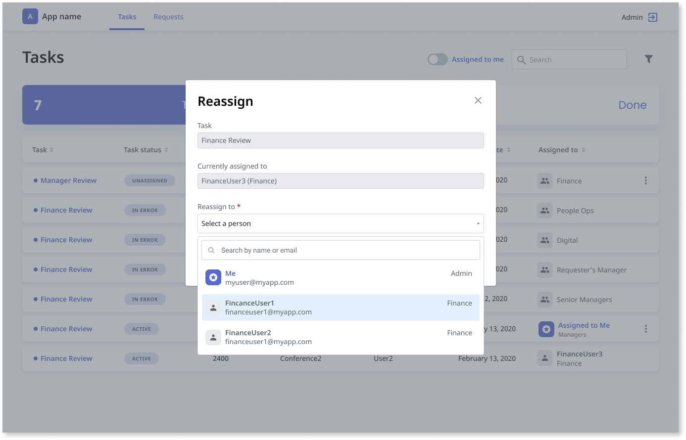
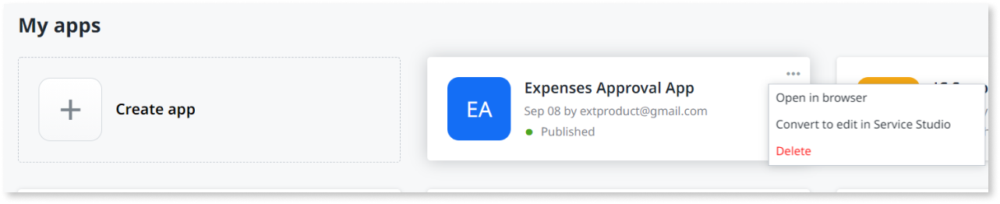

# Publishing and testing your app

Once you are comfortable with the workflow you developed, you can test your app by publishing it into your development environment, directly from the [Workflow Builder](http://workflowbuilder.outsystems.com/). This means that in the background, OutSystems creates the app that follows all the steps you defined in the Workflow Builder. Once you publish your app, you can test it and change it. Each change requires publishing before you test the new changes.

To publish your app, open it in Workflow Builder, and click on the **1 Publish** button on top of the screen.

Note: publishing your app for the first time requires a few minutes.

On the publishing process, Workflow Builder creates sample users, based on the groups of users you defined while designing the workflow, for you to test your app.

## Testing with sample users

Once the publishing finishes in the development environment, the Workflow Builder allows you to test your app. Click on the **Open in browser** button to open your app login page.

The login page contains the sample users for you to test the app from the perspective of each one of them.

Note that sample users only exist in your development environment, and are never created in other environments. This means that once your IT team deploys your app to Production, the end users don’t see the sample users in the login page of the app and need to log in using credentials, as in any other app.

These sample users appear automatically based on the roles and groups you created in your workflow. There are two users that are common to all Workflow Builder apps:

* The **Requester** user - is the one who creates the requests by filling the form.

* The **Administrator** users can view all requests and tasks in the app, edit them, or re-assign them. To learn more about the Administrator role, read [Administrator role and screens](#admin-screens)

## App screens

Out of the box, OutSystems generates a Reactive Web app that behaves according to the steps you defined in the Workflow Builder.

Using the example of the expenses approval, the generated app has the following screens:

### Requester screens

This section explains the screens available to the users with the **Requester** role.

**Request screen** - a screen that allows requesters to fulfill and submit expenses using the form you defined in the Workflow Builder.

You also have the option to cancel a request. However, this option is only possible while the request is not assigned to a user and the task details have not been opened. Once a request is assigned and opened, it cannot be canceled. When you cancel a request, it becomes a **Closed** request. It can not be reopened or resubmitted. 

**Requests list** - a screen that allows managers, the ones that deal with the requests, to move them forward through the designed process. This screen allows users with the **manager** role, and belonging to the right user group, to see all the requests that are in the stage that follows. Managers have two view options:
   
* **My tasks** - screen view that shows all the tasks assigned to a specific group of managers (a group to which the logged-in user belongs to).

    

    Within the **My Tasks** screen view, managers see the tasks organized per the following buckets:

    * **To do** - shows all requests assigned to a group of users:

        * where none of them picked up the task. In this case, the task is waiting for someone to deal with it.

        * tasks picked up by a manager, where the status changes to **Assigned to me**. Only the manager that picked up that task can perform actions on it.

    * **Done** - once a manager takes action on a request, and solves it or forwards it to the following step, the request changes to **Done**.

    * **All** - list of all the tasks assigned to the active user group of managers.

* **Requests** - screen view that shows all the active requests. A request can have one or more tasks, and so this view can help you to understand the overall progress of a specific request.

    
 
    Within the **Requests** screen view - displays the requests, organized per the following buckets:

    * **Active** - lists all requests assigned to a group of active users, meaning that the request didn't follow all the required steps of the workflow yet. This might mean that there are pending tasks from other user groups.

    * **Closed** - lists all the canceled requests and all the requests that have reached the end of the process. The active user group acted upon one task of that request, at least.

    * **All** - lists all the requests related to the active user group that are active or closed.

    * **Request Detail** - a screen where a manager can check all the details of a request. This screen shows:

    * **Request Number** - unique identifier of the request. This identifier is unique per app. Currently, this is a global incremental number, that you can not reset or change.

    * **Requester** - the requester username.

    * **Request date** - date of the request submission.

    * **Assigned to** - username of the manager that picked up the request.

    * **Form** - all the field forms submitted by the requester.

    * **Notes** - area for managers to share notes with each other, to improve communication and collaboration while solving a request.

    * **Timeline** - section that allows managers to track all the actions that occurred while solving the request.

## Administrator role and screens { #admin-screens }

This section explains the screens available to the users with the **Administrator** role.

Administrator users can view all the existing requests in the app. They have an overview of all processes, including:

* Issues, like empty groups or managers not defined for the requesters.

* Errors, like deleted groups or blocked processes.

* All statuses and requests' details.

Administrators can also edit all the existing requests and:

* Re-assign requests to other users of the same group. For example, managers.

* Act on manual tasks. For example, approving or rejecting requests.

* Block or unblock activities.

* Cancel requests.

### My tasks screen

The Administrator view has all the capabilities of the Operator view and also all tasks on the **To do**, **Done**, and **All**  screens.

Administrators can also view alert icons showing the errors. Errors can be having tasks assigned to undefined managers, or having groups without users. Administrators can filter tasks with errors and reassign these tasks.

### Requests screen

The Administrator view has all the capabilities of the Operator view and also has alert icons for errors. Errors can be having tasks assigned to managers not defined or having groups without users. Administrators can filter tasks with errors.

### Task detail screen

The Administrator view has all the capabilities of the Operator view and also has alert icons for tasks assigned to undefined managers. Administrators can reassign these tasks.

### Request details screen

Administrators can see all the details of each request and view alert icons for tasks with errors.

### Reassign tasks screen

Administrators can reassign tasks by opening them and selecting a new assignee from the dropdown list.

## App actions - My Apps screen

On the **My Apps** screen, each app has a menu with the options described below.

* **Open in browser** - you can “Open in browser” apps that were successfully published, and test their latest published version. If you made any changes and didn't republish the app, those aren't reflected.

* **Convert to edit in Service Studio** - you can decide to convert an app to Service Studio if you want to evolve it using advanced Reactive Web development not available in Workflow Builder. This means that from this point on, your app is available for further development in Service Studio like any other OutSystems app. Once you perform this action, you're no longer able to use the Workflow Builder to edit it. See [Converting a Workflow Builder app to Service Studio](how-convert-service-studio.md) to learn about it.

* **Delete** - the delete action allows you to delete an app. You need to be the owner of that app to be able to delete it.

To learn about your app lifecycle information, open [App lifecycle management](app-lifecycle.md).

