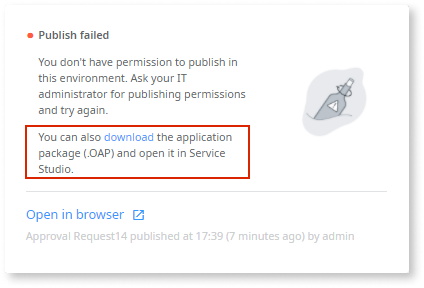
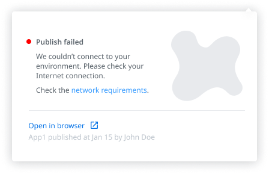
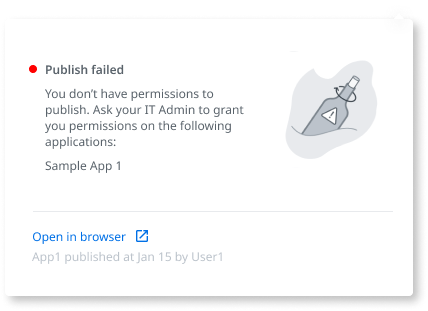

# Workflow Builder error reference

This document contains a reference to errors that users may face in [Workflow Builder](http://workflowbuilder.outsystems.com/).

## Personal environment error

This error occurs if you try to connect Workflow Builder to a Personal Environment.

You need to use the OutSystems **Basic**, **Standard**, or **Enterprise** edition. Personal Environments can't use Workflow Builder.

For more information, refer to the [Workflow Builder Prerequisites](../how-setup.md#prerequisites).

## Platform version error

This error occurs if your Platform Server version is older than release 11.7.2 (January 2020).

Refer to the [Workflow Builder Prerequisites](../how-setup.md#prerequisites) for more information.

Learn how to check the [Platform Server version of an Environment](https://success.outsystems.com/Documentation/Case_Management/How_to_check_the_Platform_Server_version_installed_in_an_Environment).

## Publish errors

### Publish failed error - can't connect to the environment

This error may occur if your Internet connection is down or if your network requirements aren't accepting inbound connections from Workflow Builder.

Ensure your development environment allows inbound traffic from `https://workflowbuilder.outsystems.com` in port **443** to communicate with Workflow Builder. Refer to the [Workflow Builder network requirements](https://success.outsystems.com/Documentation/11/Setting_Up_OutSystems/OutSystems_network_requirements#workflow-builder) for detailed information.

If your environment uses multiple database catalogs and schemas, you won't be able to publish the first version of an app.  
If you are an IT administrator, you can see a link provided to download the application package (.OAP). Click it, and then open and install the application package in Service Studio.
After that, you are able to publish new versions of the app in Workflow Builder.

### Publish failed error - issue with the app generation

You may get this error because there was an error with the app generation that OutSystems must solve. Report the issue to the OutSystems support.

### No permission to publish error

This error occurs if you don’t have permissions to publish a specific module used by an OutSystems Entity, Case Management Framework, or system modules.
An IT Administrator needs to grant you permission to publish the modules displayed in the error message.

### Publish failed - module not found

This error occurs if Workflow Builder can't find a module used in one or more fields of your form (module deleted or moved).

To avoid this error, delete the fields that use the module displayed in the error message, or ask IT to make that module available or to let you know its new location, providing them with the name of the fields and module displayed in the error message.

### Publish failed - entity not found

This error occurs if Workflow Builder can't find a module used in one or more fields of your form (module deleted or moved).

Delete the fields that use the entity displayed in the error message, or ask IT to make that module available or to let you know its new location, providing them with the name of the fields displayed in the error message, path, and names: `module` > `entity`.

### Publish failed - attribute not found

This error occurs if Workflow Builder can't find an attribute used in one or more fields of your form (module deleted or moved).

Change or delete the fields that use the attribute displayed in the error message, or ask IT to put it back or to provide you a new path, providing the name of the fields displayed in the error message, path, and names: `module` > `entity` > `attribute`.

## VPN/firewall error

This error occurs if your Internet connection is down or if your network requirements aren't accepting inbound connections from Workflow Builder.

To avoid this error, ensure your development environment allows inbound traffic from `https://workflowbuilder.outsystems.com` in port **443** to communicate with Workflow Builder. For more information see [Workflow Builder network requirements](https://success.outsystems.com/Documentation/11/Setting_Up_OutSystems/OutSystems_network_requirements#workflow-builder) for detailed information.

## Workflow Builder can't publish

This error might occur on some on-premise customers if there is an issue related to the IIS configurations related to the incoming request from Workflow Builder:

You need to review and update your IIS configuration (server runtime). Refer to the [Troubleshooting Workflow Builder](../troubleshoot.md#troubleshoot-it-admins) document for informtion about troubleshooting this error.
