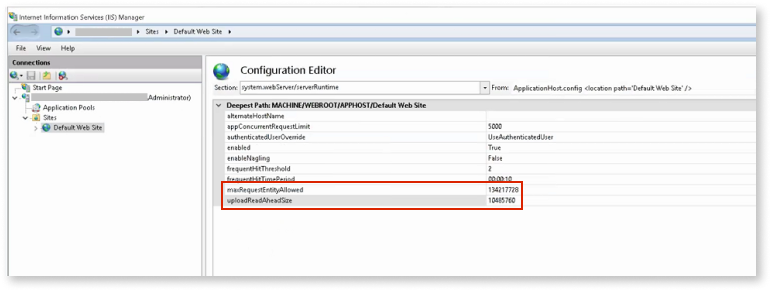

# Troubleshooting Workflow Builder

This page describes the troubleshooting procedures for the [Workflow Builder](http://workflowbuilder.outsystems.com/) app developers and the IT administrators.

## Troubleshooting for workflow app developers

### Unable to publish apps

If you aren't able to publish the app you're creating in Workflow Builder, contact your IT to ensure you have an IT user account created in LifeTime with **Create Applications** and **Change and Deploy Application** permissions for your development environment.

### Workflow Builder requests a new Case Management framework version

When you try to publish a new app with Workflow Builder and get a message saying that you can't publish it and showing you the disparity of versions, contact your IT Team.

## Troubleshooting for IT administrators  { #troubleshoot-it-admins }

### Unable to register an environment

* Ensure your development environment uses Platform Server 11.7.2 (January 2020) or later. Refer to the [release notes](https://success.outsystems.com/Support/Release_Notes/Workflow_Builder).

* Ensure your development environment allows inbound traffic from `https://workflowbuilder.outsystems.com` in port **443** to communicate with Workflow Builder. Refer to the [Workflow Builder network requirements](../../../setup-maintain/setup/network-requirements.md#workflow-builder) for detailed information.

### Workflow Builder can't publish

If your on-premise users get this error message, this can be an issue with the IIS configurations related to the incoming request from Workflow Builder. This might happen if you had changed the default IIS configurations.

Follow the steps described

1. On the Windows Start menu, go to Windows Administrative Tools and click on Internet Information Services (IIS) Manager.

1. On the left side, click on the server name and expand it.

1. Click on the **Sites** folder, and expand it.

1. Click on **Default Web Site**.

1. Double click **Configuration Editor** to open it.

1. Select `system.webServer`, and then `serverRuntime`.

1. Modify the `uploadReadAheadSize` value to **10485760**, and click **apply**.

    For more information, see the [Solution for "Request Entity Too Large" error]( https://techcommunity.microsoft.com/t5/iis-support-blog/solution-for-request-entity-too-large-error/ba-p/501134) article from Microsoft.

1. Select `system.webServer`, and then select `security`.

1. Select `request filtering configuration` and set the `maxAllowedContentLength` value to **134217728**.

1. Restart the IIS.

### Workflow Builder requests a new Case Management framework version

If your users can't publish a new app with Workflow Builder and get a warning showing the disparity of versions, you need to update the Case Management framework. The users get a message saying this, and showing them the disparity of versions.

To update the Case Management framework, perform the following steps:

1. Manually install the [latest version of Case Management Framework](https://www.outsystems.com/forge/component-overview/9179/case-management-framework) available on the OutSystems Forge.

1. Manually refresh the dependencies of apps already generated, or re-generate them with Workflow Builder to tackle potential breaking changes.
