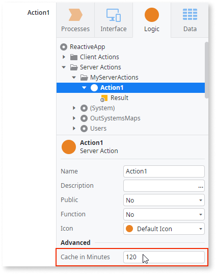

# Caching

You can improve the performance of your app by enabling the caching of some elements. The cache improves the performance by temporarily storing already retrieved or calculated data in fast memory and making that data available for an efficient loading in future requests.

Caching is RAM-based and is available in every front-end server. Whenever memory space is required, the elements are removed from the cache using the least recently used algorithm.

The cache invalidation system action can have a negative performance impact during the first access of an application. It also increases the load in the servers due to the compilation of the applications in IIS. For these reasons use of the cache invalidation system action should be kept to a minimum.

These are the elements that **support** caching:

* The lists returned by Aggregate and SQL.
* Output parameters of custom Server Actions.
* Blocks and elements they contain.

Some elements **don't support** caching. These are:

* Screens, as the feature currently does not support this element.
* Blocks with Submit.

## Activating the caching feature

To start caching the content of an element, set the **Cache in Minutes** property to a value greater than zero.

## The caching mechanism

This is how the cache works:

* On the first use, the element is evaluated and the resulting content is stored in the cache. 
* On the following uses, the stored content is returned by the server while skipping the evaluation. 

Any cached element is evaluated again, and the resulting content is updated in the cache when:

* The elapsed time since the element content was last cached exceeds the element's **Cache in Minutes** value. 
* The element has input parameters and there's no cached content for their new values.
* The cache is invalidated (for example: after republishing, deployment, server restart, explicit calls to invalidate the cache).

Additionally, the cached elements cannot have input parameters of the following types: Record, List, and Binary Data.

## Cache in producer and consumer modules

The cache also depends on whether the producer module is referenced as a strong or a weak dependency. 

When the modules have a **strong dependency**, the Action logic is executed in the context of each consumer module handling the request. The cached value exists in each of the consumers and cannot be reused between them.

If you want a **single cached value** instance in memory and serve all requests with it, expose the Action through a **weak dependency**. This way, the request executing and caching the Action exists only in the producer module, and all its consumers see the same value.

## Examples

You can consider caching the contents of:

* Elements with an execution time that negatively impacts the end user experience 
* Elements that overload the system resources (database, CPU, memory...) 
* Elements that fetch data from databases or external systems
* Elements for which the returned results rarely change or change in a controlled way for the same input parameters 

