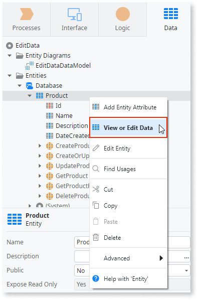
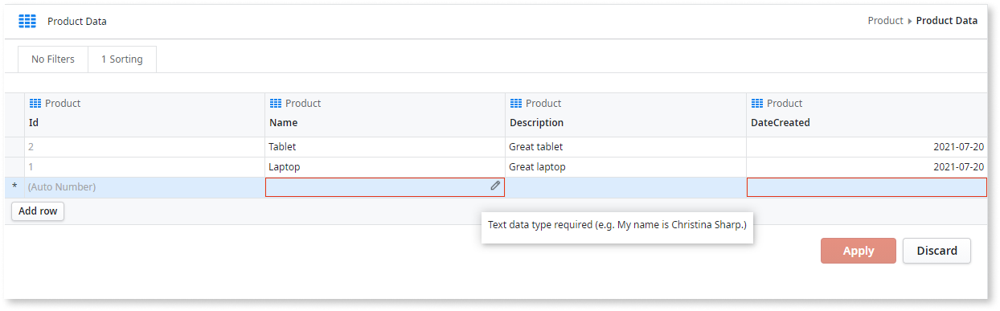
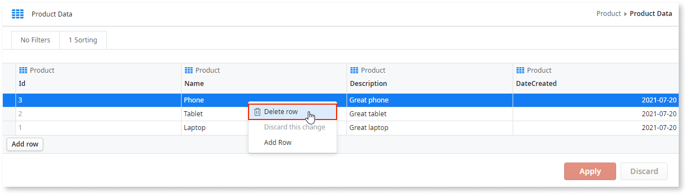
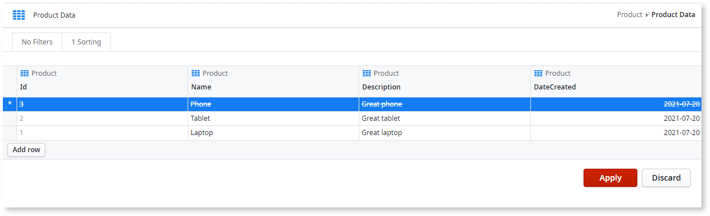
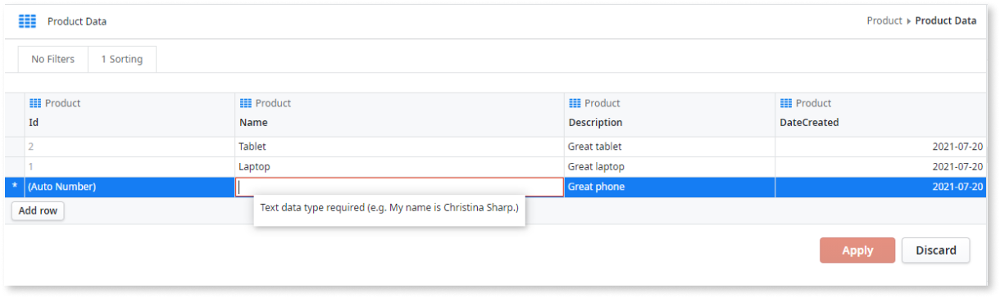
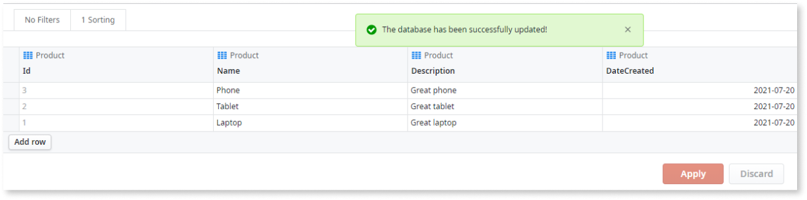
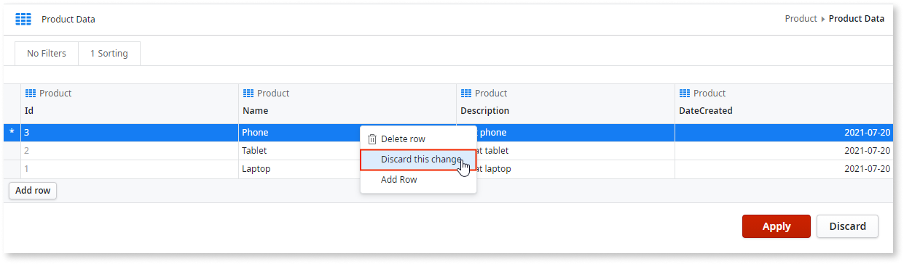
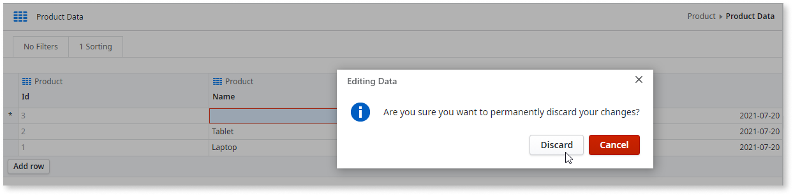

# How to edit the data of an entity in Service Studio

Learn how to add a record or row, remove a record or row, and change an attribute or cell in Service Studio.

To understand how editing data on Service Studio works and the prerequisites check the [edit data while developing article](intro.md).

## Add a record or row { #add }

To add a record or row, follow these steps:

1. In the module where the entity exists, go to the **Data** tab, and double-click the entity to **View or Edit Data**.

    

1. Select **Add row**.

1. If one or more cells' has a red outline after the previous step, it probably means they're mandatory attributes. [Define each one of those cells](#modify).

    

1. [Optional] [Define each one of the remaining cells](#modify).

1. After defining each cell, check and fix any issues with cells highlighted with a red outline. Hover over each highlighted cell to understand each issue.

1. You can prepare more than one change to the entity at a time. Once you're done with your changes [apply them](#apply).

## Remove a record or row { #remove }

To remove a record or row, follow these steps:

1. In the module where the entity exists, go to the **Data** tab, and double-click the entity to **View or Edit Data**.

    

1. Right-click the row you want to remove, and select **Delete row**.

    
    

1. You can prepare more than one change at a time. Once you're done with your changes [apply them](#apply).

## Modify a record's attribute { #modify }

To modify a record's attribute or cell, follow these steps:

1. In the module where the entity exists, go to the **Data** tab, and double-click the entity to **View or Edit Data**.

    

1. Double-click an empty space inside the cell you want to change.

1. Depending on the data type of the cell, set the data in one of the following ways:

    * For a **Text** or **Phone** cell, enter a text string, for example `text` or `+1 555 565 3730`.
    * For an **Email** cell, enter a text string with at least two characters separated by a **@**, for example `fran.wilson@example.com`.
    * For a **Integer** or a **Long Integer** cell, enter an integer for example, `10`.
    * For a **Decimal** or a **Currency** cell, enter a decimal, for example, `10.8`.
    * For a **Date** cell, enter a date using the `YYYY-MM-DD` format, for example, `1988-08-28`.
    * For a **Time** cell, enter a time using the `HH:MM:SS` format, for example, `23:59:59`.
    * For a **Date Time** cell, enter a time using the `YYYY-MM-DD HH:MM:SS` format , for example, `1988-08-28 23:59:59`.
    * For a **Boolean** cell, enter **true** or **false**, capitalization is irrelevant.
    * For a **Binary** cell, select and upload a file.
    * For an entity identifier cell, select a value from the dropdown.
    * For a static entity identifier cell, select a value from the dropdown.

1. If the cell has a red outline, hover over the highlighted cell to learn about the issue, and then fix the issue.

    

1. You can prepare more than one change to the entity to the entity at a time. Once you're done with your changes [apply them](#apply).

## Apply changes { #apply}

Once you're done with your changes, confirm you want to change the data by selecting **Apply**. 
You won't be able to apply changes if you have cells highlighted in red.

After trying to apply all your changes in the database, Service Studio lets shows you one of the following messages:

* If all changes are successful, Service Studio shows you a success message.

    

* If some changes fail Service Studio shows you an error message and highlights the rows with changes that weren't applied.  To understand the causes of the errors, hover over the asterisk, **\***, in the first cell of each highlighted cell, or select **view error report** to generate a text file with all the errors.

    

## Discard changes { #discard }

You can permanently discard changes in one of the following ways:

* To discard changes to a specific row, right-click the row and select **Discard this change**.

    

* To discard all your changes, select **Discard** and then confirm that you really want to permanently discard all the changes.

    

