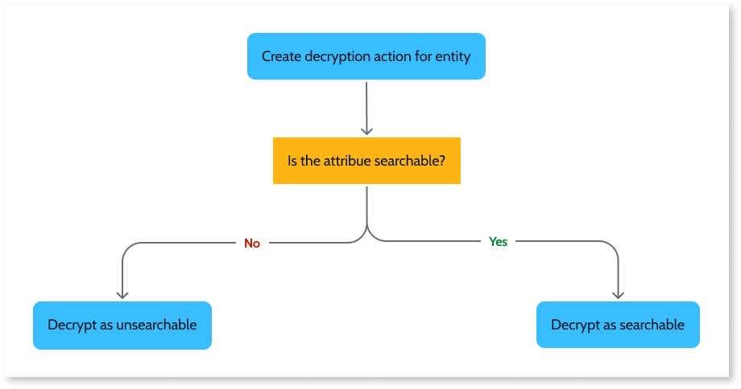

# Decrypting entity data at runtime

To enable the decryption of an entity's data, do the following:

1. Start by creating a decryption action that holds all the decryption logic for the data of an entity.

1. Then for each attribute you need to decrypt, add the logic to decrypt the data depending on if it's saved as searchable or nonsearchable.

## Create decryption action

Start by creating an action that's used to decrypt the attributes of an entity.

For each entity with attributes do decrypt, do the following:

1. In the module with the entity with encrypted attributes, add the following dependencies:

    * If you are decrypting nonsearchable attributes, from the **Cryptography Services** producer, add the **DecryptEntityText** action.
    * If you are decrypting searchable attributes, from the **Cryptography Services** producer, add the **DecryptIndexText** action.

1. Create an action to handle the decryption. Create a **Server Action** or **Service Action**, and add the following parameters:

    * Add an **Input Parameter** named `Encrypted<entity>` with **&lt;entity&gt;** data type and set as **Mandatory**. &lt;entity&gt; is the entity with encrypted data.
    * Add an **Output Parameter** named `Decrypted<entity>` with **&lt;entity&gt;** data type.

## Decrypt nonsearchable attributes

Now add the logic to decrypt each of the nonsearchable attributes, and then assign that decrypted data to an output.
For each encrypted nonsearchable attribute, do the following:

1. In the decryption action, add an **Aggregate** with **KeyIds&lt;entity&gt;** Source, with the following **Filter**:

    * `KeyIds<entity>.<entity>Id` = `Encrypted<entity>.Id`
    * `KeyIds<entity>.Salt` = `<salt-for-attribute>`, replacing &lt;salt-for-attribute&gt; with the string that identifies the attribute used during encryption.

1. After the aggregate, add an **DecryptEntityText** action, and set it's inputs as follows:

    * Set **Encryptedtext** as `Encrypted<entity>.<attribute>`, where &lt;attribute&gt; is the nonsearchable attribute.
    * Set **KeyId** as `GetKeyIdsBy<entity>Id.List.Current.KeyId`, where GetKeyIdsBy&lt;entity&gt;Id is the aggregate created on the previous step.
    * Set **EntityId** as `GetKeyIdsBy<entity>Id.List.Current.Salt`, where GetKeyIdsBy&lt;entity&gt;Id is the aggregate created on the previous step. 

1. After **DecryptEntityText**, assign the decrypted text to the respective attribute of the output parameter. Add an **Assign** with the following assignment: 

    * `Decrypted<entity>.<attribute>` = `DecryptEntityText.PlainText`

1. Publish the module.

## Decrypt searchable attributes

Now add the logic to decrypt each of the searchable attributes, and then assign that decrypted data to an output.
For each encrypted searchable attribute, do the following:

1. In the decryption action, add a **GetIndexKey** action, and set it's **IndexType** to the string that identifies the attribute used during encryption.

1. After **GetIndexKey**, add a **DecryptIndexText** action, and set it's inputs as follows:

    * Set **Encryptedtext** as `Encrypted<entity>.<attribute>`, where &lt;attribute&gt; is the searchable attribute.
    * Set **KeyId** as the output of GetIndexKey, `GetIndexKey.KeyId`.

1. After **DecryptIndexText**, assign the decrypted text to the respective attribute of the output parameter. Add an **Assign** with the following assignment: 

    * `Decrypted<entity>.<attribute>` = `DecryptIndexText.PlainText`

1. Publish the module.
