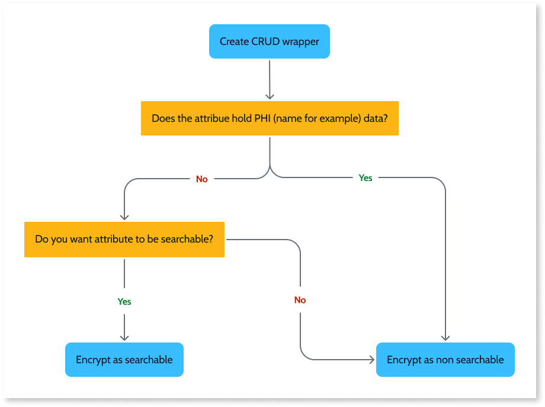
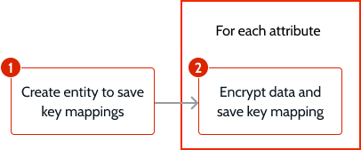

# Encrypting entity data at rest

To enable the encryption of data in an entity, do the following:

1. Start by [creating a CRUD wrapper action for the creation or updating of records from that entity](#crud-wrapper).

1. Then, for each attribute you need to encrypt, understand if the data must be saved as unsearchable or as searchable. The previous diagram helps with that decision.

    * If an attribute holds PHI data, like the name or address of a patient, you must [encrypt the data as unsearchable (using EncryptEntityText)](#encrypt-no-search).
    * For attributes that hold other type of data that can't be used by itself to identify a patient, like the blood type of a patient, decide if you need that attribute to be [searchable (using EncryptIndexText)](#encrypt-search) or [unsearchable (using EncryptEntityText)](#encrypt-no-search).

## Create a wrapper action to save data { #crud-wrapper }

To enable the encryption of data, you must be able to change data before saving it.

Start by creating a action that wraps the create or update actions for your entity, and setting the entity to read-only.

For each entity with attributes you want to encrypt, do the following:

1. In the entity, set the **Expose Read Only** property as **Yes**.

1. In the entity module, create a Server Action or Service Action to wrap the **CreateOrUpdate&lt;entity&gt;** action.

1. Add the following parameter to the action:

    * Add an **Input Parameter**, named `<entity>`, with the **&lt;entity&gt;** data type. &lt;entity&gt; is the entity with attributes to encrypt.

1. In the action flow, add the **CreateOrUpdate&lt;entity&gt;** action.

## Encrypt unsearchable attributes

Before encrypting attributes ensure you have [created a wrapper action to save data](#crud-wrapper).

1. Create entity to save key mapping - Each entity that has data to be encrypted needs one of these mapping entities. This mapping entity is needed for the decryption of the unsearchable attribute at a later stage.

1. Encrypt data and save key mapping - Each unsearchable attribute needs to be encrypted before saving the data. The key mapping for the attribute and record also needs to be saved for later decryption.

### Create entity to save key mapping

Start by creating an entity that holds the mapping of KeyIds to record identifiers and salts. This mapping entity keeps track of the salt and KeyId for each record of an entity, and is needed for the decryption of the unsearchable attribute.
You need one of these mapping entities for each entity with unsearchable attributes to encrypt.

For each entity with attributes you want to encrypt, do the following:

1. Create an entity named `KeyIds<entity>`, replacing &lt;entity&gt; with the name of the entity with unsearchable attributes to encrypt.

1. Add the following attributes:

    * `<entity>Id`, with **&lt;entity&gt;** Identifier data type. &lt;entity&gt; is the entity with attributes to encrypt.
    * `Salt`, with **Text** data type.
    * `KeyId`, with **Text** data type.

1. Publish the module.

### Encrypt data and save key mapping { #encrypt-no-search }

Now enable the encryption of each unsearchable attribute before saving the data to an entity, and then save the KeyId mapping.

For each attribute you want to encrypt, do the following:

1. Add the following dependencies to the module with the entity:

    * From the **Cryptography Services** producer, add the **GetEntityKey** action.
    * From the **Cryptography Services** producer, add the **EncryptEntityText** action.

1. In the create or update wrapper, before the **CreateOrUpdate&lt;entity&gt;** action, add a **GetEntityKey** action.

    

    The **GetEntityKey**  actions gets a KeyId to use for encryption, and that you need to save for later decryption. You won't always get the same KeyId, since the KeyId is rotated automatically.

    

1. Add the following to the action:

    * Add a **Local Variable**, named `LocalKeyIds<entity>`, with the **KeyIds&lt;entity&gt;** data type.

1. After **GetEntityKey**, add an **Assign** with the following assignment:

    * `LocalKeyIds<entity>.Salt` = `<salt-for-attribute>`, replacing &lt;salt-for-attribute&gt; with a string that identifies the attribute. For example, `Name`.
    * `LocalKeyIds<entity>.KeyId` = `GetEntityKey.KeyId`

1. After the assign, add an **EncryptEntityText** action, and set it's inputs as follows:

    * Set **PlainText** to `<entity>.<attribute>`, where &lt;entity&gt; is the entity name and &lt;attribute&gt; is the attribute to encrypt.
    * Set **KeyId** to `LocalKeyIds<entity>.KeyId`.
    * Set **EntityId** to `LocalKeyIds<entity>.Salt`.

1. After **EncryptEntityText**, assign the encrypted text to the respective attribute of the input parameter. Add an **Assign** with the following assignment:

    * `<entity>.<attribute>` = `EncryptEntityText.EncryptedText`

1. To enable the CRUD wrapper to update records, check if the record already has a key mapping. After the **CreateOrUpdate&lt;entity&gt;** action, add an **Aggregate** with **KeyIds&lt;entity&gt;** Source, with the following **Filter**:

    * `KeyIds<entity>.<entity>Id` = `<entity>.Id`
    * `KeyIds<entity>.Salt` = `LocalKeyIds<entity>.Salt`

1. After the aggregate, add an **Assign** with the following assignments:

    * `LocalKeyIds<entity>.<entity>Id` = `CreateOrUpdate&lt;entity&gt;.Id`
    * `LocalKeyIds<entity>.Id` = `GetKeyIdsBy<entity>Id.List.Current.KeyAddress.Id`, where GetKeyIdsBy&lt;entity&gt;Id is the aggregate created on step 7.

1. After the assign, save the key mapping for the record. Add a **CreateOrUpdateKeyIds&lt;entity&gt;**, and set it's **Source** to `LocalKeyIds<entity>`.

    

    You need to save the KeyId mapping to the record identifier and to the salt to ensure you can later decrypt the data.
    If the combination of record identifier and salt already has a mapped KeyId, the mapping is replaced with the new KeyId.

    

1. Publish the module.

## Encrypt searchable attributes { #encrypt-search }

1. Create encryption action - This reusable action enables the encryption of different searchable attributes. You need one of these actions for each module with entities with attributes to encrypt.

1. Encrypt data - Each searchable attribute needs to be encrypted before saving the data.

### Create encryption action

Start by creating a reusable action that enables the encryption of different searchable attributes. You need one of these actions for each module with entities with attributes to encrypt.

To enable the encryption of searchable attribute, do the following:

1. Add the following dependencies to the module with the entity:

    * From the **Cryptography Services** producer, add the **GetIndexKey** action.
    * From the **Cryptography Services** producer, add the **EncryptIndexText** action.

1. Create a **Server Action**, named `EncryptSearchableAttribute`.

1. In the action, add the following parameters:

    * Add an **Input Parameter** named `TextToEncrypt`, with **Text** data type, and set as **Mandatory**.
    * Add an **Input Parameter** named`IndexType`, with **Text** data type, and set as **Mandatory**.
    * Add an **Output Parameter** named `EncryptedText`, with **Text** data type.

1. In the action flow, add a **GetIndexKey** action, and set it's **IndexType** to the `IndexType` input parameter.

    

    The **GetIndexKey** action retrieves a new key identifier if the index type doesn't exist. Otherwise it retrieves the existing key identifier for the index type.

    

1. After **GetIndexKey**, add an **EncryptIndexText** action , and set it's inputs as follows:

    * Set **PlainText** as the `TextToEncrypt` input parameter.
    * Set **KeyId** as `GetIndexKey.KeyId`.

1. After **EncryptIndexText**, add an **Assign** and map the encrypted text to the output with the following assignment:

    * `EncryptedText` = `EncryptIndexText.EncryptedText`

### Encrypt attributes before saving data

Now call the encryption action for each searchable attribute before saving the data.
For each searchable attribute you want to encrypt, do the following:

1. In the create or update wrapper, before the **CreateOrUpdate&lt;entity&gt;** action, add the **EncryptSearchableAttribute** action created in the previous section.

1. Set the action's inputs as follows:

    * Set **Text** as `<entity>.<attribute>`, where &lt;entity&gt; is the entity name and &lt;attribute&gt; is the attribute to encrypt.
    * Set **IndexType** as `<index-type>`, replacing `<index-type>` with a string that identifies the attribute. For example, `BloodType`.

1. After **EncryptSearchableAttribute**, assign the encrypted text to the respective attribute of the input parameter. Add an **Assign** with the following assignment:

    * `<entity>.<attribute>` = `EncryptSearchableAttribute.EncryptedText`

1. Publish the module.
