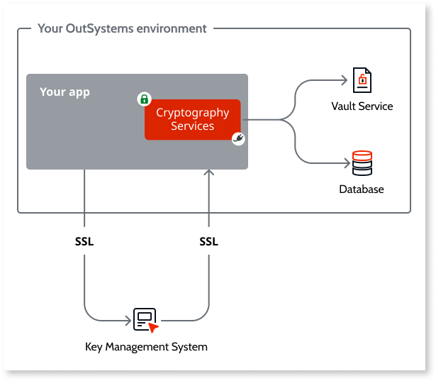

# Implement encryption and decryption for HIPAA compliance

When you subscribe to the OutSystems Cloud HIPAA offering your environments will include an app that you can reference to encrypt and decrypt PHI - **Cryptography Services**.

In its core, AWS Key Management Service provides a secure and resilient service to create and manage cryptographic keys.

The Cryptography Services app interfaces with the Key Management Service (KMS) abstracting from the complexity of having and managing a KMS. 

It exposes actions that work with the KMS to encrypt and decrypt PHI. Those are divided into two groups of actions, depending on whether you need to search on the encrypted data: **actions for searchable attributes** and **actions for unsearchable attributes**.

For example, you may want to both encrypt `email address` and `blood type`, but you only want `blood type` to be searcheable. You may have a screen that filters a search by `blood type` but you won't be able to search by `email address`.

## Actions for searchable attributes

These actions generate an unsalted encryption using the same key for all records that use the same **IndexType**. The same text results in the same cyphertext allowing apps to search within encrypted values without having to decrypt all records first. They shouldn't be used for combinations of patient-identity and medical information together.

GetIndexKey
:   Returns the Id of a key that's mapped to an **IndexType**. The IndexType is used to identify an attribute. You define a string that uniquely identifies the attribute. The Cryptography Services saves this relation with the **KeyId** and the **IndexType**. It retrieves a new **KeyId** if the **IndexType** doesn't exist. Otherwise, it retrieves the existing **KeyId** mapped for that **IndexType**.

EncryptIndexText
:   Encrypts searchable attributes.

DecryptIndexText
:   Decrypts searchable attributes.

## Actions for unsearchable attributes

These actions use the same underlying cryptographic processes with two additional protections: it's salted with the **EntityId** input and the keys are rotated periodically.
You'll need to save the relation of the record with it's salt and the KeyId. You can do this by creating an Entity to hold this mapping.
The rotation period of the keys is defined by the site property **GenericKeysExpirationInMinutes** of the Cryptography Services module. You can change this value in Service Center.

GetEntityKey
:   Returns the Id of a key. Due to the rotation, you'll need to to use this action whenever you create or update records.

EncryptEntityText
:   Encrypts the text of unsearchable attributes using a KeyId and a salt (EntityId).

DecryptEntityText
:   Decrypts into plain text the cyphered text of unsearchable attributes using a KeyId and a salt (EntityId).

Check the following articles for detailed guides of the implementation of:

* [Encrypting data for HIPAA compliance](encrypt-data-hipaa.md)
* [Decrypting HIPAA compliant data](decrypt-data-hipaa.md)
* [Search encrypted data](search-encrypted.md)

To know more about HIPAA in the OutSystems Cloud check [HIPAA compliant apps in the OutSystems Cloud](https://success.outsystems.com/Support/Security/HIPAA_compliance_-_how_OutSystems_can_help#HIPAA_compliant_apps_in_the_OutSystems_Cloud).
