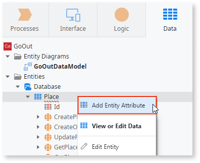

# Create an Entity to Persist Data
  
In OutSystems, a database table is an Entity, and the table columns are Entity Attributes.

To create an Entity you need to:

1. Double click in the Entity Diagram created by default in the Data tab. 
1. Right-click anywhere on the canvas and select **Add Entity to Database**. By default, it will be named "Entity1" and it can be renamed.
1. Expand the **Entities** tree and note the entity has the Id attribute created as Entity Identifier (primary key). 
1. Right-click the Entity and the other attributes by selecting **Add Entity Attribute**.
1. You can add indexes if necessary by right clicking with the Entity and choosing **Edit Entity**.

Alternatively, you can create entities in the Data tab:

* Right-click on the Entities folder and select 'Add Entity'.  
It's a quicker way, but with access to less information about the entity.
* Right-click on the Entities folder and select 'Import New Entities from Excel...'.

It's useful to create an entity and bootstrap data for it.

In mobile applications, you can create entities to store information in the device's local storage. This typically happens when end users need use the application while  offline.

## Example

We have an application called Go Out, that allows you to read and write reviews of places you go to, for instance restaurants. Let's see how to create the table that stores the information about these places.

1. In the Data tab, under Entity Diagrams, open the `GoOutDataModel` diagram.

2. Right-click and choose 'Add Entity to Database'.

3. Set the name of the entity to `Place`. OutSystems creates an `Id` attribute with data type `Long Integer`, set as AutoNumber.

4. With the entity selected, add the other attributes by clicking with the right-button in "Add Entity Attribute" to create the attributes:

    

    1. Create the `Name` attribute. By default the data type is set to `Text` and the length is `50`, change it to `100`;
    1. Make the attribute mandatory by setting the Is Mandatory property to `Yes`.
    1. Create the `Address` attribute as a mandatory Text attribute with 200 characters of length.
    1. Create the `PhoneNumber` attribute. The data type of the attribute changes to `Phone Number`. Leave this attribute optional. 
    1. Create the `Latitude` and `Longitude` attributes as optional Decimal attributes. Use the default length (37) and decimals (8) to define the precision of the numbers stored in the database.

5. Publish your application.

When you publish your application, OutSystems creates the database table that corresponds to the Place entity.
