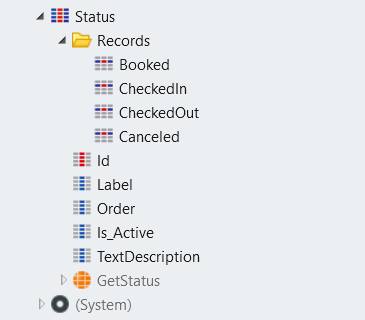

# Static Entities

A **Static Entity** consists of a set of named values. Think of static entities as enumerates or literal values stored in the database. While managing the data in **Records**, the Static Entity attributes define the structure. The scope of Static Entities is always global. Static Entities can have relationships with static and non-static entities.

The following attributes are automatically created: **Id**, **Label**, **Order**, and **Is_Active**. 

Id
:   The identifier is a unique record identifier, and it's the only attribute in the Static Entity that can be auto-number.

Label
:   Holds a value to display in an application.

Order
:   Defines the order by which the end user sees the records displayed.

Is_Active
:   The boolean Is_Active attribute defines if a record is available during runtime. For example, the records with Is_Active set to false aren't used when scaffolding uses the Static Entity.

You can create new entity attributes and define their types.

Each Record within a Static Entity is going to have an **Identifier** attribute as a unique handle. When designing applications use the Identifier directly in your business logic, for example: `Entities.<StaticEntity>.<Identifier>`.

The only action available for the static entities is the Get&lt;StaticEntity&gt; action, because OutSystems manages the data persistence for you. Static Entity data is editable during design time only.

You can convert existing entities to Static Entities and vice versa. After converting a Static Entity to an Entity, the existing records become available through database queries (Aggregate or SQL Query). When converted to an Entity, the existing "Records" folder are no longer visible in Service Studio.

## Example

Use static entities when you need a predefined immutable (constant) set of values. For example, in a hotel app you probably need some reservation statuses: "booked", "checked in", "checked out", and "canceled". You also need the default descriptions for the statuses (for example, "The guests have just left." for "checked out").

Your Static Entity Status may look like this:

The Records folder of your Static Entity contains all statuses created. If you select "CheckedOut", the Properties Editor is going to show the details:

The Identifier for the checked out status is `CheckedOut`, the Label is `"Checked-Out"`. The field TextDescription is the custom field and has the string value `"The guests have just left."`.

You can access the record for checked out status by referencing its Identifier, like this: `Entities.Status.CheckedOut`.
