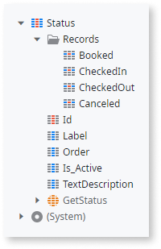
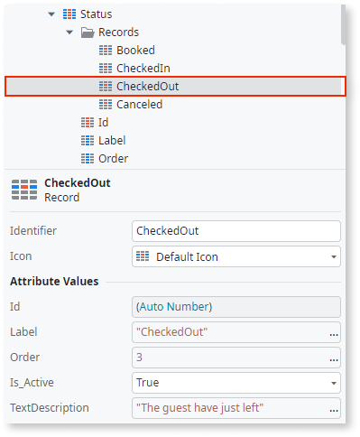

# Static entities

We've been working on this article. Please let us know how useful this new version is by voting.

A **static entity** consists of a set of named values. Think of static entities as enumerates or literal values stored in a database. While managing the data n the **Records** folder, the static entity attributes define the structure. The scope of Static Entities is always global. Static Entities can have relationships with static and non-static entities.

The following attributes are automatically created:

**Id**
:   Identifies a record and is always unique. It is the only attribute in the static entity that can be auto-number.

**Label**
:   Holds a value to display in an application.

**Order**
:   Defines the order for displaying the records to the end user.

**Is_Active**
:   The boolean Is_Active attribute defines whether a record is available during runtime. For example, the records with Is_Active set to false aren't used when scaffolding uses the static entity.

You can create new entity attributes and define their types.

Each record within a static entity has an **Identifier** attribute as a unique handle. When designing applications, use the Identifier directly in your business logic, for example: `Entities.<StaticEntity>.<Identifier>`.

Because OutSystems manages the data persistence for you, the only action available for the static entities is the Get&lt;StaticEntity&gt; action.

You can convert existing entities to Static Entities and vice versa. After converting a static entity to an entity, the existing records contained in the entity become available through database queries (Aggregate or SQL Query). When converted to an entity, the existing Records folder is no longer visible in Service Studio.

## Example

Use static entities when you need a predefined immutable (constant) set of values. For example, in a hotel app, you probably need some reservation statuses: "booked", "checked in", "checked out", and "canceled". You also need the default descriptions for the statuses (for example, "The guests have just left." for "checked out").

Your Static Entity Status may look like this:

The Records folder of your Static entity contains all statuses you have created. If you select "CheckedOut", the Properties Editor shows the folowing details:

The Identifier for the checked out status is `CheckedOut` and the Label is `"Checked-Out"`. The field TextDescription is the custom field and has the string value `"The guests have just left."`.

You can access the record for checked out status by referencing its Identifier, like this: `Entities.Status.CheckedOut`.
