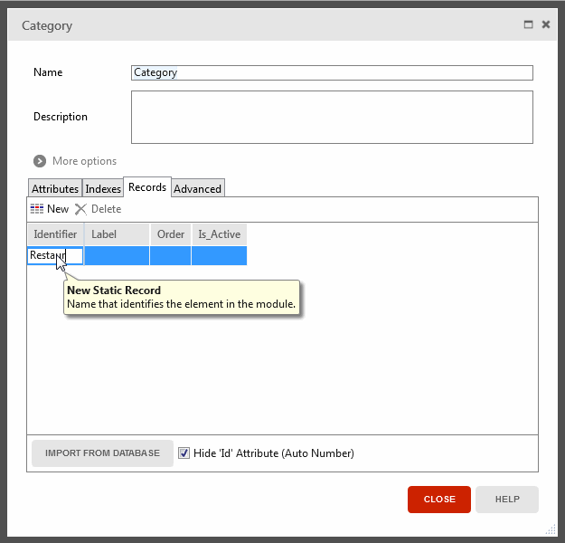

# Create and Use an Enumerate

Using enumerates allows removing hard-coded values from your applications. This makes your code easier to understand and change, and promotes strong typing, that is less error prone. In OutSystems, we model enumerates as  Static Entities stored in the database. This allows fetching its records from the database. It also allows modeling foreign keys using the Static Entity Identifier.

To create and use a Static Entity do the following:

1. Open the module's Entity Diagram.
2. Right-click on an empty space in the main editor and choose the option to add a Static Entity.
3. For each value of the enumerate, add a Record by setting the Identifiers.
4. Use the Static Entity in one of the following ways:
    * Use the new Static Entity Identifier to create foreign keys in other entities.
    * Fetch the Static Entity Records from the database using aggregates.
    * Assign or test a Static Entity Record using: `Entities.<Static Entity>.<Record>`. 

## Example

GoOut is a mobile application to search for and review places. GoOutWeb is the web application that manages those places. We want to change this application to categorize places. This provides a better search experience, allowing to search for restaurants, for instance.

To categorize places do the following in the GoOutWeb module:

1. Open the GoOutDataModel entity diagram.

2. Right-click on an empty space in the main editor and select the option to create the static entity.

3. Name the static entity `Category`.

4. By setting the Identifier, create the following records: `Restaurant`, `Cafe`, `Museum`, `Attraction,` and `Hotel`.

    

5. Drag the relationship connector from the Category static entity to the Place entity. This creates a one-to-many relationship.

6. Open the PlaceDetail screen and drag and drop the new CategoryId attribute to the form on the screen. This allows editing the relationship and categorize places.

7. Publish and set a category for each place.

Now that places have a category, we can use it for searching. In the Home screen of the GoOut application, we want to list the categories as follows:

1. Add an Aggregate to the screen to fetch the categories.
2. Add a List to the screen.
3. Expand the aggregate created in step 1.
4. Drag and drop the Label attribute to the list.
5. Select the List Item inside the list and set the On Click event to navigate to the Search screen.
6. Set the value of the input parameter using `GetCategories.List.Current.Category.Label`.
7. Open the GetPlacesWithReviews aggregate on the Search screen.
8. Drag and drop the Category static entity into the aggregate.
9. Open the Filters option and edit the filter, adding at the end:  
`or Category.Label like "%" + SearchKeyword + "%" `.

The end result should be like this:

In the Home screen, we already have a list that shows the top five places according to their rating. This list is visible when the time of day is during lunch hours. We want to only show restaurants in this list of places:

1. Open the GetPlaces aggregate.
2. Add a filter to only show restaurants using the static entity record: `Place.CategoryId = Entities.Category.Restaurant`.
3. Rename the aggregate to GetRestaurants for consistency.
