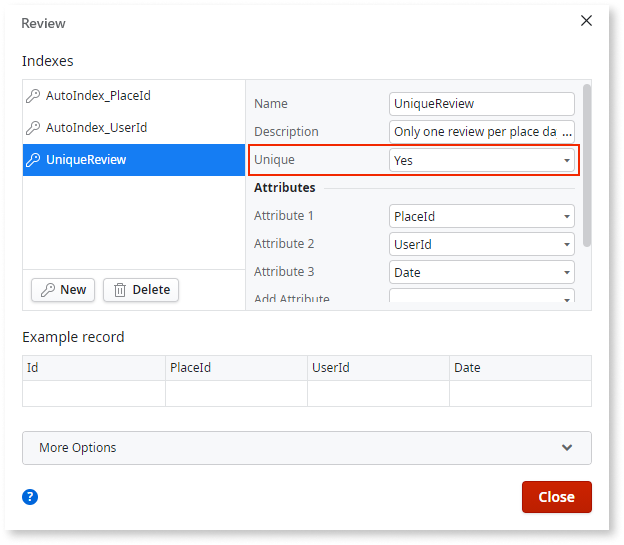

# Create an Entity Index
  
You can define a database index in your data model to enforce uniqueness of table attributes across multiple rows or to make searches quicker using those attributes as filters. In OutSystems, you can model a database index in the entity element.

To create an  index  for an entity:

1. Open the entity by double-clicking on it or selecting the Indexes property.
2. Go to the Indexes tab and create a new index.
3. Add the attributes you want to include in the index.
4. If you want to have unique values for the selected attributes, set the  Unique property to `Yes`.
5. To apply the index created in the database, publish the application.

## Example

In the GoOutWeb application, an application to find and review interesting places, we want to ensure that an end user cannot give more than one review to a place in the same day.

To create a unique index in the  Review  entity to ensure this restriction:

1. Open the  Review  entity by right-clicking on the entity and then **Edit Entity**.

2. In the Indexes tab, add a new index and name it `UniqueReview`.

3. Add the attributes: PlaceId, UserId, and Date. This will ensure that the same value for these attributes cannot be repeated in other records of  Review  table.

4. Set the index to unique.

    

5. Publish the module. While publishing, OutSystems creates the index in the database. 

From now on, when an end user tries to save the second review for the same place in the same day, OutSystems raises a database exception.
