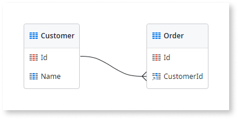
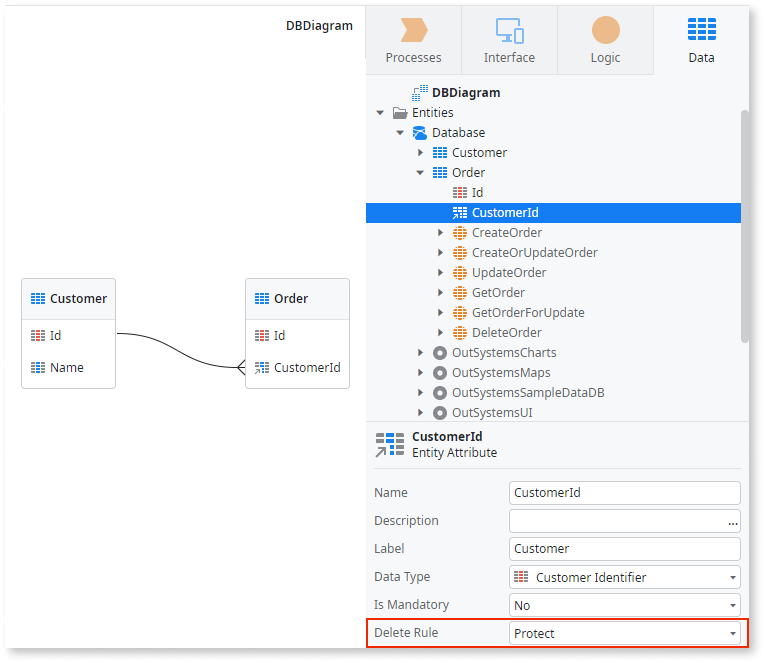
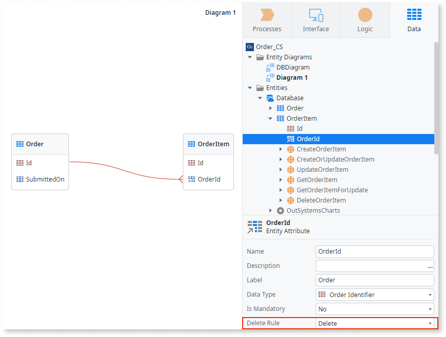
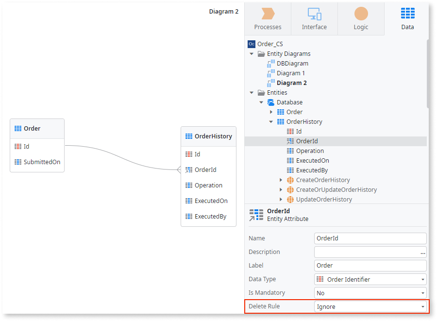

# Delete Rules

When you create relationships between the Entities in your module, you must define which kind of referential integrity you want to use when **deleting records**. The **referential integrity** specifies what happens to a record of an Entity B that references a record of Entity A, when the Entity A record is deleted.

The following Entity Diagram defines the relationship between Customers (main Entity A) and Orders (related Entity B), where a Customer can have several Orders, and an Order belongs to one and only one Customer. The [reference attribute](intro.md), which corresponds in database terminology to a foreign key, is the attribute **CustomerId** in Entity **Order**.

In this example, specifying the **referential integrity** is to define what happens to the Orders of a Customer when that Customer is deleted.

To specify the **referential integrity** in a relationship between two Entities, you need to edit the **reference attribute** of the related Entity and set the **Delete Rule** property to one of the following values: `Protect`, `Delete` or `Ignore`.

**Protect**
:   Setting the **Delete Rule** to `Protect` prevents deleting records of the main Entity while there are associated records in the related Entity.

    This behavior is ensured by a database constraint created on the reference attribute. If you try to delete a record in the main Entity that still has associated records in the related Entity, the Platform Server returns a database exception and the operation is not executed.

**Delete**
:   Setting the **Delete Rule** to `Delete` guarantees that when a record of the main Entity is deleted, all the associated records in the related Entities are also deleted. This mechanism is commonly known as Cascade Delete.

    This behavior is ensured by a database constraint created on the reference attribute.

**Ignore**
:   Setting the **Delete Rule** to `Ignore` allows deleting records of the main Entity keeping the associated records in the related Entity.

    The `Ignore` value does not guarantee referential integrity and, therefore, no database constraint is created. Accordingly, when you change the **Delete Rule** property from a previous value to `Ignore`, the corresponding automatic index is deleted (unless you have manually changed any of its properties).

    If the foreign key attribute references an external Entity exposed by an Extension, the only possible value for the **Delete Rule** property is `Ignore`, as the referential integrity can’t be guaranteed.

When designing your Entities model, you must identify the correct Delete Rule for the several relationships, ensuring your system behaves as expected in each use case. Check below some examples and considerations for each option to help you choose the appropriate choice for your use case.

## "Protect" Example

The `Protect` value is commonly used when the end user is able to delete the Entity data directly from the application’s screens.

Consider the following business scenario:

* There is an application screen where the end users can delete **Customers**.

* A **Customer** can have one or more **Orders**, and an **Order** belongs to one and only one **Customer**.

* A **Customer** cannot be deleted while there are associated Orders.

Setting the **Delete Rule** property of the reference attribute **CustomerId** to `Protect` assures that the end user won’t delete a Customer that still has associated Orders.

Trying to delete a Customer that still has associated Orders results in a database exception, and the operation is not executed:

In this case, to delete a Customer you must first delete all the Orders placed by that Customer.

This is the more performant option because you can control and optimize the individual delete statements, and still ensures data consistency. It’s a trade between having more control and performance, over higher implementation costs.

### Advantages

* The data model is always consistent, as you won’t be able to delete a record of the main Entity that is still being referenced in the related Entities.

### Constraints

* You must orchestrate the correct delete order in your logic, by deleting the records of the related Entities first, and then the record of the main Entity.

* Whenever you add a new related Entity to your model, you must include that related Entity in your delete cycle logic.

## "Delete" Example

The `Delete` value is commonly used when you implement data purging mechanisms, where you need automatic cascade delete between the whole model.

Since data purging mechanisms are typically handled by an asynchronous process (Timer or BPT), performance is not a concern.

Consider the following business scenario:

* We want to delete all the closed **Orders** older than five years.

* An **Order** has one or more **OrderItems**, and an **OrderItem** belongs to one and only one **Order**.

* When an **Order** is deleted, all the associated **OrderItems** must be deleted.

Setting the **Delete Rule** property of the reference attribute **OrderId** to `Delete` assures that when an Order is deleted, all the related OrderItems are also automatically deleted.

### Advantages

* The data model is always consistent. When you delete a record of the main Entity, that record won’t be referenced in the related Entities anymore, as all the associated records in the related Entities are also deleted.

* The development and maintenance of your delete logic are straightforward, as you only need to delete the records at the main Entity level.

* Adding new related Entities to your model implies low development effort, as you only need to set the **Delete Rule** of the reference attributes to `Delete`.

### Constraints

* Depending on the number of related records, this option can lead to poor performance. For every delete operation, the related Entities will be checked for related records, causing the delete statement to take longer. Therefore, this option is not recommended when you have a complex Entity model and performance is a concern (for example, the end user is able to delete the Entity data directly from the application’s screens).

## "Ignore" Example

The Ignore value is commonly used when you implement historical data archiving mechanisms, where you want to delete records from the main Entity but you need to keep all the records in the related Entities, considering that the details of the main record are not relevant.

Consider the following business scenario:

* Every operation performed over an **Order** is logged in **OrderHistory**.

* One **OrderHistory** record relates to one and only one **Order** and one **Order** has one or more related **OrderHistory** records.

* We want to delete all the closed **Orders** older than five years, but the **OrderHistory** records must be kept for 10 years, for compliance reasons.

Setting the **Delete Rule** property of the reference attribute **OrderId** to `Ignore` allows you to delete an Order and keep the related OrderHistory records.

### Advantages

* You can delete records in the main Entity without impacting the related Entities.

### Constraints

* This option leads to an inconsistent data model. It keeps the related records, but you can no longer fetch the details of the main record, only the identifier.

* When you change the **Delete Rule** property of a reference attribute from a previous value to `Ignore`, the corresponding automatic index is deleted. In case you use that reference attribute as a query filter, you need to manually add a new index.
