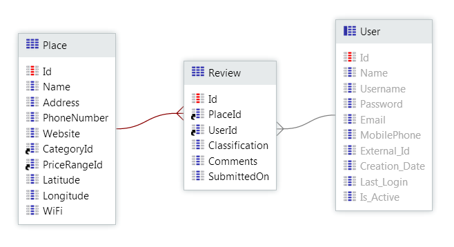

# Create a Many-to-Many Relationship

A many-to-many relationship happens when one entity has a one-to-many relationship with another entity, and vice-versa. For example, an `Author` can write several `Books`, and a `Book` can be written by several` Authors`. This kind of relationship is also known as **N to M** relationship.

Resolve this kind of relationships by adding a third entity, called **junction entity**. It must have at least two foreign keys, one to each entity in the relationship. Other attributes can also be added if needed (see the example).

To create a many-to-many relationship, follow these steps:

1. [Create a relationship entity](<../entity-create.md>).
1. Add an attribute and set the data type to the identifier of the first entity.
1. Add another attribute and set the data type to the identifier of the second entity.

If you want to ensure that the new entity has unique records (like an `Author` can only write the same `Book` once), then add a unique index to the two foreign keys.

## Example

You have a mobile application called GoOut, where end users can find and review places like restaurants, hotels, etc. An end user can review many places and a place can have reviews from many end users, i.e. a many-to-many relationship. We will call these two entities `Review` and `Place`. Besides the two foreign keys, a review has also other attributes: classification, comments, and submission date.

Let's create the `Review` entity:

1. In the Data tab, open the GoOutWebDataModel entity diagram.
1. Drag the User system entity and the `Place` entity to the diagram.
1. Right-click the diagram canvas and select 'Add Entity'.
1. Name the entity as `Review`.
1. Drag the `User.Id` attribute to the `Review`.
1. Drag the `Place.Id` attribute to the `Review`.
1. Add the remaining attributes:
    * `Classification`, Integer type
    * `Comments`, Text type
    * `SubmittedOn`, Date type

