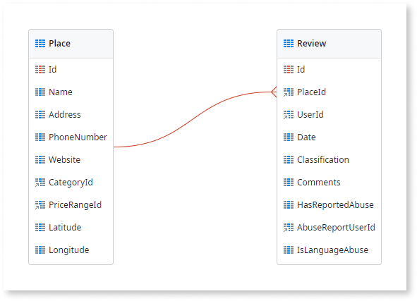

# Create a One-to-Many Relationship

When modeling data, it is sometimes necessary to create one-to-many relationships between entities. For instance, a `Place` (parent entity) can have many `Reviews` (child entity). This is typically implemented with a foreign key - the identifier of the parent record - in the child records.

To create a one-to-many relationship between two entities:

1. Select the entity with the child records (e.g. `Review`).
1. Add a new attribute that holds the identifier of the parent entity (e.g. identifier of the `Place` entity). This attribute will be the foreign key.

Having an identifier attribute pointing to another entity automatically creates a relationship. You can see the relationships between entities if you have them in the same Entity Diagram.

When you create relationships between entities in your module, you must define the referential integrity you want to use when deleting records. For more information on deletion rules, see [Delete Rules](delete-rules.md)