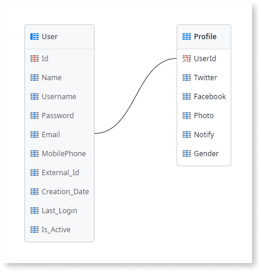

# Create a One-to-One Relationship

One-to-one relationships allow you to extend an existing entity with additional information that is not yet in the database model.

A common scenario is when you want to extend an entity with more attributes and it's not possible to add them to it. This happens when you are using a referenced entity from a different module, and adding more attributes don't make sense in the referenced module. In this case, you create an entity in your module to store the additional information.

To create a one-to-one relationship to an existing entity:

1. [Create an Entity](<../entity-create.md>).
1. Change the `Id` attribute to be the identifier of the entity you want to extend.
1. Add the attributes.

## Example

The GoOutWeb application allows to rate and review places like restaurants and hotels. The application saves some end users information like the email, the phone number or Twitter account.

Since we are using the `User` system entity to store the end users it is not possible to add attributes to it. We have to create an additional entity to store more information about the user. To do so, follow these steps:

1. In the Data tab, open the GoOutWebDataModel entity diagram.

1. If not present yet, drag the `User` system entity to the diagram from the Data tab.

1. Right-click on the diagram canvas and select "Add Entity".

1. Name it `Profile`.

1. Rename the `Id` attribute to `UserId`.

    OutSystems sets the data type to `User Identifier` based on the name given. Since this data type is the identifier of the `User` entity, OutSystems creates a connection between the created entity `Profile` and the `User` entities.

1. Add the following attributes to the `Profile` entity:

    * `Twitter`, Text type
    * `Facebook`, Text type
    * `Photo`, Binary Data type

As a result, you have the `Profile` entity extending the `User` entity. Every time a `Profile` record is created its identifier should have the value of the `User` record identifier it belongs to.

