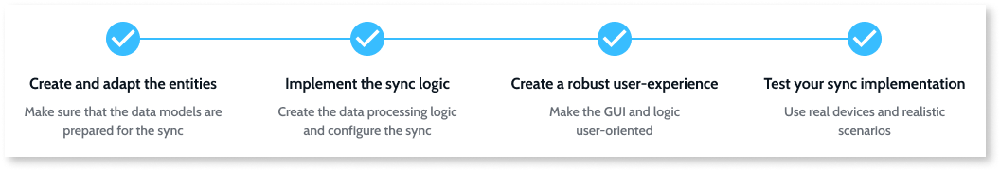
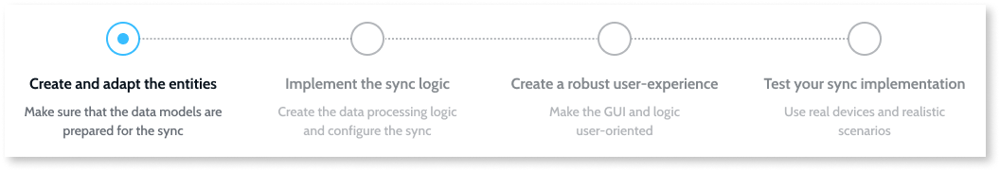
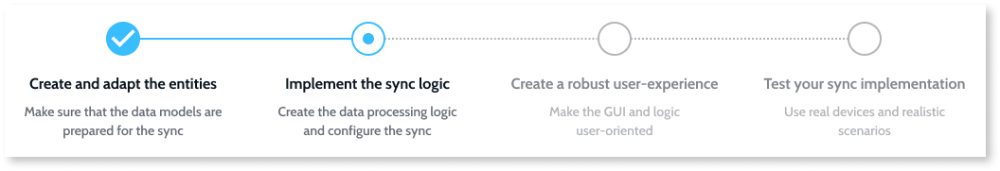
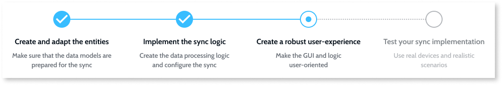
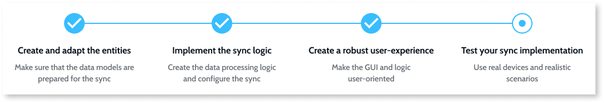

# Offline

OutSystems provides the necessary capabilities to implement use cases that require having offline access to some or even all of the functionality in your apps. Offline capabilities are available for apps running on mobile devices and on the browser (if you use PWAs - [Progressive Web Apps](https://success.outsystems.com/Documentation/11/Delivering_Mobile_Apps/Distribute_as_a_progressive_web_app)). For example, a field service mobile app to support remote workers that may not always have a connection to the Internet on their mobile devices.

When you install an OutSystems mobile app, it already includes all resources such as UI elements and client-side logic that are necessary for the app to run with no connectivity to the server. Data can be persisted locally in an SQLite database. Your mobile app only needs network connectivity to access data and logic on the server.

When you install an OutSystems PWA, the service worker has already cached all the resources such as UI elements and client-side logic that are necessary for the app to run with no connectivity to the server. Data can be persisted locally in an IndexedDB database. Similarly to a mobile app, your PWA only needs network connectivity to access data and logic on the server. 

The following diagram shows the runtime architecture of a typical OutSystems mobile app. In PWA's the architecture is very similar but uses IndexedDB for the browser local storage and an offline framework composed of JavaScript.

To make your apps ready for scenarios with intermittent network access you need to define you local data model and implement a synchronization mechanism to exchange data between the device and the server when there is network access.

Offline capabilities require that the app you chose in Service Studio is of the type mobile (Tablet or Phone), but the same code base can be used to run the app in a browser, by choosing [Distribute as a progressive web app](https://success.outsystems.com/Documentation/11/Delivering_Mobile_Apps/Distribute_as_a_progressive_web_app).

## Using Local Storage

In OutSystems you define the data model and manipulate persistent data in the same way on the server database and on the local storage of a mobile device.

Modeling the local storage can be accelerated by copying just the necessary server entities and attributes with a right-click. When you create a new local storage entity, OutSystems automatically provides entity actions that enable you to handle the entity records, just like for server entities.

If you are considering storing sensitive data in local storage, you should use the best practices to [secure the data of your mobile apps](<../../data/secure-the-data-of-your-mobile-apps.md>).

## Implementing Offline Data Sync

The following are the recommended steps for implementing your offline data sync mechanism.

Before you start the sync implementation, analyze the business needs and define who the end users are. Define the conditions under which the app should work. This will help in creating the connectivity and data capacity requirements that your apps should meet.

Also, decide who modifies the records and how. The sync implementation will be influenced by the number of users accessing a database record simultaneously and whether the editing of records is possible in the mobile app. In cases when the server holds the main data and the clients download the updates, you may want to implement the [Read-Only Data Optimized](<patterns/read-only-data-optimized.md>) sync pattern. However, in cases where many clients access and modify data, you will need a more complex sync pattern similar to the [Read/Write Data with Conflict Detection](<patterns/read-write-data-with-conflict-detection.md>).

### 1. Create and adapt the entities

The local storage entities need to be simpler than the complex server entities. Denormalize the database relations to [design a lightweight local storage](<https://success.outsystems.com/Documentation/Best_Practices/OutSystems_Mobile_Best_Practices#Design_a_Lightweight_Local_Storage>) in your mobile app. Use simple relations for the attributes corresponding to the data requirements you defined previously. You should be able to map the attributes of the simpler local entities to the server entities.

Analyze and select the sync patterns. On the local storage and server, create data structures for the metadata and for the conflicting data. If you plan to support binary files compare the performance impact of storing in the local entities versus storing as local files.

### 2. Implement the sync logic

OutSystems provides a [sync framework](<sync-implement.md>) that enables you to synchronize data between mobile apps and the server. The following are the main steps of implementing a sync mechanism with this framework:

#### Data processing logic

Create the logic for handling and storing the business data. You should create and organize the actions in single or multiple flows, in a way that is the most efficient and maintainable for your use case. The aim is to define the input and output values of the actions that update data, and then place the actions in the server or client side of the logic. You should also create all logic for detecting conflicts and also scenarios to resolve them.

We provide you with a collection of [sample data sync patterns](<patterns/intro.md>) that you can use to get started and adapt to your specific requirements.

#### Sync configuration

Once you have your actions for receiving, sending, processing data and resolving conflicts, embed them into the sync framework. Then, define the network detection and the app behavior. If the end users can start the sync manually, make sure the sync is started as an asynchronous call by using the action TriggerOfflineDataSync.

### 3. Create a robust user-experience

At this point you should have most of your sync logic in place. The next step is to create a user experience around the sync. The user interface and app behavior should provide a robust experience for the end users. The end users should be aware of the network status, if the data they are working with is up to date, and they should also be aware of the sync outcomes. The initial sync should be well thought out. It should be obvious how to resolve conflicts.

### 4. Test your sync implementation

Test your sync implementation against defined business goals, the use cases and also user experience. The browser simulator works well for basic debugging, but you should install your app on several devices and test how the sync and app perform in realistic scenarios. Keep in mind that your app is using the internal database and that it needs to be able to update even in poor connectivity. Another important sync test is a usability test to verify that the end users will have a responsive app that is intuitive to use.

Finally, check the items in the [Offline Sync Checklist](<sync-checklist.md>) to help ensure your application meets all expectations regarding performance and end user experience.
