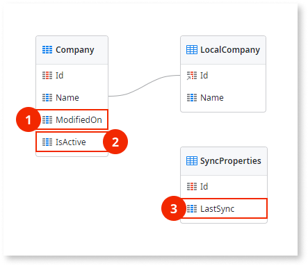
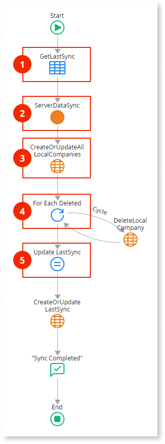

# Read-Only Data Optimized

Applies only to Mobile Apps.

This data synchronization pattern is recommended for mobile apps where end users only need to read data while the apps are offline and there are large amounts of data, as follows:

* The server database holds the master data which can change over time.
* Synchronization is optimized to transfer only data that needs to be updated in the local storage of the device.
* Data modifications performed on the device are not propagated to the server.

The following is an overview of the Read-Only Data Optimized pattern logic:

1.  Invokes server to get data.

1.  Returns database data.

1.  Deletes and recreates data in the local storage with the data received from the server. 

Download the [sample module for the Read-Only Data Optimized pattern](http://www.outsystems.com/forge/component/1638/Offline+Data+Sync+Patterns/), that uses companies as an example of data to synchronize. The following sections provide detailed descriptions of the data model and logic used in the sample module.

## Data Model

This sample defines a database entity `Company` and its local storage counterpart `LocalCompany`. Additionally, the `SyncProperties` local storage entity keeps the date and time of the last synchronization.

1. Tracks changed records by storing the timestamp when the record was last updated or created.
1. Tracks deleted records.
1. Timestamp of the last synchronization. Note that this timestamp is established by the server to avoid problems due to clock differences between client and server.

The application logic must keep the entity attributes `ModifiedOn` and `IsActive` updated.

## OfflineDataSync Logic

The following is a description of the logic of the `OfflineDataSync` client action:

1. Obtains the timestamp of the last synchronization.
1. Calls the `ServerDataSync` server action to retrieve data from the database that changed since the last synchronization. The server returns a list of changed or added Company records, a list of deleted (inactive) Company records, and the timestamp of this synchronization.
1. Updates the Company records in the local storage using the list of changed or added records returned by the server.
1. Iterates the list of deleted (inactive) Company records returned by the server and deletes the corresponding records in the local storage.
1. Updates the entity attribute `SyncProperties.LastSync` with the timestamp of this synchronization returned by the server.

## ServerDataSync Logic

The following is a description of the logic of the `ServerDataSync` server action:

1. Assigns the timestamp of this synchronization to an output parameter.

1. Obtains the list of changed or added Company records since the last synchronization. The aggregate uses the following filter:

        Company.IsActive = True and
        (Company.ModifiedOn = NullDate() or Company.ModifiedOn >= LastSync)

1. Obtains the list of all deleted (inactive) Company records since the last synchronization. The aggregate uses the following filter:

        Company.IsActive = False and
        (Company.ModifiedOn = NullDate() or Company.ModifiedOn >= LastSync)

1. Assigns the timestamp and the two lists of Company records to the output parameters of the action.
