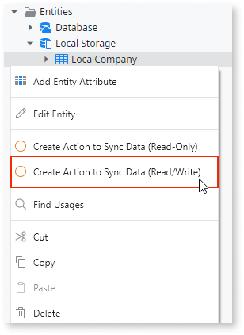
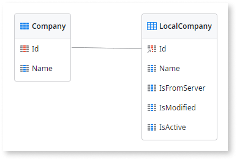

# Read/Write Data Last Write Wins

Applies only to Mobile Apps.

This data synchronization pattern is recommended for mobile apps where it is not likely for multiple end users to change the same data while the apps are offline, as follows:

* The server database holds the master data that can change over time.
* The local storage database holds a subset of the master data and can be modified.
* Synchronization sends the modified data from the local storage to the server database and vice-versa.
* In the server, data is updated in a "last write wins" strategy. With this strategy, the latest data update overrides earlier updates.

The following is an overview of the Read/Write Data Last Write Wins pattern:

1.  Sends local storage data modified by the app back to the server. 

1.  Updates database data with the one sent from local storage. 

1.  Sends updated database data. 

1.  Deletes and recreates data in the local storage with the data received from the server. 

Download the [sample module for the Read/Write Data Last Write Wins pattern](http://www.outsystems.com/forge/component/1638/Offline+Data+Sync+Patterns/), that uses companies as an example of data to synchronize. The following sections explain how to automatically generate this synchronization pattern and provide detailed descriptions of the data model and logic used in the sample module.

## Automatically Generate the Pattern for an Entity

To automatically generate the logic needed to implement this pattern for an entity:

1. In Service Studio, open the Data tab. 
1. Under Local Storage, select the local entity of the entity you want to synchronize with the server. 
1. Right-click on the local entity and choose the **Create Action to Sync Data (Read/Write)** option. 

This option is only available if the local entity is linked to the database entity (with the Id as a foreign key to the database entity). That happens if you create local entities with a right click on **Local Storage** and choose **Add Entity from Database...**.

This creates the actions needed to implement the Read/Write synchronization pattern:

SyncLocal&lt;Entity&gt;
:   Client action that starts the synchronization between the local entity and the entity in the server database. It sends the added, changed and deleted local records to the Sync&lt;Entity&gt; server action that handles the synchronization of the entity on the server side.

Sync&lt;Entity&gt;
:   Server action called by the SyncLocal&lt;Entity&gt; action, that synchronizes the received local entity records with the server database records. It returns the current records of the entity in the database to be updated in the client local storage. 

Along with these actions, new attributes **IsFromServer**, **IsModified** and **IsActive** are added to the local entity to track changes and store meta-information needed by the synchronization process. To keep these new attributes updated and coherent for the synchronization process, the accelerator creates new client actions that must replace the use of the default local entity actions of the local entity:

CreateOrUpdateLocal&lt;entity&gt;ForSync
:   Replaces the CreateOrUpdateLocal&lt;entity&gt; client action.

DeleteLocal&lt;entity&gt;ForSync
:   Replaces the DeleteLocal&lt;entity&gt; client action.

UpdateLocal&lt;entity&gt;ForSync
:   Replaces the UpdateLocal&lt;entity&gt; client action. 

These client actions are created in the Logic tab, Client Actions, SyncActions_Local&lt;entity&gt;.

To guarantee the success of the synchronization process when using this accelerator, you must replace the use of all entity actions of the local entity by the corresponding new actions created by the accelerator.

If you want this pattern to run in the [synchronization template mechanism](<../sync-implement.md>), add a call to the SyncLocal&lt;entity&gt; client action in the OfflineDataSync client action.

## Data Model

This sample defines a database entity `Company` and its local storage counterpart `LocalCompany`. Additionally, the `LocalCompany` entity defines three metadata attributes to keep track of the synchronization status of the records.

The application logic must update the metadata attributes `IsFromServer` , `IsModified` and `IsActive` of the local entity according to the following:

* `IsFromServer`: If True, the record exists on the server.
* `IsModified`: If True, the record has been modified locally.
* `IsActive`: If False, the record was deleted locally but may not yet have been removed from the server.

## OfflineDataSync Logic

The following is a description of the logic of the `OfflineDataSync` client action:

1. Obtains the list of locally added Company records. The aggregate uses the following filter:

        LocalCompany.IsFromServer = False and
        LocalCompany.IsActive = True

1. Obtains the list of locally updated Company records. The aggregate uses the following filter:

        LocalCompany.IsModified = True and
        LocalCompany.IsFromServer = True and
        LocalCompany.IsActive = True

1. Obtains the list of locally deleted (inactive) Company records. The aggregate uses the following filter:

        LocalCompany.IsActive = False and
        LocalCompany.IsFromServer = True

1. Calls the `ServerDataSync` server action with the lists of locally added, updated, and deleted Company records as inputs. The server updates the data in the database and returns the list of updated Company records.

1. Deletes all Company records in the local storage.

1. Recreates the Company records in the local storage using the list of records returned by the server.

## ServerDataSync Logic

The following is a description of the logic of the `ServerDataSync` server action:

1. Iterates the list of locally added Company records and creates the new records in the database. To avoid collisions, the `Company.Id` is set to `NullIdentifier()` so that the records are created with new identifiers.

1. Iterates the list of locally modified Company records and updates the records in the database.

1. Iterates the list of locally deleted (inactive) Company records and deletes the records in the database.

1. Retrieves all the Company records from the database.

1. Assigns the list of Company records to the output parameter of the action, while setting appropriate values for the synchronization metadata attributes:

    IsFromServer = True  
    IsModified = False  
    IsActive = True
